# Phase B — DFIR Hardening with Velociraptor

**Project:** SOC Lab — Enterprise Cybersecurity Home Lab
**Repository:** [soc-lab-repo](https://github.com/ahmedargoubi/soc-lab-repo)
**Phase:** B — Hardening & DFIR Automation
**Component:** Velociraptor (Digital Forensics & Incident Response)
**Author:** Ahmed Argoubi

---

## 1. Project Context

Following the Phase A attack simulations (SQL injection, backdoor exploitation, WannaCry FIM testing, and the full AD kill chain), Phase B focuses on hardening the environment and building out active defense and forensic response capability. This document covers the DFIR component of that effort: deploying and operationalizing **Velociraptor** across the lab's endpoints.

### 1.1 Infrastructure

| Component | Role | Address |
|---|---|---|
| Security-Core | Velociraptor Server (GUI + Frontend) | `192.168.9.133:8889` |
| DMZ-Web | Linux agent (Velociraptor client) | `192.168.11.177` |
| AD-DC | Windows Server agent (Velociraptor client) | `192.168.7.139` |
| HAROUN, AHMED | Windows 10 clients (Velociraptor agents) | `192.168.8.x` |
| node1 | CentOS agent (Velociraptor client) | `192.168.8.x` |

### 1.2 Goal

The objective of this phase was to move from a purely reactive incident-response posture to a **proactive hunting model**: rather than waiting for an alert to trigger a manual investigation, Velociraptor Hunts are used to continuously and consistently sweep every enrolled endpoint — Windows and Linux alike — for indicators of compromise, configuration drift, and evidence that would otherwise require console-by-console manual collection.

---

## 2. Work Completed

| Task | Description | Status |
|---|---|---|
| Created Hunts | Used the Velociraptor Hunt Manager to create multiple Hunts targeting Linux and Windows endpoints | ✅ Done |
| Selected Artifacts | Chose relevant built-in artifacts for each Hunt (processes, files, services, users, logs) | ✅ Done |
| Configured Parameters | Set artifact-specific parameters (file globs, service name lookup tables, log paths, Grok patterns) | ✅ Done |
| Set Resource Limits | Applied CPU, IOPS, and execution-time limits to avoid impacting endpoints | ✅ Done |
| Collected Evidence | Ran Hunts and reviewed results (Bash history, process lists, user lists, SSH logs, live shell output) | ✅ Done |

This the full list of Hunts that i created  during in this phase:

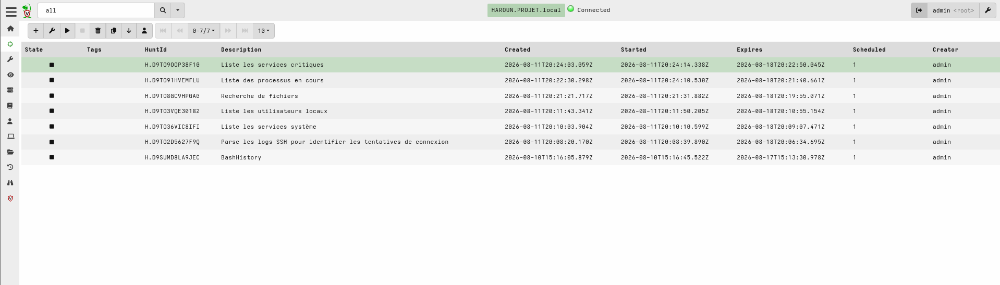
*Figure 1 — Hunt Manager overview: seven Hunts covering critical services, running processes, file search, local users, system services, SSH login parsing, and Bash history.*

---

## 3. Why Velociraptor — Introduction

Velociraptor is an open-source endpoint monitoring, forensic, and response platform built on top of Google's **osquery**-style VQL (Velociraptor Query Language) engine. Unlike traditional EDR agents that only forward pre-defined telemetry, Velociraptor allows an analyst to run arbitrary, parameterized queries — called **artifacts** — against one endpoint or an entire fleet on demand.

Two capabilities make it central to this lab's DFIR strategy:

- **On-demand triage** — an analyst can pull live process lists, file listings, registry keys, shell history, or run an interactive shell session on any enrolled client, without shipping a new agent or waiting for a scheduled collection.
- **Fleet-wide Hunts** — the same artifact can be scheduled against every client matching a filter (e.g., "all Windows hosts" or "all Linux hosts"), turning a single query into a fleet-wide sweep. Results stream back asynchronously and are stored centrally for correlation.

Endpoint filesystem and metadata can also be browsed directly through the Virtual File System (VFS) view, which exposes low-level artifact metadata (mtime/atime/ctime/btime, mode, device major/minor, filesystem type) for any file or directory on an enrolled client:

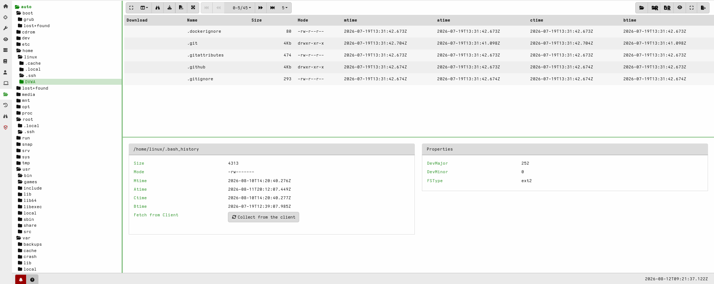
*Figure 2 — VFS view of `/home/linux/.bash_history` showing file size, permissions, and MACB timestamps, with an option to re-collect the file live from the client.*

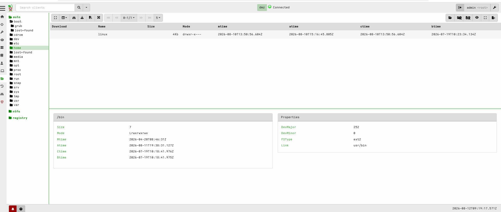
*Figure 3 — VFS view confirming `/bin` is a symlink to `usr/bin`, illustrating how Velociraptor surfaces filesystem structure without requiring shell access.*

### 3.1 Why Proactive Hunting Matters

In Phase A, evidence was gathered manually and reactively — after an attack had already been simulated, an analyst went endpoint-by-endpoint to inspect artifacts. This does not scale, and it means detection is always a step behind the attacker. Phase B replaces that workflow with **scheduled, repeatable Hunts** that:

- Establish a baseline of "normal" (running services, local users, active processes) across the environment, so future deviations are easier to spot.
- Reduce mean time to respond (MTTR), since evidence is already centrally indexed rather than requiring a fresh manual pull during an incident.
- Provide auditable, timestamped collection — every Hunt records its creation time, start time, expiry, and the exact VQL query executed, giving a defensible chain of custody for evidence.
- Apply consistent resource governance (CPU/IOPS/time caps) so that forensic collection itself never becomes a source of endpoint disruption — an important consideration on production-like systems.

---

## 4. Overview of Artifacts Used

The table below summarizes the built-in Velociraptor artifacts used in this phase, grouped by platform.

### 4.1 Linux Artifacts

| Artifact | Purpose (DFIR value) |
|---|---|
| `Linux.Sys.BashHistory` | Recovers shell command history from user home directories (e.g. `~/.bash_history`). Reveals reconnaissance commands, lateral-movement attempts, and data exfiltration commands an attacker may have run interactively. |
| `Linux.Sys.BashShell` | Opens a live, interactive shell session on the target and executes ad-hoc commands (`whoami`, `ls`, etc.). Used for real-time triage when a canned artifact isn't sufficient. |
| `Linux.Sys.Users` | Parses `/etc/passwd` to enumerate local accounts, UID/GID, home directories, and login shells. Used to detect unauthorized or newly-created local accounts (a common persistence technique). |
| `Linux.Sys.Services` | Parses `systemctl list-units --type=service` output to list all systemd services and their state. Used to identify unauthorized or suspicious services (e.g., a persistence mechanism registered as a fake system service). |
| `Linux.Syslog.SSHLogin` | Parses `/var/log/auth.log` / `/var/log/secure` using a Grok pattern to extract every SSH authentication attempt (source IP, username, success/failure). Core artifact for detecting brute-force attempts and confirming lateral movement over SSH. |

Artifact discovery in the GUI — searching `BASH` surfaces both history-recovery and live-shell artifacts:

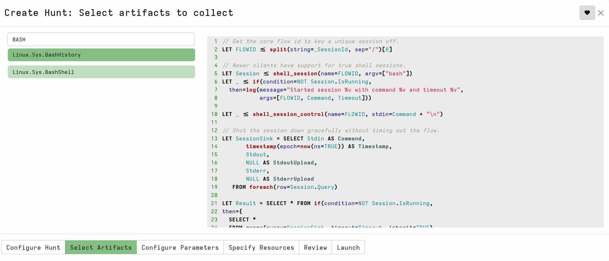
*Figure 4 — Searching the artifact catalog for "BASH" returns `Linux.Sys.BashHistory` and `Linux.Sys.BashShell`, along with the full underlying VQL for the live-shell session artifact.*

### 4.2 Windows Artifacts

| Artifact | Purpose (DFIR value) |
|---|---|
| `Windows.System.Pslist` | Enumerates running processes with executable paths, command lines, and optional Authenticode trust verification / binary hashing. Used to spot untrusted or unsigned binaries masquerading as legitimate processes. |
| `Windows.System.CriticalServices` | Checks that critical Windows services (AV, Windows Defender, update services, etc. — e.g. `WinDefend`, `MpsSvc`, `wuauserv`) are running. Flags tampering that disables endpoint protection, a common pre-ransomware/pre-exfiltration step. |
| `Windows.Search.FileFinder` | Searches the filesystem by glob pattern, with optional YARA content inspection and file hashing/upload. Used to hunt for dropped malware, leaked credentials, or exfiltrated data staged on disk. |

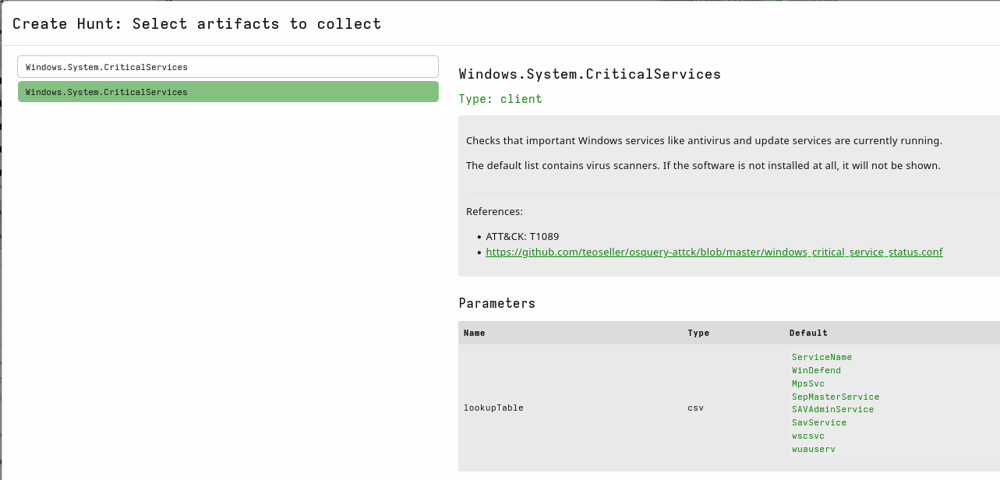
*Figure 5 — `Windows.System.CriticalServices`, mapped to ATT&CK T1089 (Disable or Modify Tools), with its default `lookupTable` of critical service names.*

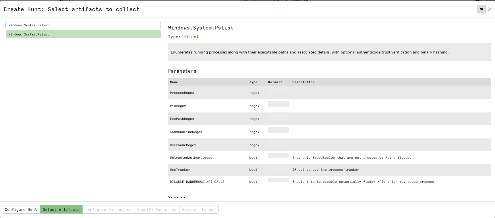
*Figure 6 — `Windows.System.Pslist` parameters, including regex filters and the `UntrustedAuthenticode` flag for isolating unsigned executables.*

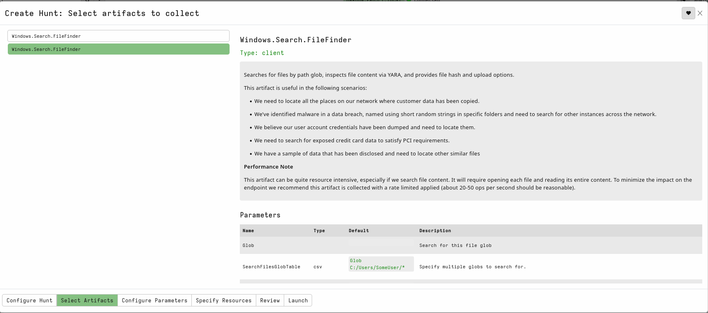
*Figure 7 — `Windows.Search.FileFinder`, showing its documented use cases (credential dumps, PCI data exposure, malware search) and performance guidance on rate-limiting.*

---

## 5. Creating Hunts — Step-by-Step

The following procedure documents the exact GUI workflow used to build every Hunt in this phase.

### 5.1 Configure Hunt

From the Velociraptor GUI (`https://192.168.9.133:8889`), navigate to **Hunt Manager → +** to open the *New Hunt* wizard. On the **Configure Hunt** tab:

- **Description** — a short, human-readable label for the Hunt (e.g. `BashHistory`, `Recherche de fichiers`).
- **Expiry** — the timestamp after which the Hunt stops accepting new client check-ins (typically set 7 days out).
- **Include Condition** — the targeting filter, e.g. *Operating System*.
- **Operating System Included** — restrict the Hunt to `Linux` or `Windows` as appropriate, so a Linux-only artifact isn't wastefully scheduled against Windows clients (and vice-versa).
- **Exclude Condition** — left as *Run everywhere* unless specific hosts need to be excluded.
- **Orgs** — left as *All Orgs* in this single-tenant lab.
- **Hunt State** — *Start Hunt Immediately* left unchecked so the Hunt can be reviewed before launch.

The wizard shows a live **Estimated affected clients** count, confirming how many enrolled endpoints match the current filter before the Hunt is even launched.

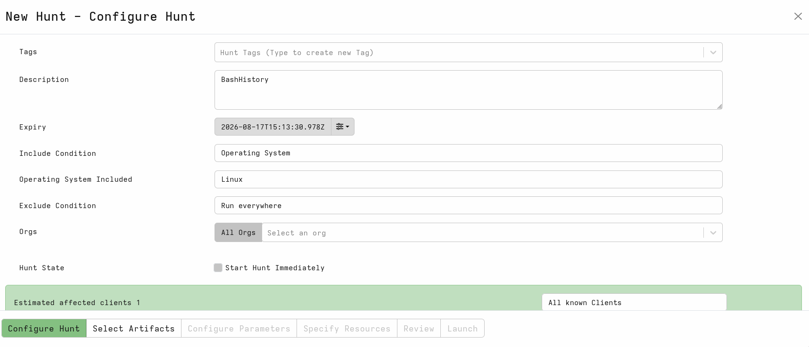
*Figure 8 — Configure Hunt tab for the `BashHistory` Hunt: OS filter set to `Linux`, 7-day expiry, estimated 1 affected client.*

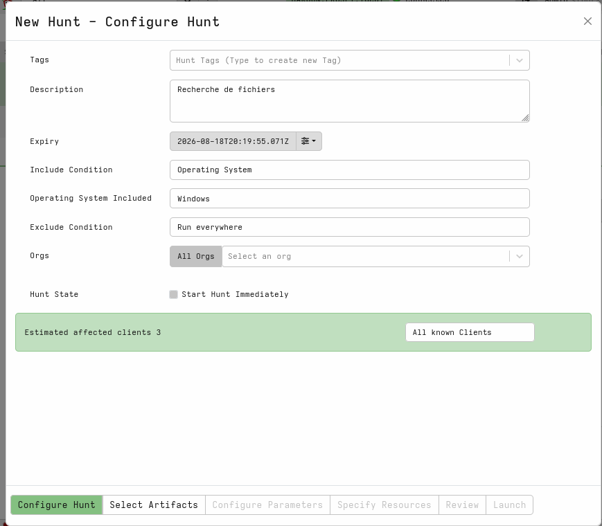
*Figure 9 — Configure Hunt tab for the file-search Hunt: OS filter set to `Windows`, estimated 3 affected clients.*

### 5.2 Select Artifacts

On the **Select Artifacts** tab, the target artifact is located via the search box. Selecting an artifact displays its full description, DFIR use case, any ATT&CK references, and its underlying **VQL source**, which is fully visible and auditable.

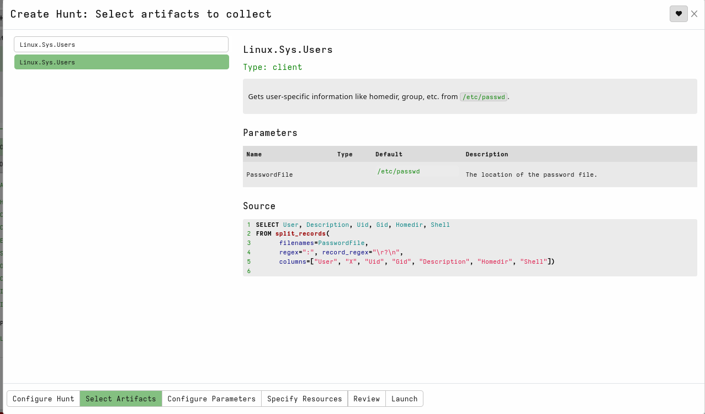
*Figure 10 — `Linux.Sys.Users` selected, showing its VQL source: a `split_records` parse of `/etc/passwd` into `User, Description, Uid, Gid, Homedir, Shell` columns.*

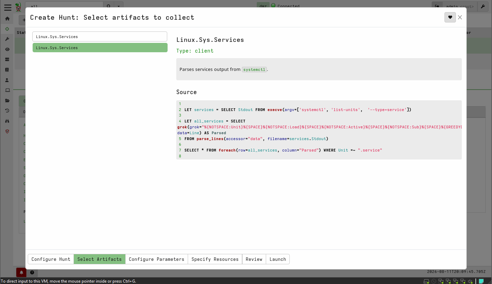
*Figure 11 — `Linux.Sys.Services` selected: the VQL wraps `execve('systemctl', ['list-units','--type=service'])` and Grok-parses each line into structured fields.*

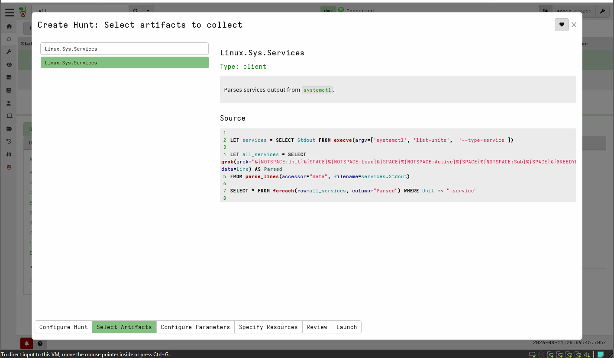
*Figure 12 — Full `Linux.Sys.Services` query, filtering parsed rows down to entries whose `Unit` ends in `.service`.*

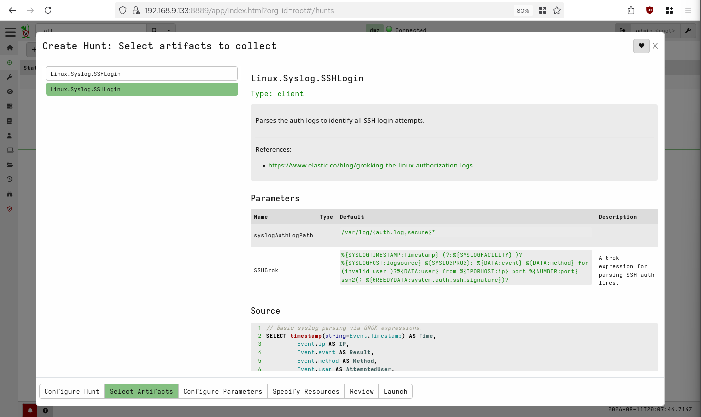
*Figure 13 — `Linux.Syslog.SSHLogin` selected, showing the default log path (`/var/log/{auth.log,secure}*`), the dedicated `SSHGrok` parsing pattern, and the reference to Elastic's Grokking-the-Linux-auth-logs blog post.*

Multiple artifacts can be added to a single Hunt when it makes sense to collect related evidence in one pass.

### 5.3 Configure Parameters

Each artifact exposes its own parameter set on the **Configure Parameters** tab. Parameters used in this phase are visible directly in the artifact detail panels shown above — for example:

- `Windows.System.CriticalServices` — `lookupTable` (CSV), defaulted to the standard list of critical service names: `ServiceName, WinDefend, MpsSvc, SepMasterService, SAVAdminService, SavService, wscsvc, wuauserv` (Figure 5).
- `Windows.Search.FileFinder` — `Glob` / `SearchFilesGlobTable` (CSV), used to target specific paths (e.g. `C:/Users/SomeUser/*`) rather than scanning the entire filesystem, in line with the artifact's own performance guidance to keep the operation rate-limited (20–50 ops/sec recommended) (Figure 7).
- `Windows.System.Pslist` — optional regex filters (`ProcessRegex`, `PidRegex`, `ExePathRegex`, `CommandLineRegex`, `UsernameRegex`) and boolean flags (`UntrustedAuthenticode`, `UseTracker`) left at defaults for a full, unfiltered process sweep (Figure 6).
- `Linux.Sys.Users` — `PasswordFile`, defaulted to `/etc/passwd` (Figure 10).
- `Linux.Syslog.SSHLogin` — `syslogAuthLogPath` (defaulted to `/var/log/{auth.log,secure}*`) and the `SSHGrok` pattern used to parse each line into `Timestamp`, `IP`, `Result`, `Method`, and `AttemptedUser` fields (Figure 13).

### 5.4 Specify Resource Limits

On the **Specify Resources** tab, guardrails are applied so that forensic collection cannot degrade endpoint or network performance:

| Limit | Value Used |
|---|---|
| CPU Limit Percent | 30% |
| IOPS/Sec | Unlimited (default) |
| Max Execution Time | 600s per artifact (default) |
| Max Rows | 1,000,000 rows (default) |
| Max Logs | 100,000 (default) |
| Max MB Uploaded | 1 GB (default) |
| Urgent | Unchecked (queued normally, not prioritized) |

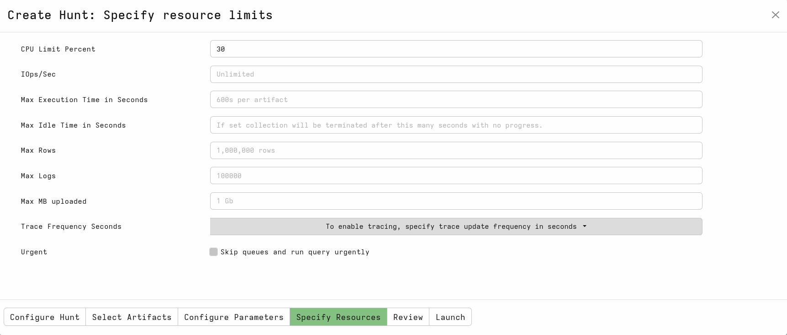
*Figure 14 — CPU capped at 30%, all other limits left at Velociraptor's safe defaults, ensuring the Hunt runs as a background task without contending with normal endpoint workloads.*

### 5.5 Review and Launch

The **Review** tab presents the full Hunt configuration — targeting filter, artifacts, parameters, and resource limits — as a final confirmation before the **Launch** tab commits it. Once launched, the Hunt appears in the Hunt Manager list (Figure 1) with a live **State** indicator, and results stream in per-client as each endpoint checks in and executes the query.

---

## 6. Example Results from Hunts

### 6.1 Linux Command History — `Linux.Sys.BashHistory`

The `BashHistory` Hunt (`H.D9SUMD8LA9JEC`) was scheduled against the `dmz` client and collected 50 lines from `/home/linux/.bash_history`. Results are reviewed in the Hunt's **Notebook** tab, which presents each recovered line alongside its source path, Flow ID, Client ID, and FQDN for full traceability:

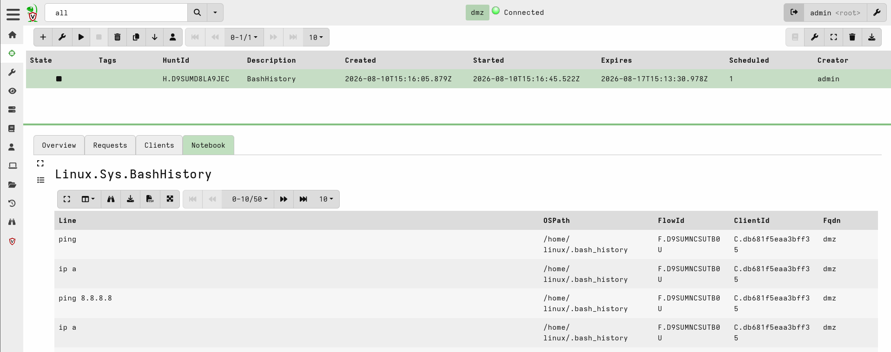
*Figure 15 — Notebook view of the `BashHistory` Hunt: recovered commands (`ping`, `ip a`, `ping 8.8.8.8`, ...) from `/home/linux/.bash_history` on client `C.db681f5eaa3bff35` (FQDN `dmz`).*

**Value:** Bash history is one of the highest-signal artifacts on a compromised Linux host. It directly reveals what an operator (legitimate or attacker) typed interactively — reconnaissance commands (`ip a`), connectivity checks (`ping`), tool downloads, privilege-escalation attempts, or exfiltration commands. Because it is recovered centrally through a Hunt rather than by SSH-ing into each box, this evidence is preserved with a timestamp and chain of custody even if the attacker later attempts to clear their local history.

### 6.2 Live Bash Shell — `Linux.Sys.BashShell`

Two separate live-shell sessions were run against the DMZ-Web client using `Linux.Sys.BashShell`, which opens an interactive session rather than a one-shot query:

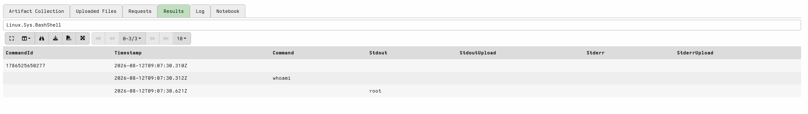
*Figure 16 — Live shell session result: `whoami` returns `root`, confirming the privilege level of the current Velociraptor session on the client.*

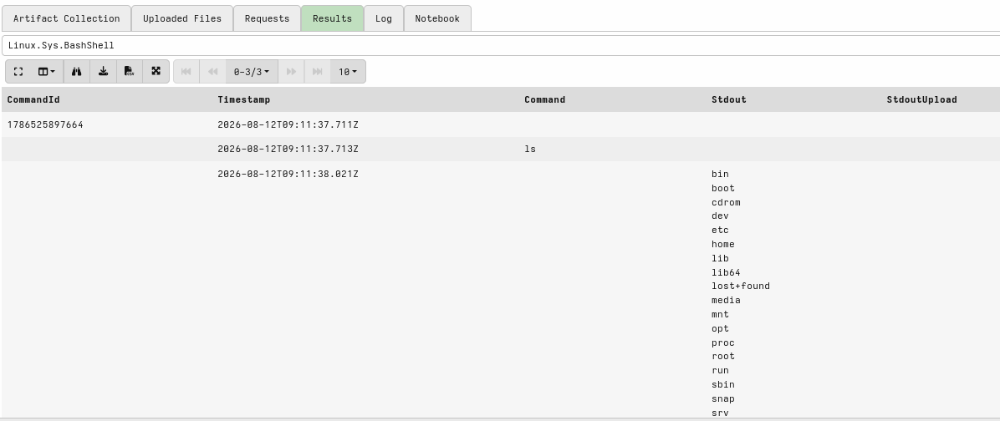
*Figure 17 — Live shell session result: `ls` returns the full root directory listing (`bin, boot, cdrom, dev, etc, home, lib, lib64, lost+found, media, mnt, opt, proc, root, run, sbin, snap, srv, ...`).*

**Value:** Unlike the fixed set of pre-built artifacts, `BashShell` gives an analyst a live, ad-hoc command channel to any enrolled endpoint. Confirming the session is running as `root` establishes the privilege level available for the collection, which matters when scoping what evidence can be reliably gathered (e.g., reading protected log files or process memory).

### 6.3 Linux Services & Users — `Linux.Sys.Services` / `Linux.Sys.Users`

The `Linux.Sys.Services` artifact enumerates all `systemd` services on the DMZ-Web host via `systemctl list-units --type=service`, with the raw output parsed using a Grok pattern into structured `Unit`, `Load`, `Active`, `Sub` fields, filtered to entries ending in `.service` (VQL source shown in Figures 11–12). The companion `Linux.Sys.Users` artifact parses `/etc/passwd` to return `User`, `Description`, `Uid`, `Gid`, `Homedir`, and `Shell` for every local account (VQL source shown in Figure 10).

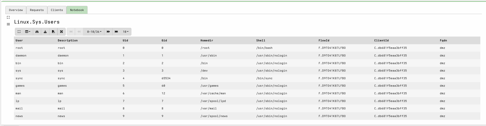

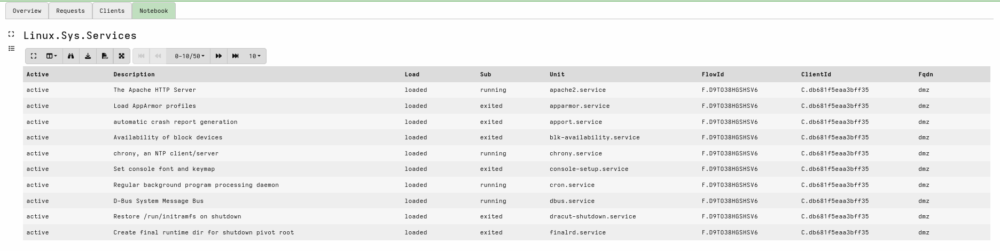

**Value:** A baseline service and account inventory makes it possible to spot an attacker-installed persistence mechanism disguised as a system service, or a new/unexpected local account (e.g., a UID 0 account that isn't `root`) — both classic persistence indicators. Running these Hunts fleet-wide, rather than host-by-host, makes it trivial to diff service and account lists across all Linux endpoints in one pass.

### 6.4 SSH Login Monitoring — `Linux.Syslog.SSHLogin`

The `Linux.Syslog.SSHLogin` artifact parses `/var/log/{auth.log,secure}*` using a dedicated Grok expression that extracts, per line: `Timestamp`, `IP` (source), `Result` (accepted/failed/invalid user), `Method` (e.g. password, publickey), and `AttemptedUser` (VQL source and Grok pattern shown in Figure 13).

---

## 7. Conclusion

Phase B's Velociraptor work moved the lab's DFIR capability from **manual, reactive, single-host triage** to a **centrally orchestrated, fleet-wide, repeatable hunting workflow**:

- Five Linux artifacts and three Windows artifacts were operationalized as Hunts, covering command history, live shell access, service inventories, local account enumeration, SSH authentication logs, process listings, critical-service health, and targeted file search.
- Every Hunt is scoped by OS, resource-limited (30% CPU cap), time-boxed with a defined expiry, and fully auditable through its VQL source, meaning the exact evidence-collection logic is reviewable and defensible.
- Evidence that previously required console access to each of the five agent endpoints (DMZ-Web, AD-DC, HAROUN, AHMED, node1) is now collected centrally through the `Security-Core` server and reviewed in one place via the Notebook interface.
- This directly, measurably reduces detection and triage time — a key metric for the portfolio's claimed risk reduction across the five professional roles (SOC, Pentest, Forensics, Malware Analysis, GRC) this lab is built to demonstrate.

---

*Report generated as part of the SOC Lab Phase B hardening effort. See the [project repository](https://github.com/ahmedargoubi/soc-lab-repo) for the full lab architecture and Phase A attack simulation documentation.*
