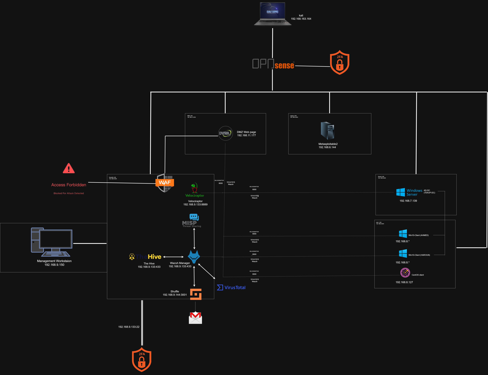

# Enterprise SOC / Red Team / DFIR / CTI / GRC Lab

> Simulation d'un réseau d'entreprise segmenté, attaqué et défendu à travers 5 rôles de cybersécurité successifs (Red Team, SOC Analyst, DFIR, CTI, GRC) sur la même infrastructure virtualisée.


---

## 🎯 Objectif du projet

**La motivation première de ce projet est de concevoir et construire une
architecture de sécurité d'entreprise réelle — segmentation, détection,
threat intelligence, réponse automatisée, gestion de case — pas
uniquement de "faire des simulations d'attaque".** Les 4 scénarios
d'attaque ne sont pas le but du projet ; ce sont des **outils de
validation** utilisés pour vérifier que l'architecture construite se
comporte comme prévu, exactement comme un architecte sécurité en
entreprise validerait une conception via des tests d'intrusion internes
plutôt que de la déployer en confiance aveugle.

Concrètement, le travail se déroule dans cet ordre :

1. **Construire** l'architecture (segmentation OPNsense, stack de
   détection, threat intel, SOAR, case management) — c'est le cœur du
   projet, documenté dans [`config/`](config/) et
   [`docs/architecture-overview.md`](docs/architecture-overview.md).
2. **Mesurer** son comportement réel avec des attaques reproductibles
   (Phase A, sans durcissement, pour une baseline honnête).
3. **Durcir** l'architecture de façon progressive et documentée (Phase B)
   — chaque mesure de durcissement est justifiée par un principe de
   conception explicite, voir
   [`docs/security-principles.md`](docs/security-principles.md).
4. **Revalider** avec les mêmes attaques (Phase C) pour mesurer
   l'amélioration réelle plutôt que supposée.

Les 5 rôles (Red Team, SOC Analyst, DFIR, CTI, GRC) ne sont donc pas des
personæ séparées d'un exercice pédagogique isolé : ce sont les 5 angles
sous lesquels **la même architecture** est construite, exploitée et
évaluée — voir Section "Les 5 rôles simulés" pour le détail concret de ce
que chaque rôle a réellement produit dans ce lab.

---

## 🏗️ Architecture

- **Hyperviseur** : VMware Workstation Pro (laptop unique, Windows)
- **Pare-feu central** : OPNsense — 6 interfaces réseau, une par zone, filtrage first-match/deny-by-default
- **Zones réseau** :

| Zone | Rôle | Machines hébergées |
|---|---|---|
| **Security_LAN** | Cœur SOC : détection, DFIR, threat intel, SOAR, case management | Security-Core (Wazuh + MISP + Velociraptor + TheHive + VirusTotal), Shuffle, WAF, Management Workstation |
| **DMZ** | Services exposés | DMZ-Web (Apache + DVWA), derrière un WAF |
| **User_LAN** | Postes utilisateurs | 2 clients Windows 10 (AHMED, HAROUN), 1 client CentOS (node1) |
| **Server_LAN** | Serveurs internes | AD-DC (Windows Server 2022 — domaine `PROJET.local`, hostname `TEKUP-DC`) |
| **Legacy** | Machine volontairement vulnérable, non supervisée | Metasploitable2 |
| **Attacker** | Poste d'attaque (NAT VMware) | Kali Linux |

### Topologie complète

**Phase A — Baseline :**


### Pourquoi commencer par la Phase A (baseline non durcie) ?

Il aurait été plus rapide de construire l'architecture durcie directement
et de la tester une seule fois. Ce n'est délibérément pas ce qui a été
fait, pour trois raisons :

1. **Sans mesure "avant", une amélioration ne peut pas être prouvée —
   seulement supposée.** Affirmer que le SOAR "accélère la réponse" ou
   que le WAF "bloque les attaques" n'a de valeur que si on peut le
   comparer à un état sans ces protections. La Phase A donne ce point de
   comparaison honnête : quatre attaques, sur l'infrastructure telle que
   construite, sans aucune protection ajoutée.
2. **Éviter le biais de confirmation.** En construisant l'architecture
   durcie en premier, il devient facile de supposer qu'elle fonctionne
   comme prévu sans jamais la challenger réellement. Attaquer d'abord la
   version non protégée oblige à observer ce qui se passe réellement —
   par exemple, le fait que la segmentation seule ne bloque pas un
   Pass-the-Hash via un flux SMB légitime (Simulation 4) n'aurait pas été
   aussi clairement identifié si le WAF, TheHive et Shuffle avaient déjà
   été en place dès le départ.
3. **C'est la méthodologie GRC standard.** Établir une baseline avant
   remédiation, puis mesurer l'écart après remédiation, est la démarche
   attendue dans toute évaluation de maturité sécurité sérieuse (NIST CSF
   2.0 y compris) — ce lab suit cette méthodologie plutôt que d'annoncer
   une architecture "sécurisée" sans preuve mesurée à l'appui.

La Phase A n'est donc pas une étape "attaque pour attaquer" séparée du
reste du projet — c'est la mesure de référence sans laquelle la Phase B
(durcissement) et la Phase C (revalidation) n'auraient aucune valeur
démonstrative.


**Phase B — Durcissement + Automatisation :**



📄 Détails complets : [`docs/architecture-overview.md`](docs/architecture-overview.md) · [`docs/network-topology.md`](docs/network-topology.md)

**Note :** certaines machines ont changé de sous-réseau plusieurs fois au cours du projet à cause de bugs de configuration VMware/OPNsense. Les IPs réelles utilisées dans chaque simulation sont documentées dans les rapports individuels et dans le [journal de dépannage](docs/troubleshooting-journal.md) — elles ne sont pas rétroactivement uniformisées.

---

## 🛠️ Stack de sécurité

| Outil | Rôle | Déploiement |
|---|---|---|
| **Wazuh** | SIEM | Manager sur Security-Core, agents sur AD-DC, DMZ-Web, clients Windows/CentOS |
| **Velociraptor** | DFIR | Installation native sur Security-Core, agents sur les mêmes cibles |
| **MISP** | Threat Intelligence | Docker sur Security-Core |
| **VirusTotal** | Enrichissement threat intel | Intégré à Wazuh pour la vérification de hashs/IOCs |
| **Shuffle** | SOAR — automatisation de la réponse | Self-hosted, VM dédiée (`node4`, `192.168.9.144:3001`) |
| **TheHive** | Case management | Sur Security-Core, `192.168.9.133` |
| **SafeLine WAF** | Protection applicative devant la DMZ | Devant DVWA |
| **Suricata** | NIDS | Interfaces WAN, DMZ et Security_LAN d'OPNsense |
| **Kali Toolset** | Red Team | Metasploit, nmap, sqlmap, Responder, impacket, SharpHound/BloodHound, John the Ripper, Hydra |

📄 Guides d'installation/configuration détaillés : [`config/`](config/)

---

## 🎭 Les 5 rôles simulés

```
Red Team  →  SOC Analyst (Wazuh + TheHive)  →  DFIR (Velociraptor)  →  CTI (MITRE + MISP + VirusTotal)  →  GRC (NIST CSF 2.0)
```

Chaque simulation d'attaque est rejouée à travers ces 5 angles d'analyse. Ce ne sont pas des rôles séparés artificiellement : c'est la **même chaîne d'incident**, vue à chaque étape par l'outil/discipline correspondant.

### 🔴 Red Team
Exécute l'attaque depuis Kali — injection SQL/commande (Sim 1), exploitation de backdoor (Sim 2), exécution de ransomware réel (Sim 3), LLMNR poisoning → Pass-the-Hash → BloodHound (Sim 4), brute force SSH via Hydra (Phase B).

### 🔵 SOC Analyst — Wazuh + TheHive
- **Détection (Wazuh)** : les alertes sont mesurées avec leur `rule.id` et `rule.level` réels — ex. rule `5763` (brute force SSH, niveau 10), rule `92652` (Pass-the-Hash), rules `554/553/550` (FIM, WannaCry). Le TTD (temps de détection) de chaque simulation est mesuré, pas estimé — voir [`phase-a-summary.md`](reports/phase-a-baseline/phase-a-summary.md), section 2.
- **Triage et gestion de case (TheHive)** : chaque alerte qualifiante (Phase B) devient un case structuré — tags hérités de Wazuh, observables extraits automatiquement, classification TLP/PAP, checklist de tâches d'investigation, clôture formelle avec un statut de résolution (`TruePositive`, etc.). Voir [`phase-b-brute-force-blocking.md`](reports/phase-b-hardening/config/phase-b-brute-force-blocking.md), section Case Management.

### 🟢 DFIR — Velociraptor
Collecte forensique post-incident sur les hôtes compromis : artefacts, processus, timeline, mémoire. C'est la discipline qui répond à la question que Wazuh seul ne couvre pas — pas seulement *"une attaque a eu lieu"*, mais *"qu'est-ce que l'attaquant a fait exactement une fois dedans"*. Voir [`DFIR/velociraptor-dfir.md`](DFIR/velociraptor-dfir.md).

### 🟡 CTI — MITRE ATT&CK (dans Wazuh) + MISP + VirusTotal
- **Mapping MITRE ATT&CK directement dans les règles Wazuh** : chaque alerte qualifiante porte ses champs `rule.mitre.id` / `rule.mitre.tactic` / `rule.mitre.technique` — ex. `T1110` / `Credential Access` / `Brute Force` pour la rule `5763`, exploités tels quels par l'analyste sans recherche manuelle supplémentaire.
- **MISP** : corrélation d'IOCs (hashs de fichiers via FIM) entre les alertes Wazuh et des indicateurs de menace connus — voir [`config/wazuh-misp-integration.md`](reports/phase-b-hardening/config/wazuh-misp-integration.md).
- **VirusTotal** : enrichissement automatique des hashs/IOCs observés — voir [`config/virustotal-integration.md`](reports/phase-b-hardening/config/virustotal-integration.md).

### ⚪ GRC
Évalue la maturité de la réponse à chaque phase, documente explicitement les gaps de conception assumés (ex. Legacy_LAN sans agent) et les compromis réels (ex. MFA non centralisé) plutôt que de les masquer — voir [`docs/security-principles.md`](docs/security-principles.md).

---

## 📂 Simulations — Phase A (Baseline)

| # | Simulation | Zone cible | Rapport |
|---|---|---|---|
| 1 | DVWA — SQL Injection & Command Injection | DMZ | [`simulation-1-dvwa.md`](reports/phase-a-baseline/simulation-1-dvwa.md) |
| 2 | Metasploitable2 — Backdoor & pivot test | Legacy | [`simulation-2-metasploitable-pivot.md`](reports/phase-a-baseline/simulation-2-metasploitable-pivot.md) |
| 3 | WannaCry — Exécution de ransomware réel | User_LAN | [`simulation-3-wannacry-ransomware.md`](reports/phase-a-baseline/simulation-3-wannacry-ransomware.md) |
| 4 | Active Directory — LLMNR Poisoning, Pass-the-Hash, BloodHound | Server_LAN | [`simulation-4-active-directory.md`](reports/phase-a-baseline/simulation-4-active-directory.md) |

📊 Comparatif des 4 simulations : [`phase-a-summary.md`](reports/phase-a-baseline/phase-a-summary.md)

---

## 🔧 Phase B — Durcissement + Automatisation

| Item | Statut | Détails |
|---|---|---|
| MFA — OPNsense (admin GUI) | ✅ Configuré | TOTP natif OPNsense — [`config/opnsense-mfa.md`](reports/phase-b-hardening/config/opnsense-mfa.md) |
| MFA — SSH (Security-Core) | ✅ Testé et confirmé | `libpam-google-authenticator` — [`config/security-core-ssh-mfa.md`](reports/phase-b-hardening/config/security-core-ssh-mfa.md) |
| Intégration Wazuh ↔ MISP | ✅ Fonctionnelle | Corrélation de hashs via FIM — [`config/wazuh-misp-integration.md`](reports/phase-b-hardening/config/wazuh-misp-integration.md) |
| Intégration Wazuh ↔ VirusTotal | ✅ Fonctionnelle | [`config/virustotal-integration.md`](reports/phase-b-hardening/config/virustotal-integration.md) |
| SOAR (Shuffle) — détection & blocage automatique brute-force | ✅ Testé de bout en bout | Wazuh → Shuffle → blocage actif de l'IP → TheHive → email — [`phase-b-brute-force-blocking.md`](reports/phase-b-hardening/config/phase-b-brute-force-blocking.md) |
| TheHive — case management | ✅ Fonctionnel | Intégré au pipeline ci-dessus |
| SafeLine WAF (DMZ) | ✅ Déployé | [`config/safeline-waf.md`](reports/phase-b-hardening/config/safeline-waf.md) |
| Durcissement Active Directory (LAPS, LLMNR/NBT-NS, Kerberos) | ✅ Configuré | [`config/phase-b-ad-hardening.md`](reports/phase-b-hardening/config/phase-b-ad-hardening.md) |
| Durcissement postes clients Windows | ✅ Configurés | [`config/windows-client-hardening.md`](reports/phase-b-hardening/config/windows-client-hardening.md) |

⚠️ **Point GRC à noter :** le MFA n'a pas été centralisé sur un seul mécanisme comme prévu initialement (privacyIDEA partout) — contrainte de temps. Résultat : trois approches différentes selon le point d'accès (TOTP natif OPNsense, PAM Google Authenticator pour SSH, rien encore pour Windows/AD). Ce compromis est documenté en détail dans chaque guide `config/` correspondant, avec la recommandation de centraliser via privacyIDEA en itération future.

📄 Suivi détaillé : [`reports/phase-b-hardening/README.md`](reports/phase-b-hardening/README.md) · [`opnsense-firewall-rules-post-hardening.md`](network/opnsense-firewall-rules-post-hardening.md) (comparatif des règles de pare-feu avant/après durcissement — à venir)

---

## 🧭 Principes de conception

Les choix de segmentation, les gaps volontaires (ex. Legacy_LAN sans
agent), l'équilibre entre automatisation et contrôle humain, et la
philosophie de transparence sur les incohérences rencontrées en cours de
projet sont documentés dans
[`docs/security-principles.md`](docs/security-principles.md).

---

## 🗺️ Structure du dépôt

```
/
├── README.md
├── docs/
│   ├── architecture-overview.md
│   ├── network-topology.md
│   ├── security-principles.md
│   ├── troubleshooting-journal.md
│   └── roadmap.md
├── config/
│   ├── README.md
│   ├── opnsense.md
│   ├── wazuh.md
│   ├── shuffle.md
│   ├── thehive.md
│   ├── velociraptor.md
│   ├── misp.md
│   └── active-directory.md
├── network/
│   ├── opnsense-firewall-rules.md
│   ├── opnsense-firewall-rules-post-hardening.md
│   └── diagrams/
│       ├── phase-a-topology.png
│       └── phase-b-topology.jpg
├── reports/
│   ├── phase-a-baseline/
│   │   ├── simulation-1-dvwa.md
│   │   ├── simulation-2-metasploitable-pivot.md
│   │   ├── simulation-3-wannacry-ransomware.md
│   │   ├── simulation-4-active-directory.md
│   │   └── phase-a-summary.md
│   ├── phase-b-hardening/
│   │   ├── README.md
│   │   └── config/
│   │       ├── phase-b-brute-force-blocking.md
│   │       ├── phase-b-ad-hardening.md
│   │       ├── opnsense-mfa.md
│   │       ├── security-core-ssh-mfa.md
│   │       ├── safeline-waf.md
│   │       ├── virustotal-integration.md
│   │       ├── wazuh-misp-integration.md
│   │       └── windows-client-hardening.md
│   └── phase-c-reattack/       (à venir)
├── scripts/
│   ├── wazuh-install.sh
│   ├── custom-w2thive.py
│   └── custom-w2thive
└── DFIR/
    └── velociraptor-dfir.md
```

---


