# Installation & Configuration — Active Directory

Configuration du contrôleur de domaine et des objets Active Directory pour le lab, sur la zone **Server_LAN** (`192.168.7.0/24`).

---

## 1. Contrôleur de domaine

| Paramètre | Valeur |
|---|---|
| Hostname | `TEKUP-DC` |
| OS | Windows Server 2022 Standard Evaluation |
| Domaine | `PROJET.local` |
| IP | `192.168.7.139` |
| Forest functional level | `Windows Server 2016` |
| Domain functional level | `Windows Server 2016` |
| NetBIOS domain name | `PROJET` |
| DSRM password | Défini lors de la promotion (non visible) |

### 1.1 – Promotion en Domain Controller

Le rôle **Active Directory Domain Services** a été installé et configuré via l'assistant AD DS Configuration Wizard. La promotion s'est terminée avec succès (`This server was successfully configured as a domain controller`), avec un redémarrage automatique du serveur.

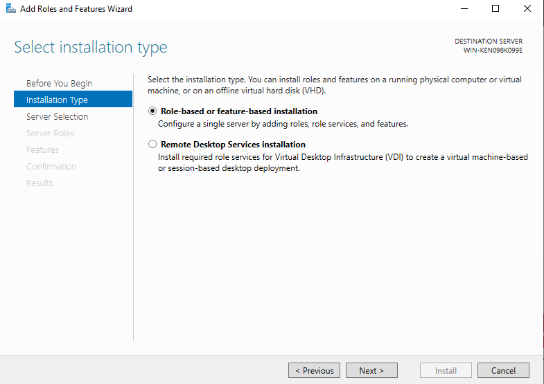
*Sélection du type d'installation : "Role-based or feature-based installation".*

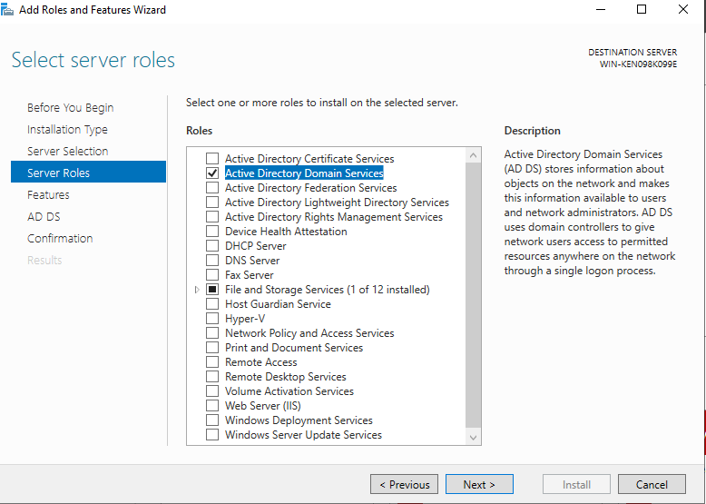
*Sélection du rôle "Active Directory Domain Services".*

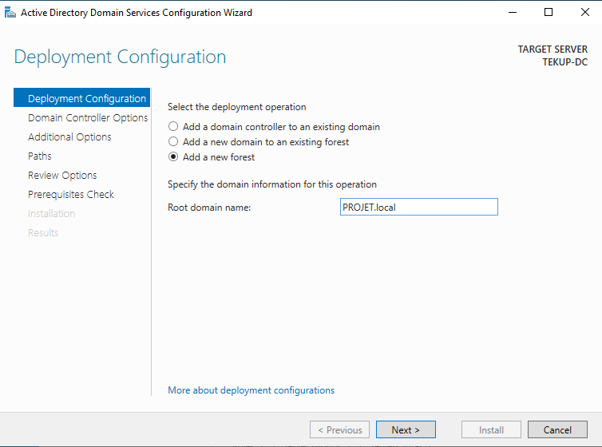
*Déploiement : "Add a new forest" avec le domaine `PROJET.local`.*

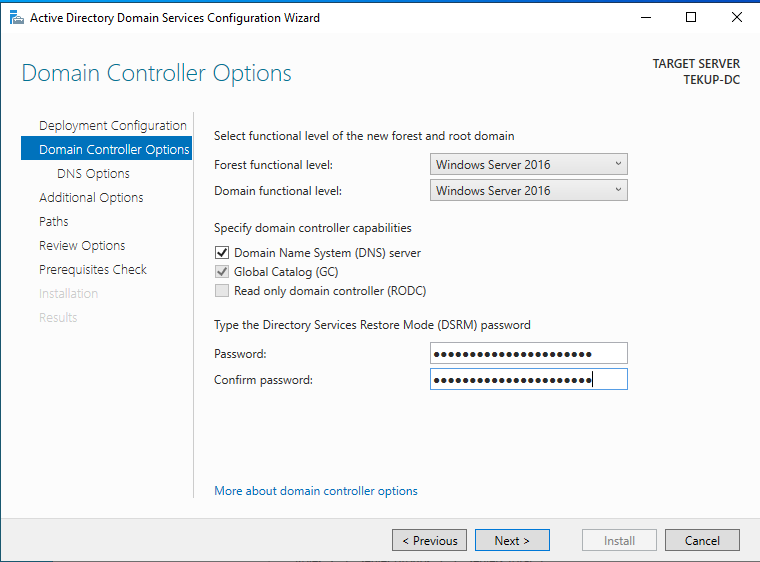
*Options du contrôleur de domaine : DNS Server, Global Catalog, DSRM password.*

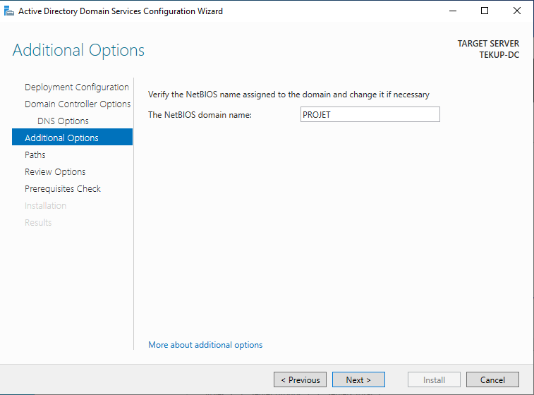
*NetBIOS domain name : `PROJET`.*

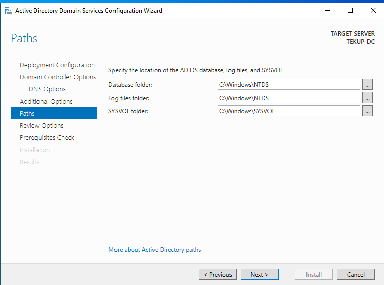
*Chemins par défaut pour la base de données NTDS, les logs et SYSVOL.*

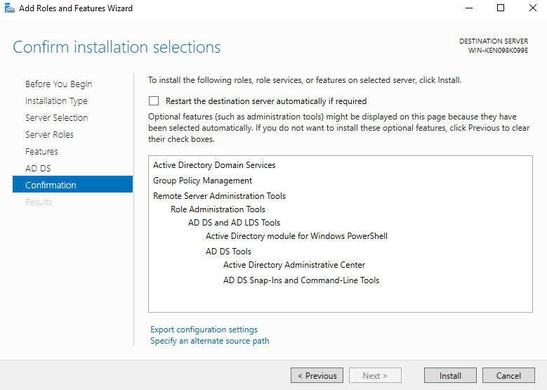
*Confirmation des rôles et fonctionnalités à installer.*

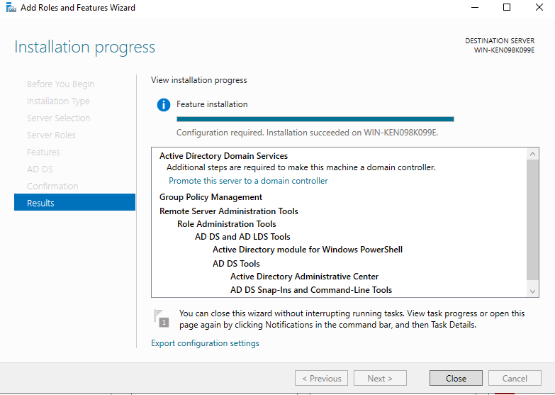
*Installation réussie avec message "Configuration required. Installation succeeded".*

**Avertissement noté pendant l'installation :** Windows Server 2022 applique par défaut le paramètre de sécurité *"Allow cryptography algorithms compatible with Windows NT 4.0"*, qui désactive les algorithmes de chiffrement faibles lors de l'établissement des canaux sécurisés — comportement par défaut, aucune action requise.

### 1.2 – Renommage du serveur

Le serveur a été renommé `TEKUP-DC` avant ou pendant la promotion, comme visible dans les paramètres système.

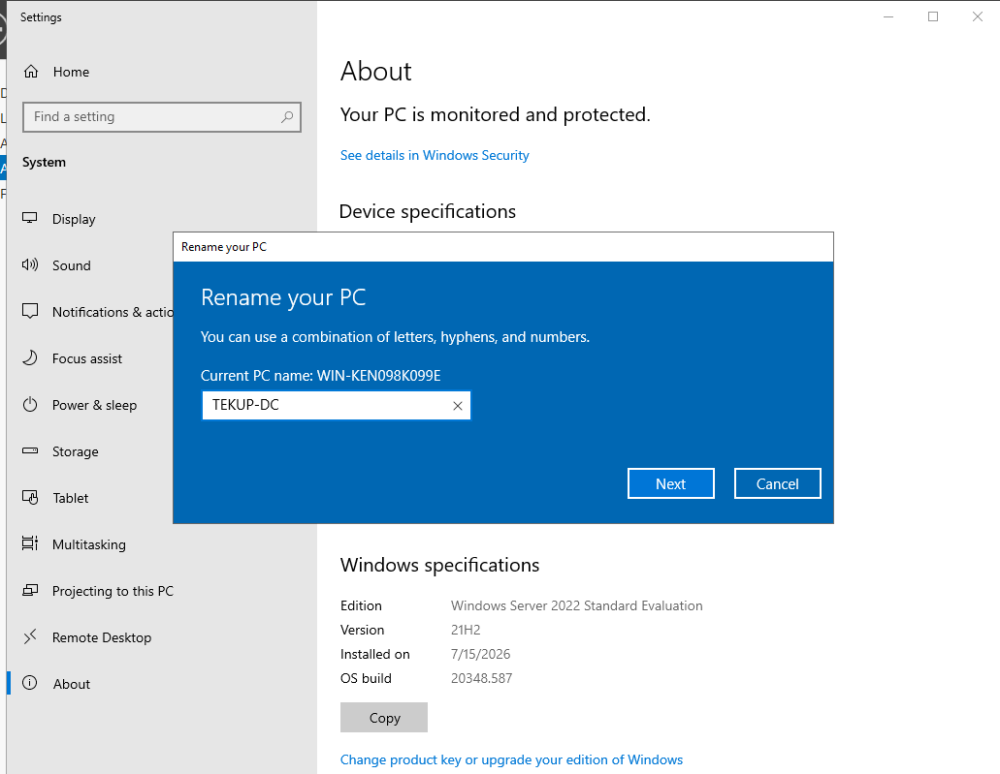
*Renommage du serveur en `TEKUP-DC`.*

### 1.3 – DNS

Le rôle DNS Server a été installé conjointement à la promotion AD DS. La zone `TEKUP-DC.PROJET.local` est créée automatiquement et visible dans la console **DNS Manager**.

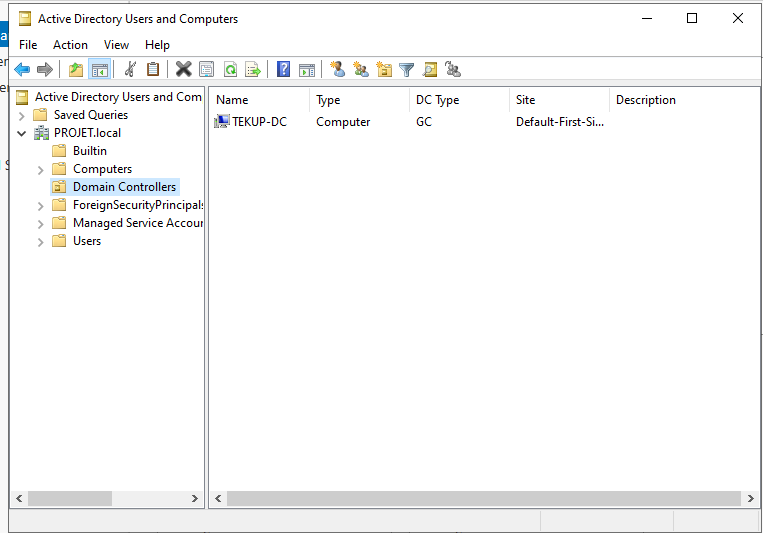
*Zone DNS `TEKUP-DC.PROJET.local` visible dans DNS Manager.*

**Tests de résolution (capture `cap37`) :**

```cmd
C:\Users\ahmed>ping 192.168.7.139
Réponses reçues (0% perte)

C:\Users\ahmed>nslookup PROJET.local
Server:  Unknown
Address: 192.168.7.139
Name:    PROJET.local
Address: 192.168.7.139
```

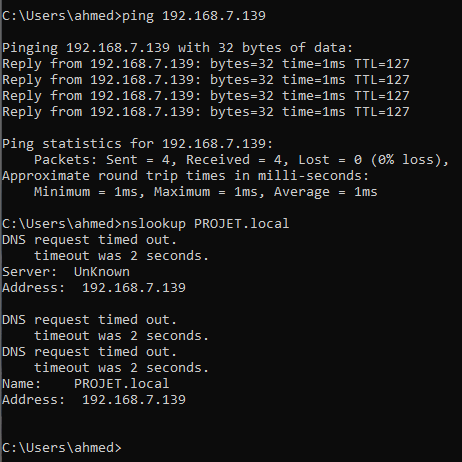
*Ping et résolution DNS vers le contrôleur de domaine.*

---

## 2. Essais de jonction de domaine (avant configuration DNS correcte)

Avant que le contrôleur de domaine soit pleinement fonctionnel, plusieurs tentatives de jonction ont échoué avec le message *"That domain couldn't be found. Check the domain name and try again."* :

| Nom de domaine testé | Résultat |
|---|---|
| `PROJET.local` | ❌ Domaine introuvable |
| `TEKUP.local` | ❌ Domaine introuvable |

Ces échecs correspondent à une phase où le DNS des clients ne pointait probablement pas encore vers `TEKUP-DC`, ou le contrôleur n'était pas encore pleinement promu. La jonction a fini par réussir une fois `PROJET.local` pleinement opérationnel.


*Message "That domain couldn't be found" lors de la tentative de jonction.*

---

## 3. Postes clients joints au domaine

| Nom de PC (avant jonction) | Nom final | Type |
|---|---|---|
| `DESKTOP-A9LLDAQ` | `AHMED` | Computer (Win10-Client) |
| `DESKTOP-A9LLDAQ` | `HAROUN` | Computer (Win10-Client) |

Les deux machines apparaissent dans **Active Directory Users and Computers → PROJET.local → Computers** une fois la jonction réussie.

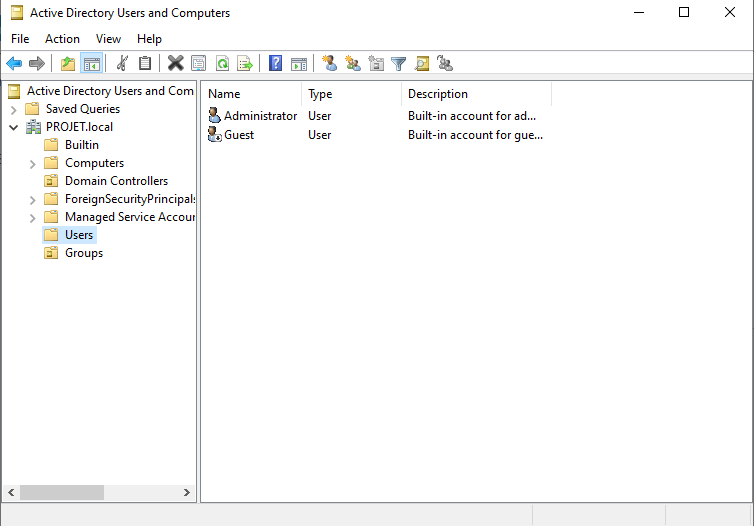
*Postes AHMED et HAROUN visibles dans le conteneur Computers.*


*Vue d'ensemble du conteneur Computers avec les postes joints.*

---

## 4. Comptes utilisateurs créés

Plusieurs comptes ont été créés par copie d'utilisateurs existants (`Copy Object - User`), avec l'option **"Password never expires"** activée systématiquement.

| Utilisateur créé | Copié depuis | Login | Notes |
|---|---|---|---|
| Ahmed arg (`ahmed`) | - | `ahmed@PROJET.local` | Compte standard (créé directement) |
| Haroun Rashid (`Haroun`) | Administrator | `Haroun@PROJET.local` | Compte privilégié (copié depuis Admin) |
| SQL service (`SQLservice`) | Haroun Rashid | `SQLservice@PROJET.local` | Compte de service — candidat probable pour Kerberoasting |
| Mohamed arg (`Mohamed`) | Ahmed arg | `Mohamed@PROJET.local` | Copié depuis un compte standard |

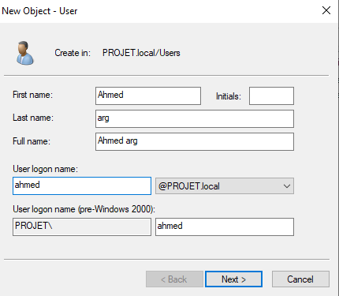
*Création du compte ahmed.*

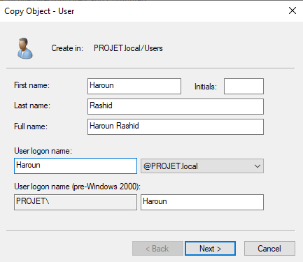
*Création du compte Haroun Rashid.*

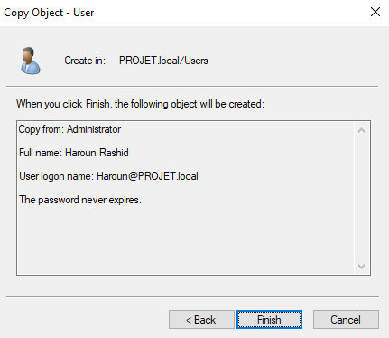
*Copie du compte Haroun Rashid avec option "Password never expires".*

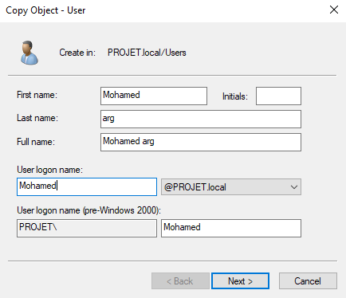
*Création du compte Mohamed arg.*

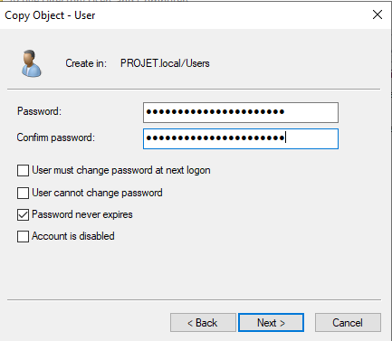
*Définition du mot de passe avec option "Password never expires".*

### 4.1 – Appartenance aux groupes

**Haroun Rashid** — compte fortement privilégié :

| Groupe |
|---|
| Administrators (Builtin) |
| Domain Admins |
| Domain Users |
| Enterprise Admins |
| Group Policy Creator Owners |
| Schema Admins |


*Appartenance de Haroun Rashid aux groupes Domain Admins, Enterprise Admins, Schema Admins, etc.*

⚠️ Ce niveau de privilège sur un compte utilisateur standard est **la faille exploitée dans la Simulation 3 (WannaCry)** — `haroun` étant Domain Admin, le ransomware exécuté sous son contexte a pu désactiver Windows Defender sans invite UAC. Voir `reports/phase-a-baseline/simulation-3-wannacry-ransomware.md`, section 3.5 et 5.3.

**Mohamed arg** — compte standard, non privilégié :

| Groupe |
|---|
| Domain Users |

---

## 5. Service Principal Names (SPN) – candidats Kerberoasting

Un SPN a été explicitement ajouté pour le compte `SQLservice` :

```cmd
setspn -a TEKUP-DC/SQLservice.PROJET.local:60111 PROJET\SQLservice
```

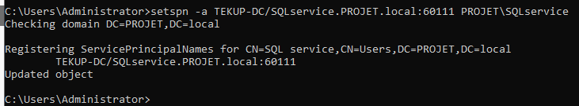
*Ajout du SPN `TEKUP-DC/SQLservice.PROJET.local:60111` pour le compte `PROJET\SQLservice`.*

Cela rend le compte `SQLservice` Kerberoastable (car il possède un SPN). Le mot de passe du compte ayant été défini avec Password never expires, il constitue une cible idéale pour une attaque Kerberoasting — exploitée dans la Simulation 4 (`reports/phase-a-baseline/simulation-4-active-directory.md`).

La liste complète des SPN du domaine est visible avec la commande :

```cmd
setspn -T PROJET.local -Q */*
```

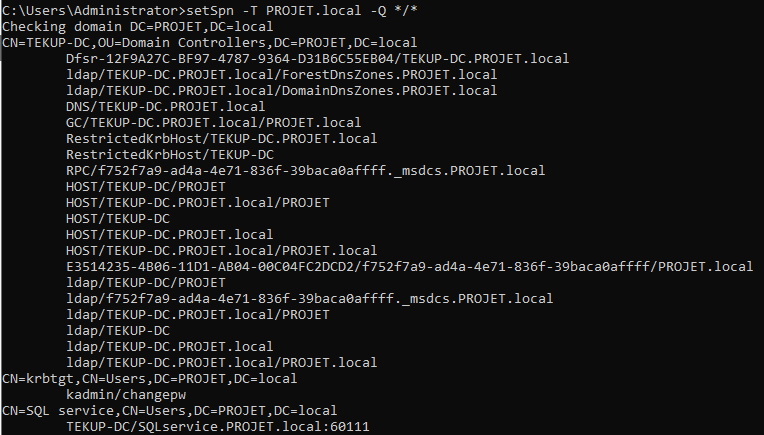
*Liste des SPN du domaine PROJET.local, incluant celui de SQLservice.*

Un autre SPN est visible dans les captures (`HYDRA-DC/SQLService.MARVEL.local:60111`) mais il s'agit d'un test antérieur (domaine MARVEL.local) ; il n'est pas actif dans PROJET.local.

---

## 6. Gestion des stratégies de groupe (GPO) — faiblesses intentionnelles

Plusieurs GPO ont été créées ou modifiées pour affaiblir la sécurité du domaine à des fins pédagogiques :

| GPO | Paramètre | Impact |
|---|---|---|
| Turn off Microsoft Defender Antivirus | Enabled | Désactive Microsoft Defender sur les postes clients, permettant l'exécution de ransomwares (Simulation 3) sans être bloqués. |

La GPO est visible dans la console Group Policy Management et liée au domaine PROJET.local.

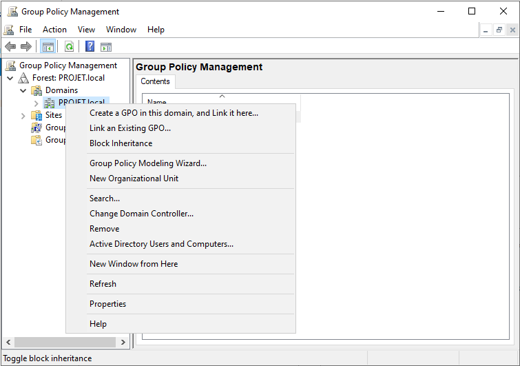
*Console Group Policy Management avec la GPO créée.*

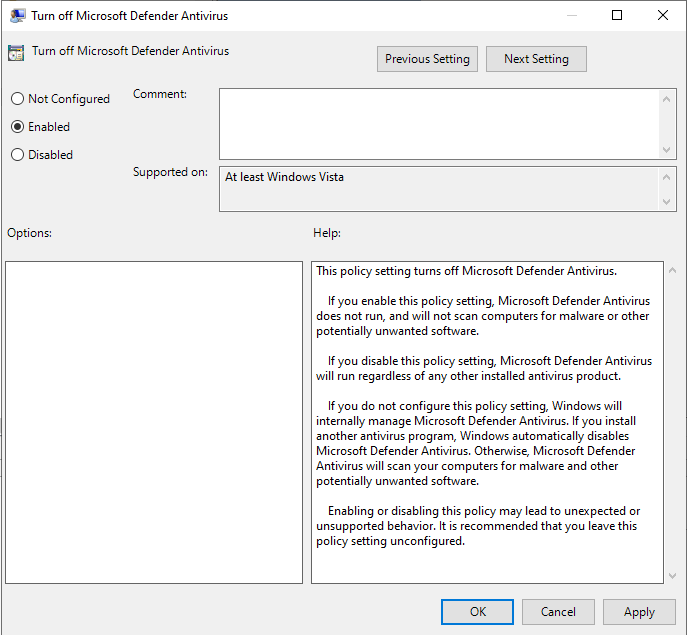
*Paramètre de la GPO : "Turn off Microsoft Defender Antivirus" activé.*

⚠️ Cette GPO a permis au ransomware WannaCry (Simulation 3) de s'exécuter sans être bloqué par Windows Defender, car le compte haroun (Domain Admin) a pu désactiver la protection.

---

## 7. Partages réseau (SMB)

Plusieurs partages ont été créés sur le contrôleur de domaine :

| Nom du partage | Chemin local | Type | Objectif |
|---|---|---|---|
| NETLOGON | `C:\Windows\SYSVOL\sysvol\PROJET.local\scripts` | SMB | Partage système AD (scripts de connexion) |
| SYSVOL | `C:\Windows\SYSVOL\sysvol` | SMB | Répertoire système AD (stratégies) |
| hackme | `C:\Shares\hackme` | SMB | Partage volontairement exposé (trop permissif) pour simuler une exfiltration ou un pivot |
| share (sur AHMED) | `C:\share` | SMB | Partage créé sur le poste client AHMED |

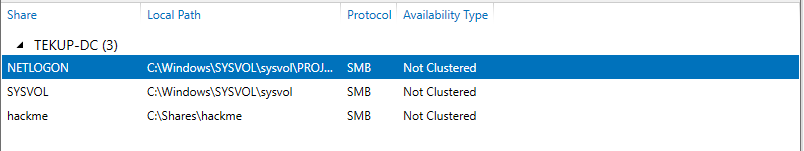
*Partages NETLOGON, SYSVOL et hackme sur le contrôleur de domaine.*

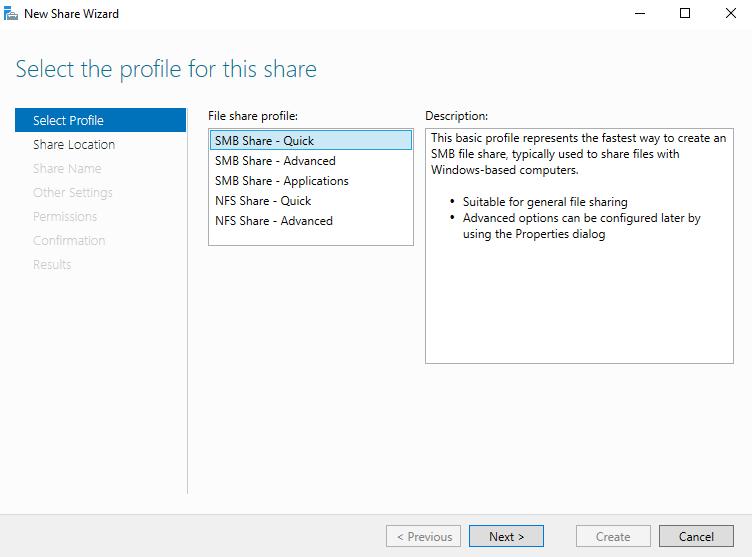
*Sélection du profil "SMB Share - Quick" pour le partage hackme.*

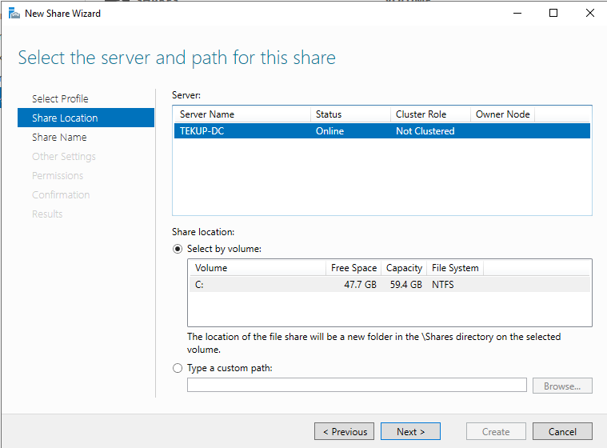
*Chemin du partage : C:\Shares\hackme.*

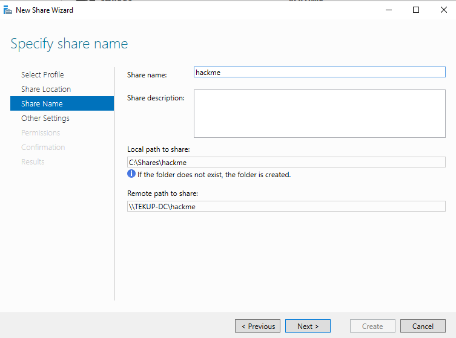
*Nom du partage : hackme.*

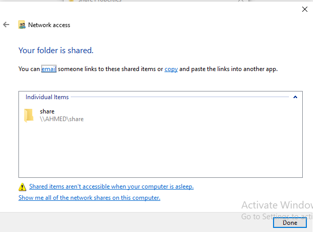
*Partage share créé sur le poste client AHMED.*

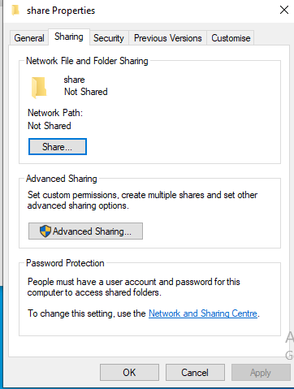
*Propriétés du partage share sur AHMED.*

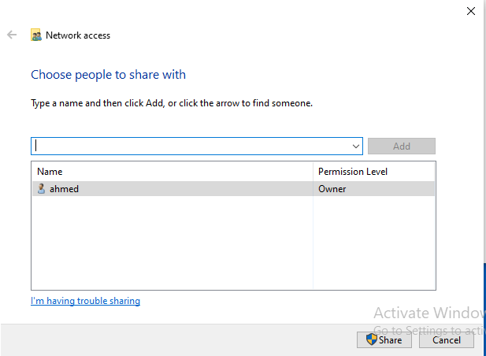
*Ajout de l'utilisateur Ahmed comme propriétaire du partage.*

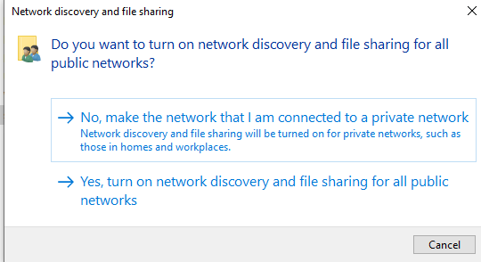
*Activation du partage réseau et découverte réseau.*

Le partage hackme a été créé avec le profil "SMB Share - Quick" et est accessible depuis les postes du domaine. Il est utilisé dans les simulations de pivot/latéral (notamment Simulation 2) pour démontrer les risques de partages mal sécurisés.

---

## 8. Configuration Dnsmasq sur OPNsense

Le service Dnsmasq DNS & DHCP sur OPNsense a été configuré pour gérer les zones réseau et les interfaces.

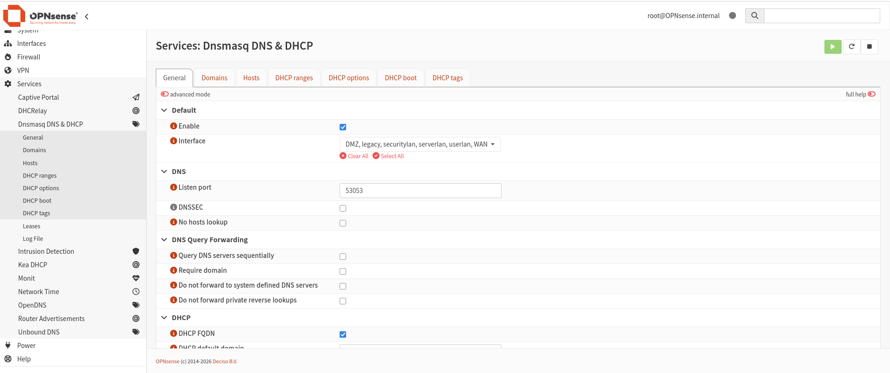
*Configuration générale de Dnsmasq avec les interfaces sélectionnées.*

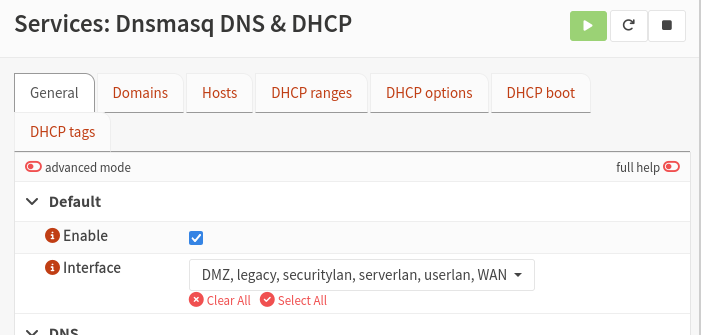
*Interfaces activées : DMZ, legacy, securitylan, serverlan, userlan, WAN.*

---

## 9. Récapitulatif des faiblesses intentionnelles introduites

| Faiblesse | Objectif pédagogique | Simulation liée |
|---|---|---|
| haroun cumule Domain Admins + Enterprise Admins + Schema Admins | Démontrer l'impact d'un compte utilisateur sur-privilégié | Sim 3 (WannaCry), Sim 4 (BloodHound) |
| Compte SQLservice avec SPN et mot de passe n'expirant jamais | Cible Kerberoasting | Sim 4 (AD Attack) |
| Mot de passe faible sur ahmed (TempPass123!) | Démontrer la faisabilité du cassage offline après capture NTLMv2 | Sim 4 (LLMNR Poisoning) |
| GPO désactivant Microsoft Defender | Permettre l'exécution de ransomware sans détection AV | Sim 3 (WannaCry) |
| Partage hackme accessible à tous | Simuler un point d'exfiltration ou de stockage de payloads | Sim 2 (pivot) |
| Comptes avec Password never expires | Faciliter le Kerberoasting et la persistance | Sim 4 (AD Attack) |
