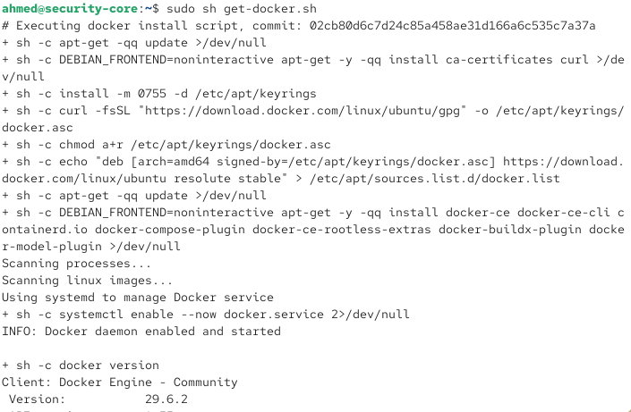
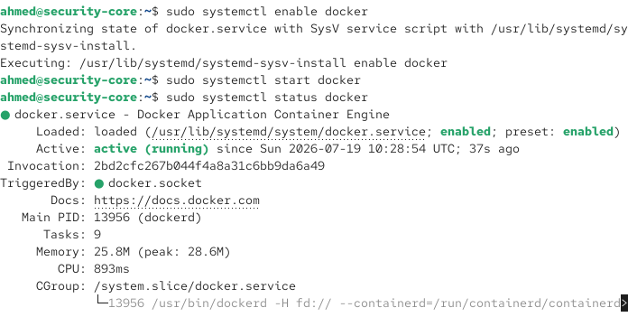
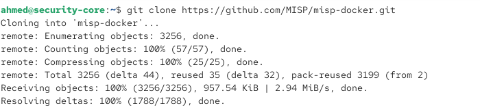
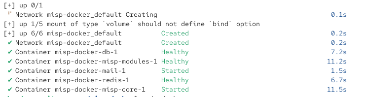
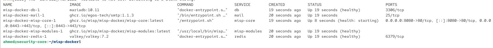
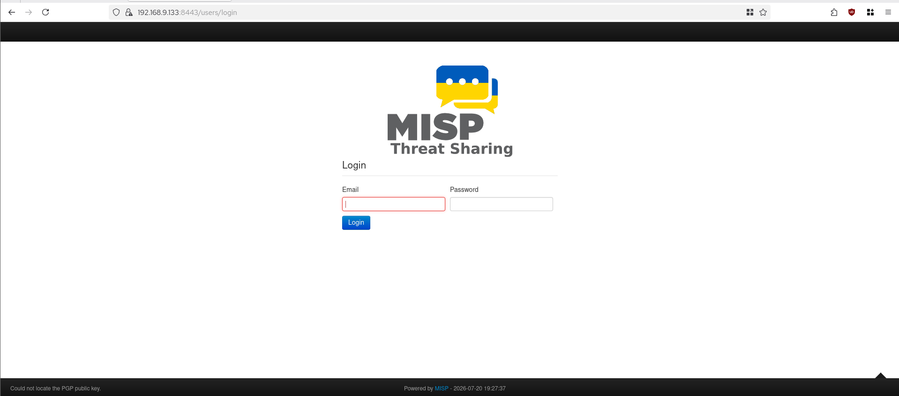

# MISP — Configuration Guide

Guide complet du déploiement de MISP via Docker Compose sur Security-Core, incluant les correctifs appliqués pendant le build.

## 1. Prérequis — Docker

MISP est déployé via Docker Compose (contrairement à Wazuh et Velociraptor, déployés nativement dans ce lab). Installer Docker au préalable :

```bash
curl -fsSL https://get.docker.com -o get-docker.sh
sudo sh get-docker.sh
sudo systemctl enable docker
sudo systemctl start docker
sudo usermod -aG docker $USER
```

<br>


> **Note** : le script officiel `apt-get`/repo Docker classique a échoué sur Ubuntu 26.04 (codename trop récent, non encore reconnu par le dépôt Docker officiel) — le script de convenance `get.docker.com` a résolu ce problème automatiquement.

## 2. Récupération du projet officiel

```bash
cd ~
git clone https://github.com/MISP/misp-docker.git
cd misp-docker
cp template.env .env
```



## 3. Configuration du fichier `.env`

```bash
nano .env
```

Variables essentielles à définir — **⚠️ ne jamais laisser d'espace après le `=`**, cela corrompt la valeur (piège rencontré pendant le build : `ADMIN_EMAIL= user@mail.com` au lieu de `ADMIN_EMAIL=user@mail.com`) :

```
ADMIN_EMAIL=votre-email@example.com
ADMIN_PASSWORD=VotreMotDePasseSolide!
BASE_URL=https://192.168.9.133:8443
MYSQL_PASSWORD=VotreMotDePasseSolide!
MISP_EMAIL=votre-email@example.com
CORE_HTTP_PORT=8080
CORE_HTTPS_PORT=8443
```

> **Important sur `CORE_HTTPS_PORT`** : par défaut, MISP tente de se lier au port **443**, qui entre en conflit avec le dashboard Wazuh (qui utilise aussi 443) s'ils sont sur la même machine. Toujours définir explicitement `CORE_HTTP_PORT` et `CORE_HTTPS_PORT` sur des ports alternatifs (8080/8443) pour éviter `address already in use`.

## 4. Démarrage

```bash
sudo docker compose up -d
```




Le premier démarrage télécharge plusieurs images (base de données MariaDB, Redis, modules MISP, cœur MISP) — peut prendre plusieurs minutes selon la connexion.

### Vérification
```bash
sudo docker compose ps
```


Tous les conteneurs doivent afficher `running` ou `healthy` : `misp-docker-db-1`, `misp-docker-redis-1`, `misp-docker-misp-modules-1`, `misp-docker-misp-core-1`, `misp-docker-mail-1`.

## 5. Accès à l'interface

```
https://<IP-Security-Core>:8443
```
Identifiants : `ADMIN_EMAIL` / `ADMIN_PASSWORD` définis dans `.env`.




## 6. Firewall — ports requis

Depuis les machines analystes (Security_LAN) : port **8443** (HTTPS interface web). MISP n'a normalement pas besoin d'être joignable depuis les autres zones du réseau (DMZ, User_LAN, etc.) — c'est un outil consulté par l'analyste CTI, pas un agent déployé sur les endpoints.

## 7. Problèmes rencontrés et résolus

### 7.1 — `failed to bind host port 0.0.0.0:443/tcp: address already in use`
**Cause** : port 443 déjà utilisé par Wazuh sur la même VM.
**Fix** : définir `CORE_HTTP_PORT` / `CORE_HTTPS_PORT` dans `.env` (voir section 3), puis :
```bash
sudo docker compose down
sudo docker compose up -d
```

### 7.2 — `failed to copy: local error: tls: bad record MAC` pendant le `docker compose up`
**Cause réelle** (découverte après un long dépannage) : **routage asymétrique** sur Security-Core — la VM avait deux routes par défaut concurrentes (adaptateur NAT et adaptateur Security_LAN), causant une corruption des réponses TLS volumineuses (comme les téléchargements d'images Docker).
**Fix** :
```bash
ip route get 8.8.8.8   # vérifier quelle interface est utilisée pour la sortie
sudo ip route add <subnet-manquant>/24 via <passerelle-locale> dev <interface-locale>
```
Voir le détail complet du diagnostic dans [`docs/troubleshooting-journal.md`](../docs/troubleshooting-journal.md), entrée #4 — **ce même bug de routage a aussi causé, en apparence sans lien, les échecs de connexion des agents Wazuh à ce moment du build.**

### 7.3 — Espaces dans les valeurs du fichier `.env`
**Symptôme** : authentification impossible malgré des identifiants visuellement corrects.
**Cause** : espace parasite après le `=` dans `.env` (ex: `MYSQL_PASSWORD= motdepasse`), qui inclut l'espace dans la valeur réelle.
**Fix** : relire `.env` ligne par ligne, s'assurer qu'aucune variable ne contient d'espace immédiatement après le signe `=`.

## 8. Utilisation — création d'un événement (workflow CTI)

1. **Add Event** dans le menu principal
2. Renseigner : Date, Threat Level, Analysis (Initial/Ongoing/Completed), Distribution
3. Ajouter les attributs (IOCs) collectés pendant l'investigation DFIR :

| Type d'attribut | Exemple |
|---|---|
| `ip-dst` | IP de l'attaquant (ex: `192.168.163.164`) |
| `filename` | Nom du malware/artefact déposé |
| `md5` / `sha1` / `sha256` | Hash du binaire malveillant |
| `domain` | Domaine C2 ou kill-switch contacté |
| `btc` | Adresse Bitcoin de rançon (si ransomware) |

4. **Publish Event** une fois la revue terminée (le rend visible aux autres organisations si le partage est activé)

## 9. Intégration prévue Phase B

- Synchronisation automatique Wazuh → MISP (création d'événement automatique sur alerte critique)
- Tags MITRE ATT&CK Galaxy sur chaque événement pour un contexte enrichi
- Abonnement à des flux de threat intelligence externes (AlienVault OTX)
