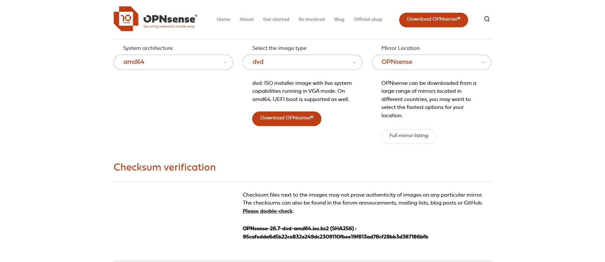
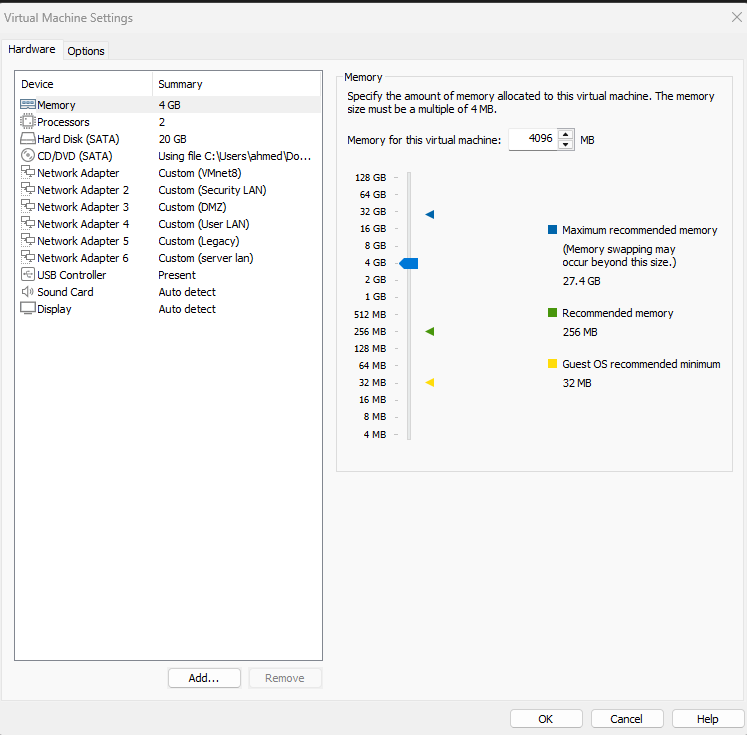
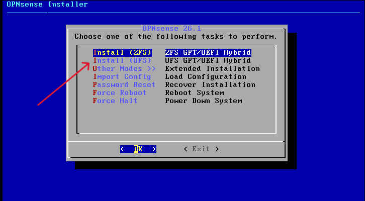
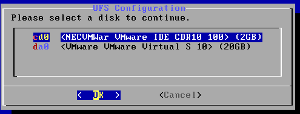
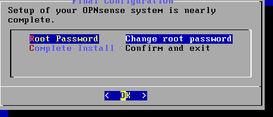
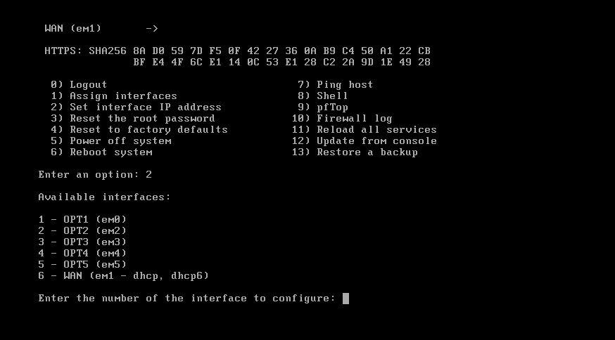
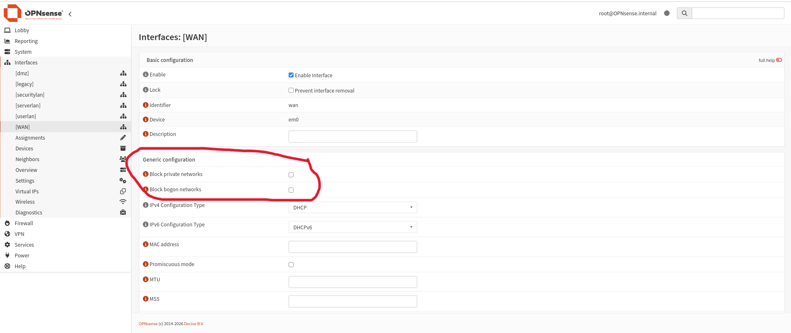
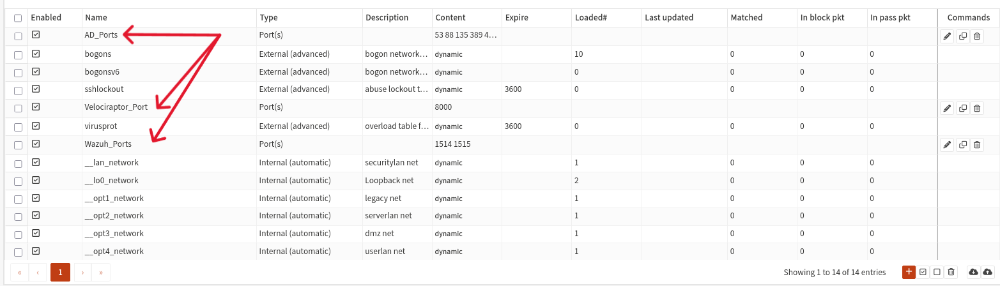
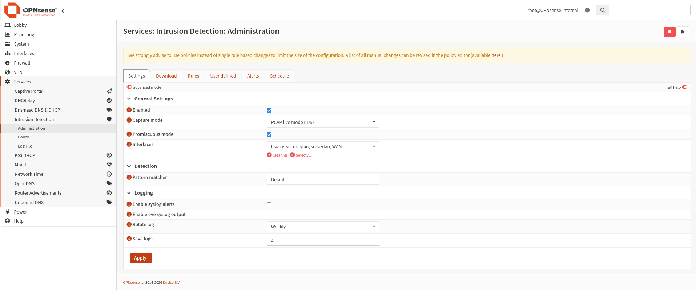

# OPNsense — Configuration Guide

Guide complet des étapes et commandes utilisées pour installer, configurer et dépanner OPNsense dans ce laboratoire.

## 1. Installation

### 1.1 — Téléchargement
- Source : `opnsense.org/download`
- Architecture : **AMD64**
- Format : **dvd / iso**

### 1.2 — Création de la VM (VMware Workstation)
- Guest OS : **FreeBSD 64-bit**
- RAM : 4 GB 
- Disque : 20 GB
- **6 adaptateurs réseau**, un par zone (Custom : DMZ, User LAN, Server LAN, Security LAN, Legacy, Attacker/NAT)

### 1.3 — Installation
1. Sélectionner **Install (UFS)** — pas ZFS (empreinte mémoire plus légère, adaptée à une VM pare-feu à 2 Go de RAM)





2. Clavier → défaut (ou français si AZERTY)
3. Sélection du disque → choisir le disque virtuel réel (`da0` ou `ada0` selon le contrôleur SCSI/SATA), **jamais** le lecteur CD-ROM





4. Confirmer la destruction du disque → **YES**


5. Définir le mot de passe root





6. **Complete Install**


## 2. Attribution des interfaces (console, option 1)

```
1) Assign interfaces
   LAGGs? → N
   VLANs? → N
   WAN interface: em0
   LAN interface: em1          ← NE JAMAIS SAUTER CE RÔLE (règle anti-lockout automatique)
   Optional 1: em2
   Optional 2: em3
   Optional 3: em4
   Optional 4: em5
   Confirm: y
```



## 3. Adressage IP (console, option 2)

**Ordre recommandé pour éviter les conflits d'IP déjà attribuées :**

| Interface | Zone | IP | DHCP |
|---|---|---|---|
| LAN (em1) | Security_LAN | 192.168.9.1/24 | 192.168.9.100–200 |
| OPT1 (em2) | DMZ | 192.168.6.1/24 | 192.168.6.100–200 |
| OPT2 (em3) | User_LAN | 192.168.8.1/24 | 192.168.8.100–200 |
| OPT3 (em4) | Legacy | 192.168.11.1/24 | 192.168.11.100–200 |
| OPT4 (em5) | Server_LAN | 192.168.7.1/24 | 192.168.7.100–200 |
| WAN (em0) | Attacker | 192.168.163.1/24 (ou DHCP via NAT VMware) | — (pas de serveur DHCP côté WAN) |

Pour chaque interface (option 2 du menu console) :
```
Configure IPv4 via DHCP? → N
Enter new IPv4 address: <ip>
Subnet bit count: 24
Gateway (laisser vide, Enter)
Configure IPv6 via DHCP6? → N (laisser vide)
Enable DHCP server? → y (sauf WAN)
Start range / End range
Revert to HTTP? → N (garder HTTPS)
```

## 4. Interfaces WAN — désactiver le blocage privé/bogon

**Important dans ce lab** : le WAN sert de zone Attaquant sur un réseau NAT privé (192.168.163.0/24), pas un vrai WAN internet. Il faut désactiver :

`Interfaces → WAN` :
- ☐ **Block private networks** → décocher
- ☐ **Block bogon networks** → décocher




Sans cela, tout le trafic Attacker→cible est silencieusement rejeté avant même l'évaluation des règles de pare-feu.


## 5. Alias de pare-feu

`Firewall → Aliases → Add` :

### AD_Ports (trafic d'authentification Active Directory)
- Type : Port(s)
- Contenu (un par ligne — **pas d'espaces**, les plages utilisent `:` et non `-`) :
```
53
88
135
389
445
464
636
3268
3269
49152:65535
```

### Wazuh_Ports
```
1514
1515
```

### Velociraptor_Client_Port
```
8000
```



## 6. Règles de pare-feu par interface

Voir le fichier séparé [`network/opnsense-firewall-rules.md`](../network/opnsense-firewall-rules.md) pour la liste complète et à jour des règles par zone.

**Principe appris pendant le build** : une règle sur l'interface source ne suffit pas toujours — il faut parfois une règle miroir sur l'interface destination (ex. règles Wazuh_Ports dupliquées sur `legacy`/`userlan`/`serverlan` **et** sur `securitylan`), car OPNsense évalue le trafic sur l'interface physique réelle où il entre, qui ne correspond pas toujours à l'étiquette attendue.

## 7. Suricata (NIDS)

1. `System → Firmware → Plugins` → rechercher `os-suricata` → installer
2. `Services → Intrusion Detection → Administration` :
   - ☑ Enabled
   - Interfaces : `securitylan`, `WAN`, `DMZ`, `serverlan`
3. `Services → Intrusion Detection → Download` :
   - ☑ ET Open
   - **Download & Update Rules**
4. `Services → Intrusion Detection → Rules` : activer la catégorie ET Open

## 8. Commandes de diagnostic utiles (console shell, option 8)

```bash
# Voir les interfaces et IPs actuelles
ifconfig

# Voir les MAC de toutes les interfaces
ifconfig | grep -E "^em|ether"

# Capturer le trafic sur une interface spécifique
tcpdump -i em0 -n icmp
tcpdump -i em4 -n host <IP>

# Voir les règles réellement chargées dans le filtre de paquets
pfctl -sr | grep <IP-ou-port>

# Voir la table d'états (connexions actives suivies)
pfctl -ss | grep <IP>

# Vider la table d'états (utile après de nombreux changements de règles)
pfctl -F state

# Recharger complètement le filtre
configctl filter reload

# Voir la table de routage
netstat -rn | grep <subnet>

# Tester la résolution ARP
arp -a | grep -i <MAC>
```

## 9. Bugs récurrents rencontrés et leur cause

| Symptôme | Cause réelle | Fix |
|---|---|---|
| Lockout total sur Security_LAN après assignation des interfaces | Rôle "LAN" non attribué → pas de règle anti-lockout | Réassigner explicitement le rôle LAN |
| Ping vers passerelle échoue alors que tout semble correct | L'hôte physique VMware avait un adaptateur virtuel concurrent sur le même VMnet/IP `.1` | Décocher "Connect a host virtual adapter" dans Virtual Network Editor pour chaque réseau custom |
| Trafic bloqué malgré une règle qui semble correcte | Étiquette d'interface (`userlan`/`serverlan`) ne correspond pas au sous-réseau réel | Vérifier avec `ifconfig` + comparer les MAC, écrire la règle avec l'IP/CIDR explicite plutôt que l'alias `<interface> net` |
| Ping OK mais port applicatif (1514, 8889) refusé | Traffic arrive bien à OPNsense mais la machine destination répond via la mauvaise interface (routage asymétrique) | Ajouter une route statique explicite sur la VM destination (voir `troubleshooting-journal.md`) |
| Aucun paquet visible dans le Live Log malgré un `tcpdump` positif sur l'interface | Bug d'affichage de l'interface web du Live Log — ne pas s'y fier à 100%, toujours confirmer avec `tcpdump` en console |
