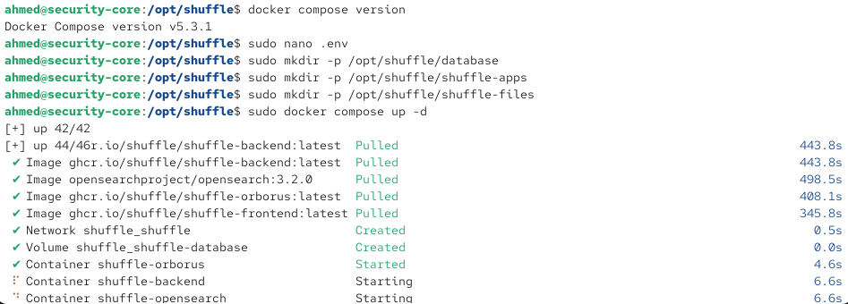
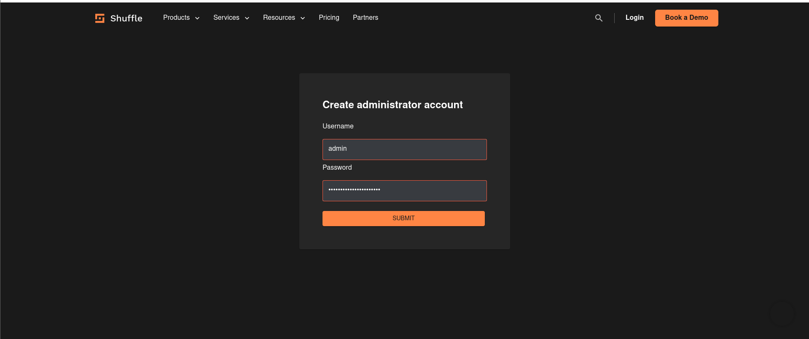
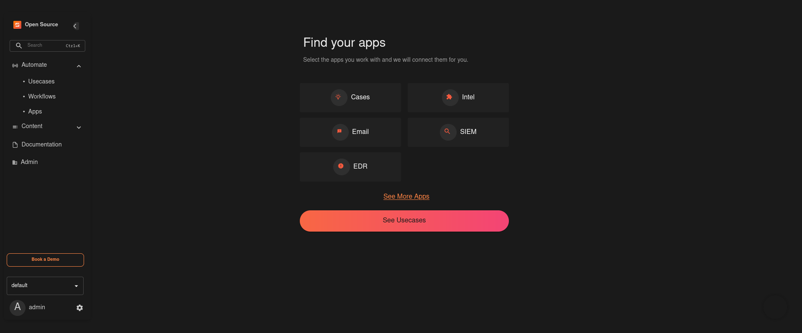
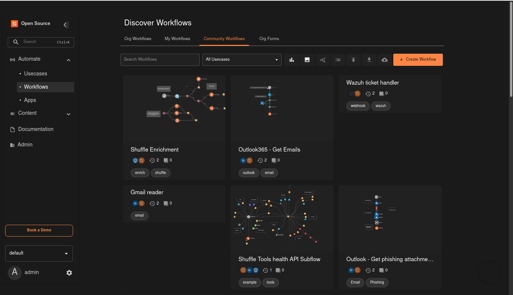
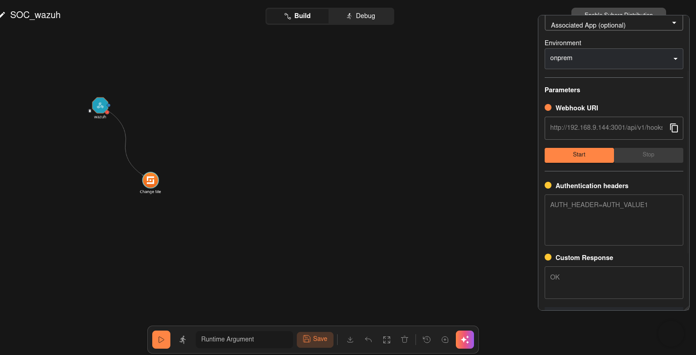
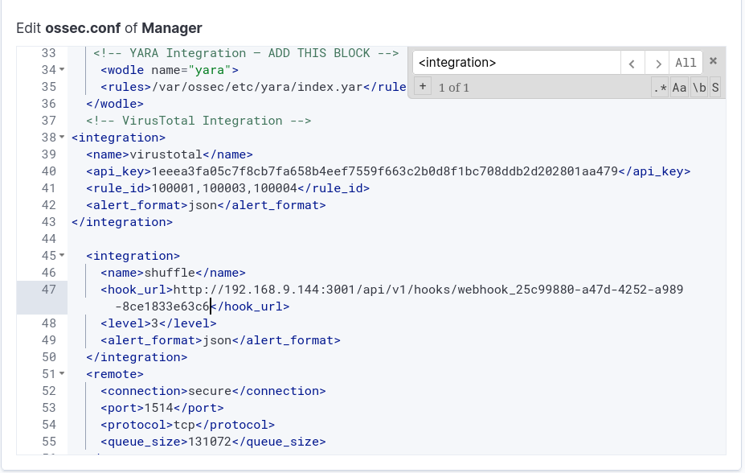
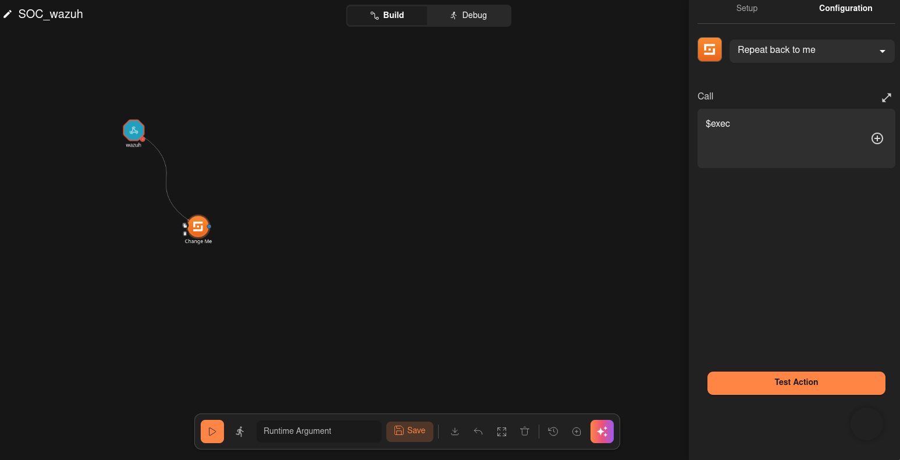
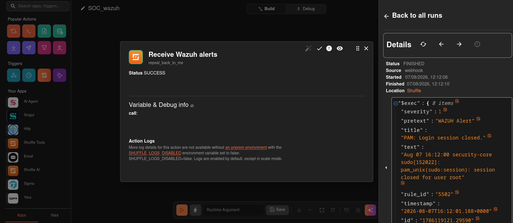

# Installation & Configuration — Shuffle SOAR

Shuffle est le composant SOAR (Security Orchestration, Automation and Response) du lab — il reçoit les alertes Wazuh via webhook et exécute des workflow automatisé (voir `reports/phase-b-hardening/` .

---

## 1. Introduction

### 1.1 – Qu'est-ce que Shuffle SOAR

Shuffle est une plateforme SOAR open-source, auto-hébergeable, qui orchestre des réponses automatisées à partir d'alertes de sécurité. Elle reçoit des événements (ici, via un webhook déclenché par Wazuh), applique une logique de workflow (branchements conditionnels, approbation humaine, appels API), et déclenche des actions concrètes (blocage d'IP, création de cas, notification).


### 1.2 – Pourquoi dans ce lab

Sans Shuffle, chaque réponse à incident du lab serait manuelle. Avec Shuffle, une alerte à haute sévérité peut suivre un chemin structuré — notification, approbation, action automatisée — reproduisant la logique d'un vrai SOC où l'automatisation réduit le temps de réponse (MTTR) sans éliminer le contrôle humain sur les actions sensibles.

---

## 2. Environnement

| Paramètre | Valeur |
|---|---|
| Serveur Shuffle | VM CentOS `node4` (`192.168.9.144`) |
| Méthode d'installation | Docker Compose (self-hosted) |
| Wazuh Manager | Security-Core (`192.168.9.133`) |

---

## 3. Installation

### 3.1 – Docker et Docker Compose

```bash
sudo yum install -y yum-utils
sudo yum-config-manager --add-repo https://download.docker.com/linux/centos/docker-ce.repo
sudo yum install -y docker-ce docker-ce-cli containerd.io docker-compose-plugin
sudo systemctl enable --now docker
```

### 3.2 – Cloner le dépôt Shuffle

```bash
sudo git clone https://github.com/Shuffle/Shuffle /opt/shuffle
cd /opt/shuffle
```

### 3.3 – Fichier `.env`

Variables clés utilisées :
```env
FRONTEND_PORT=3001
FRONTEND_PORT_HTTPS=3002
BACKEND_PORT=5001
OPENSEARCH_PORT=9201
BACKEND_HOSTNAME=shuffle-backend
OUTER_HOSTNAME=192.168.9.144
DB_LOCATION=/opt/shuffle/database
SHUFFLE_OPENSEARCH_URL=http://shuffle-opensearch:9200
SHUFFLE_OPENSEARCH_USERNAME=admin
SHUFFLE_OPENSEARCH_PASSWORD=Shuffle123!
```

⚠️ `OUTER_HOSTNAME` doit correspondre à l'IP réellement joignable depuis Security-Core (`192.168.9.144`) — c'est cette valeur qui détermine l'URL de base utilisée par Shuffle pour générer ses propres liens (webhooks, notifications).

### 3.4 – Démarrage des conteneurs

```bash
docker compose up -d
```




---

## 4. Configuration

### 4.1 – Accès à l'interface web et création du compte admin

Interface : **`http://192.168.9.144:3001`**





### 4.2 – Intégration Wazuh (webhook)

**Côté Shuffle :** création d'un workflow avec un déclencheur **Webhook**, générant une URL unique (`webhook_25c99880-a47d-4252-a989-8ce1833e63c6`).



**Côté Wazuh** (`/var/ossec/etc/ossec.conf`, sur le Manager Security-Core) :
```xml
<integration>
    <name>shuffle</name>
    <hook_url>http://192.168.9.144:3001/api/v1/hooks/webhook_25c99880-a47d-4252-a989-8ce1833e63c6</hook_url>
    <level>3</level>
    <alert_format>json</alert_format>
</integration>
```




```bash
sudo systemctl restart wazuh-manager
```

### 4.3 – Workflow de test : `SOC_wazuh`

Workflow minimal utilisant le node **"Repeat back to me"** de Shuffle (fonctionne comme un echo — renvoie simplement ce qu'il reçoit), pour confirmer que la réception fonctionne avant de construire une logique plus complexe.



---

## 5. Test — vérification de la réception des alertes

Déclencher n'importe quel événement Wazuh de niveau ≥3 sur un agent surveillé, puis vérifier :



✅ Confirmé — les alertes Wazuh atteignent bien Shuffle via le webhook, et le workflow de test les traite correctement.

---


