# Installation & Configuration — TheHive (plateforme de gestion des cas)

TheHive sert de plateforme de gestion des incidents ("case management") pour le SOC du lab — les alertes Wazuh, relayées via Shuffle, y seront escaladées et suivies comme de vrais dossiers d'investigation.

---

## 1. Introduction

### 1.1 – Qu'est-ce que TheHive ?

TheHive est une plateforme open-source de réponse à incident (Security Incident Response Platform). Elle permet de transformer une alerte brute (venant d'un SIEM comme Wazuh) en un **cas** structuré : tâches à réaliser, observables (IOCs) à analyser, notes d'investigation, statut de résolution — le tout traçable et partageable entre analystes.


### 1.2 – Pourquoi dans ce lab

Jusqu'ici, le lab dispose de détection (Wazuh), de threat intelligence (MISP), d'automatisation (Shuffle) — mais d'aucun endroit centralisé pour **suivre le cycle de vie d'un incident** (de la détection à la clôture). TheHive comble ce manque : c'est la pièce "GRC/gestion opérationnelle" qui manquait pour boucler la boucle SOC complète.

---

## 2. Environnement

| Paramètre | Valeur |
|---|---|
| Serveur | Security-Core (`192.168.9.133`) |
| OS | Ubuntu 26.04 LTS |
| Version TheHive | 5.2 |
| Base de données | Apache Cassandra |
| Indexation | Elasticsearch 7.x |
| Runtime Java | Java 11 (Amazon Corretto) |

---

## 3. Prérequis

- Dépendances système : `wget`, `gnupg`, `apt-transport-https`, `ca-certificates`, `software-properties-common`
- Java 11 (Amazon Corretto — recommandé officiellement par TheHive pour la compatibilité avec Cassandra/Elasticsearch)
- Ports libres : `9042` (Cassandra), `9200` (Elasticsearch), `9000` (TheHive)

---

## 4. Installation

### 4.1 – Dépendances et Java 11 (Amazon Corretto)

```bash
sudo apt update
sudo apt install -y wget gnupg apt-transport-https ca-certificates software-properties-common
wget -O- https://apt.corretto.aws/corretto.key | sudo apt-key add -
sudo add-apt-repository 'deb https://apt.corretto.aws stable main'
sudo apt update
sudo apt install -y java-11-amazon-corretto-jdk
```


### 4.2 – Apache Cassandra

```bash
echo "deb https://debian.cassandra.apache.org 40x main" | sudo tee /etc/apt/sources.list.d/cassandra.sources.list
curl https://downloads.apache.org/cassandra/KEYS | sudo apt-key add -
sudo apt update
sudo apt install -y cassandra
```

### 4.3 – Elasticsearch 7.x

```bash
wget -qO - https://artifacts.elastic.co/GPG-KEY-elasticsearch | sudo apt-key add -
echo "deb https://artifacts.elastic.co/packages/7.x/apt stable main" | sudo tee /etc/apt/sources.list.d/elastic-7.x.list
sudo apt update
sudo apt install -y elasticsearch
```

### 4.4 – TheHive 5.2

```bash
wget -qO - https://raw.githubusercontent.com/TheHive-Project/TheHive/master/PGP-PUBLIC-KEY | sudo apt-key add -
echo "deb https://deb.thehive-project.org release main" | sudo tee /etc/apt/sources.list.d/thehive-project.list
sudo apt update
sudo apt install -y thehive
```


---

## 5. Configuration

### 5.1 – Cassandra (`/etc/cassandra/cassandra.yaml`)

```yaml
cluster_name: 'thp'
listen_address: 192.168.9.133
rpc_address: 192.168.9.133
seeds: "192.168.9.133,7000"
```

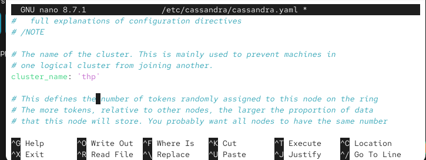
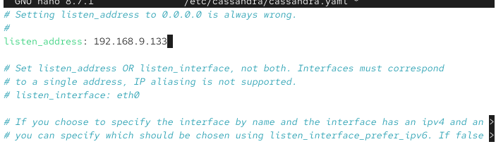
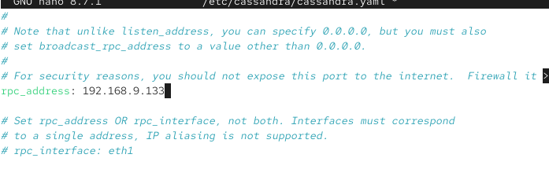
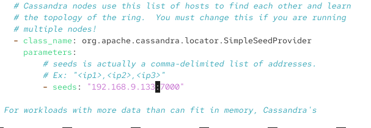

### 5.2 – Elasticsearch (`/etc/elasticsearch/elasticsearch.yml`)

```yaml
network.host: 192.168.9.133
cluster.initial_master_nodes: ["node-1"]
```

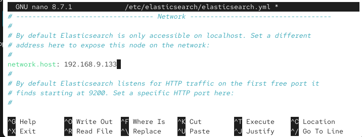
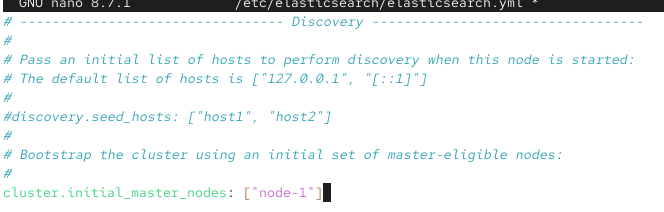

### 5.3 – TheHive (`/etc/thehive/application.conf`)

```hocon
application.baseUrl = "http://192.168.9.133:9000"

db.janusgraph {
  storage {
    backend = cql
    hostname = ["192.168.9.133"]
    cql {
      cluster-name = thp
      keyspace = thehive
    }
  }
  index.search {
    backend = elasticsearch
    hostname = ["192.168.9.133"]
    index-name = thehive
  }
}

storage {
  provider = locals
  locals.location = /opt/thp/thehive/files
}
```

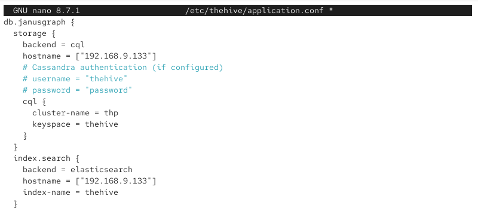
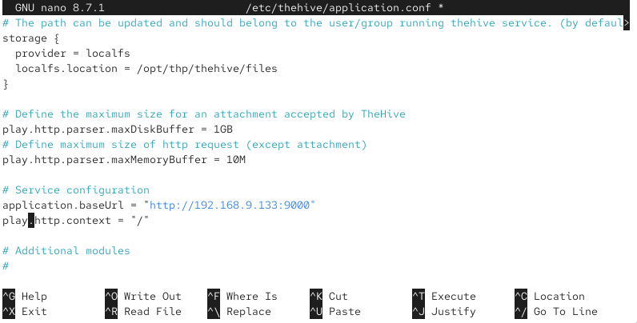

---

## 6. Démarrage et vérification des services

```bash
sudo systemctl enable --now cassandra
sudo systemctl enable --now elasticsearch
sudo systemctl enable --now thehive
```

```bash
sudo systemctl status cassandra
```
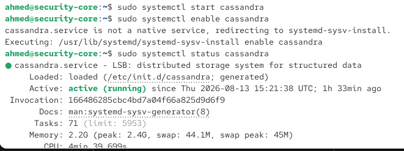

```bash
sudo systemctl status elasticsearch
```
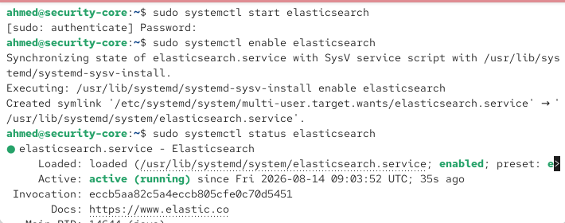

```bash
sudo systemctl status thehive
```
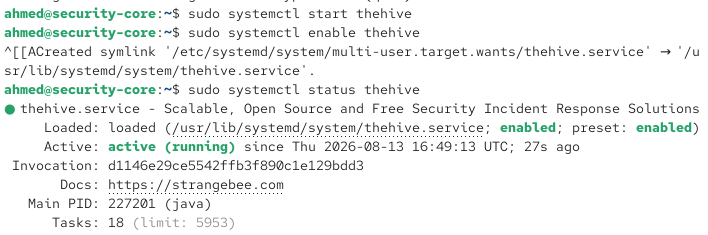
⚠️ **Ordre de démarrage important :** Cassandra doit être pleinement opérationnel (`nodetool status` → `UN` = Up/Normal) avant qu'Elasticsearch et TheHive ne démarrent proprement — un démarrage simultané à froid échoue souvent. Vérifier avec `nodetool status` en cas de souci au premier lancement.

---

## 7. Connexion initiale

Interface web : **`http://192.168.9.133:9000`**


**Identifiants par défaut :**
| Champ | Valeur |
|---|---|
| Login | `admin@thehive.local` |
| Mot de passe | `secret` |


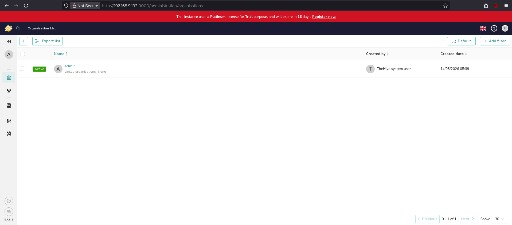

⚠️ **Changer ce mot de passe immédiatement après la première connexion** — identifiants par défaut publics et bien connus.

---

## 8. Intégration avec Wazuh (prévue — à documenter séparément)

Flux prévu, une fois câblé :

```
Wazuh (alerte) → Shuffle (webhook + logique de playbook) → TheHive (création automatique d'un cas)
```

### 8.1 – Préparation TheHive : organisation et utilisateur dédiés

Une organisation dédiée `ahmed` est créée (au lieu d'utiliser l'organisation `admin` par défaut), afin d'isoler les cas générés par l'intégration Wazuh.

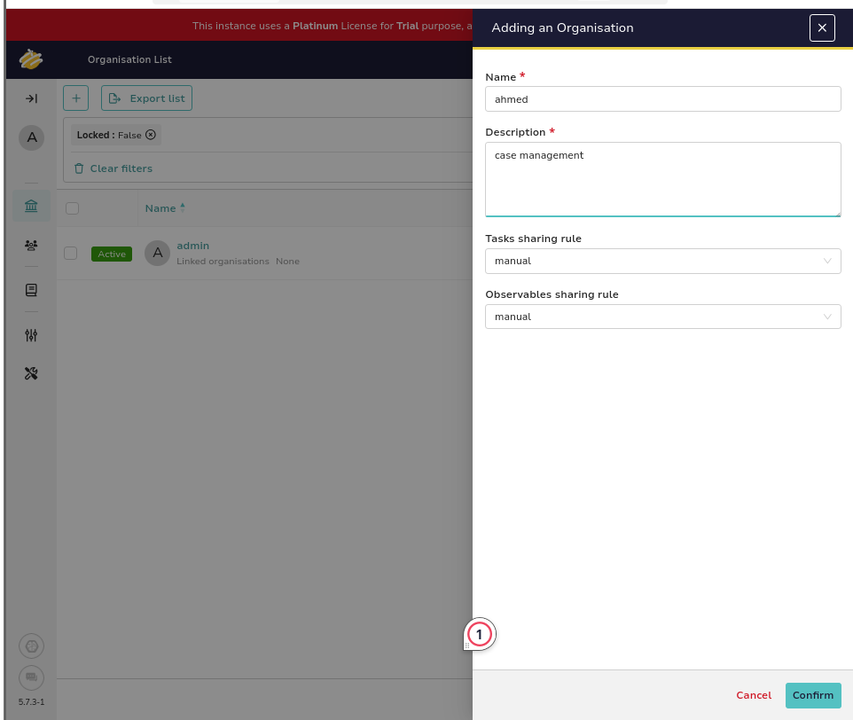

Un utilisateur `ahmed@gmail.com` est ensuite ajouté à cette organisation avec le rôle `org-admin`.

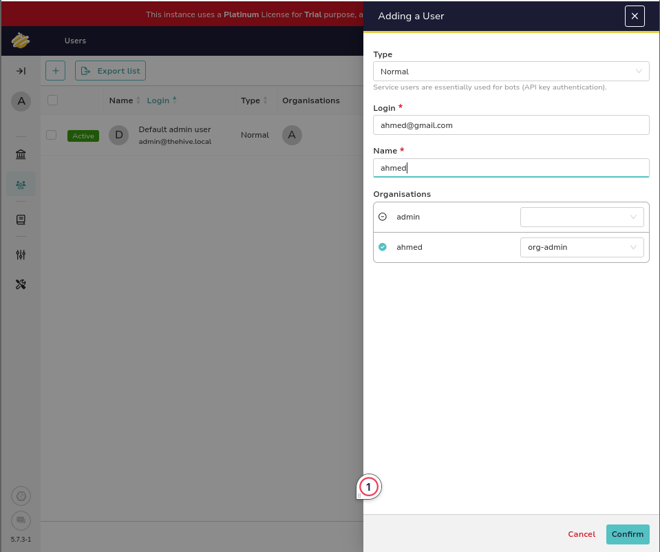

### 8.2 – Génération de la clé API

Une clé API est créée puis révélée pour cet utilisateur — elle servira d'authentification pour le script d'intégration côté Wazuh.

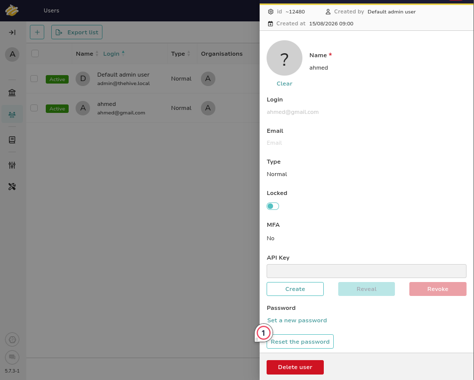

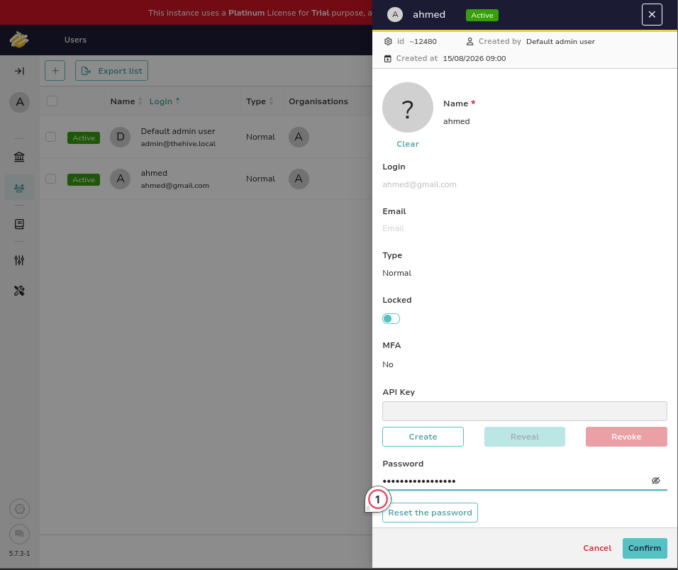

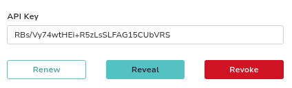

⚠️ Cette clé (`RBs/Vy74wtHEi+R5zLsSLFAG15CUbVRS` dans ce lab) doit être traitée comme un secret — elle est reprise telle quelle dans `ossec.conf` (section 8.5).

### 8.3 – Récupération et installation du connecteur (wazuh2thehive)

Le script d'intégration provient du dépôt [crow1011/wazuh2thehive](https://github.com/crow1011/wazuh2thehive), cloné directement sur Security-Core :

```bash
sudo git clone https://github.com/crow1011/wazuh2thehive.git
```

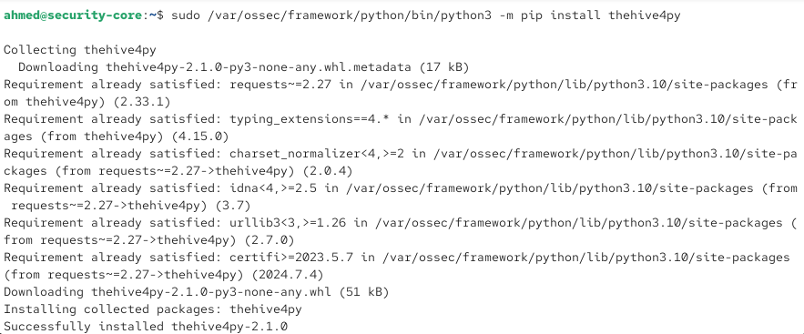

Les dépendances Python du script (dont `thehive4py`, `future`, `python-magic`) sont installées via l'interpréteur Python embarqué de Wazuh :

```bash
sudo /var/ossec/framework/python/bin/python3 -m pip install -r /opt/wazuh2thehive/requirements.txt
```

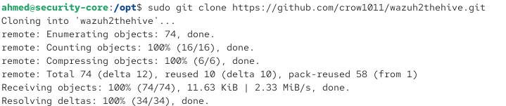

`thehive4py` est également installé de façon autonome pour confirmer la résolution de version (2.1.0) :

```bash
sudo /var/ossec/framework/python/bin/python3 -m pip install thehive4py
```

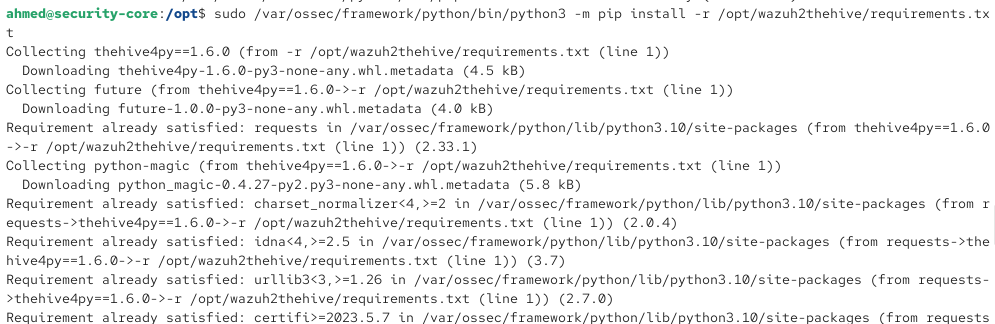

### 8.4 – Déploiement du connecteur dans `/var/ossec/integrations`

Le script (wrapper shell + implémentation Python) est copié vers le répertoire d'intégrations de Wazuh, avec les permissions et le propriétaire attendus par `wazuh-manager` :

```bash
sudo cp /opt/wazuh2thehive/custom-w2thive.py /var/ossec/integrations/custom-w2thive.py
sudo cp /opt/wazuh2thehive/custom-w2thive /var/ossec/integrations/custom-w2thive
sudo chmod 755 /var/ossec/integrations/custom-w2thive.py
sudo chmod 755 /var/ossec/integrations/custom-w2thive
sudo chown root:wazuh /var/ossec/integrations/custom-w2thive.py
sudo chown root:wazuh /var/ossec/integrations/custom-w2thive
```

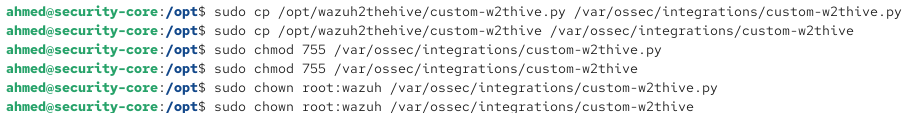

### 8.5 – Configuration de `ossec.conf` et redémarrage

Le bloc `<integration>` suivant est ajouté à `/var/ossec/etc/ossec.conf` :

```xml
<integration>
    <name>custom-w2thive</name>
    <hook_url>http://192.168.9.133:9000</hook_url>
    <api_key>RBs/Vy74wtHEi+R5zLsSLFAG15CUbVRS</api_key>
    <rule_id>5763</rule_id>
    <alert_format>json</alert_format>
</integration>
```

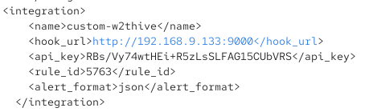

Le service `wazuh-manager` est ensuite redémarré pour prendre en compte le nouveau connecteur :

```bash
sudo systemctl restart wazuh-manager
```


## 9. Dépannage

| Symptôme | Cause probable | Solution |
|---|---|---|
| Cassandra ne démarre pas | RAM insuffisante (Cassandra est gourmand par défaut) | Réduire `MAX_HEAP_SIZE` / `HEAP_NEWSIZE` dans `/etc/cassandra/cassandra-env.sh`, ou allouer plus de RAM à la VM |
| Elasticsearch échoue au démarrage | `vm.max_map_count` trop bas (limite noyau Linux) | `sudo sysctl -w vm.max_map_count=262144` (et le rendre persistant dans `/etc/sysctl.conf`) |
| TheHive reste bloqué sur "waiting for Cassandra" | Cassandra pas encore prêt, ou `listen_address`/`rpc_address` mal alignés avec l'IP réelle de la VM | Vérifier `nodetool status`, confirmer que l'IP dans `cassandra.yaml` correspond à l'IP réelle de Security-Core |
| Conflit de port (9000, 9042, 9200) | Un autre service (MISP, Wazuh dashboard...) occupe déjà le port | `sudo ss -tlnp \| grep <port>` pour identifier le conflit — cf. le même type de conflit déjà rencontré avec privacyIDEA/MISP sur le port 8443 |
| Erreurs SSL au premier accès | Certificat auto-signé ou HTTPS non configuré | Accéder en HTTP simple (`http://`, pas `https://`) tant que TLS n'est pas explicitement configuré |

---


