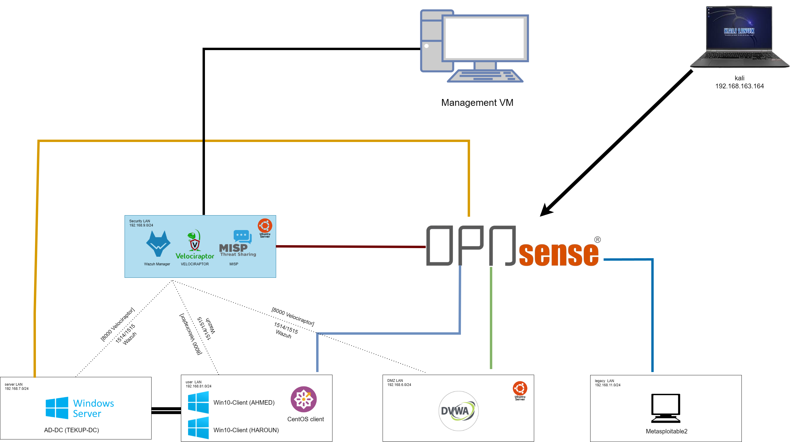

# Network Topology — Phase A

Topologie réseau réelle de la Phase A (Baseline), telle que représentée sur le schéma [`diagrams/phase-a-topology.png`](/soc-lab-repo/network/diagrams/phase-a-topology.png).

---

## 1. Zones et sous-réseaux (confirmés par le schéma)

| Zone | Sous-réseau | Machines hébergées |
|---|---|---|
| **Security_LAN** | `192.168.9.0/24` | Wazuh Manager, Velociraptor, MISP (Threat Sharing) — appliance Ubuntu Server unique |
| **Server_LAN** | `192.168.7.0/24` | AD-DC (Windows Server — `TEKUP-DC`) |
| **User_LAN** | `192.168.81.0/24` ⚠️ *(à confirmer — voir note ci-dessous)* | Win10-Client (AHMED), Win10-Client (HAROUN), CentOS client |
| **DMZ_LAN** | `192.168.6.0/24` | DVWA (Ubuntu Server) |
| **Legacy_LAN** | `192.168.11.0/24` | Metasploitable2 |
| **Attacker** | — | Kali Linux — `192.168.163.164` |

⚠️ **Note sur User_LAN :** le schéma indique `192.168.81.0/24`, alors que les rapports de simulation (Sim 3 — WannaCry) utilisent des IPs en `192.168.8.x` (ex. `192.168.8.118` pour WIN10-HAROUN). À confirmer : s'agit-il bien de `192.168.81.0/24`, ou d'une coquille dans le schéma pour `192.168.8.0/24` ?

---

## 2. ⚠️ Confirmation importante — inversion DMZ / Legacy

Ce schéma **inverse** l'attribution de sous-réseaux utilisée dans les rapports Phase A déjà rédigés :

| Zone | Sous-réseau utilisé dans les rapports | Sous-réseau sur ce schéma |
|---|---|---|
| DMZ_LAN (Simulation 1 — DVWA) | `192.168.11.177` | `192.168.6.0/24` |
| Legacy_LAN (Simulation 2 — Metasploitable2) | `192.168.6.141` | `192.168.11.0/24` |

Cette inversion correspond exactement à l'incohérence déjà anticipée dans le brief initial du projet ("DMZ 192.168.6.0/24 ou 192.168.11.0/24 selon la machine — variable selon debug réseau"). Elle est documentée comme un changement réel survenu en cours de projet dans [`troubleshooting-journal.md`](troubleshooting-journal.md) plutôt que corrigée rétroactivement dans les rapports de simulation existants.

**Ce schéma est considéré comme la topologie de référence actuelle** (post-changement). Les rapports de Simulation 1 et 2 restent inchangés et reflètent les IPs réelles au moment de ces attaques.

---

## 3. Machine de management

Une **Management VM** dédiée à l'administration est doublement raccordée :
- une interface sur **Security_LAN** (`192.168.9.0/24`) — pour gérer Wazuh, Velociraptor et MISP
- une interface sur **Server_LAN** (`192.168.7.0/24`) — pour l'administration directe de l'Active Directory (`TEKUP-DC`)

Cette machine ne passe pas par OPNsense pour accéder à ces deux zones — elle y est directement raccordée en tant qu'hôte de gestion.

---

## 4. Flux d'agents SOC (Security_LAN → toutes les zones)

L'appliance Security_LAN (Wazuh Manager + Velociraptor + MISP) communique avec les agents déployés sur `Server_LAN`, `User_LAN` et `DMZ_LAN` via les ports suivants :

| Port | Service | Direction |
|---|---|---|
| `1514/1515` | Wazuh (agents → manager) | Server_LAN, User_LAN, DMZ_LAN → Security_LAN |
| `8000` | Velociraptor (agents → serveur) | Server_LAN, User_LAN, DMZ_LAN → Security_LAN |

**Note :** aucune ligne d'agent n'est représentée vers `Legacy_LAN` — cohérent avec l'absence volontaire d'agent Wazuh/Velociraptor sur Metasploitable2 (gap de conception assumé, voir Simulation 2).

---

## 5. Interfaces OPNsense

OPNsense centralise le routage entre l'Attacker Zone (Kali) et toutes les zones internes. Chaque zone est raccordée à une interface dédiée d'OPNsense (Security_LAN, User_LAN, DMZ_LAN, Legacy_LAN, Server_LAN via la Management VM).

📄 Détail des règles de pare-feu par zone : [`opnsense-firewall-rules.md`](../network/opnsense-firewall-rules.md) *(à venir — captures nécessaires)*
