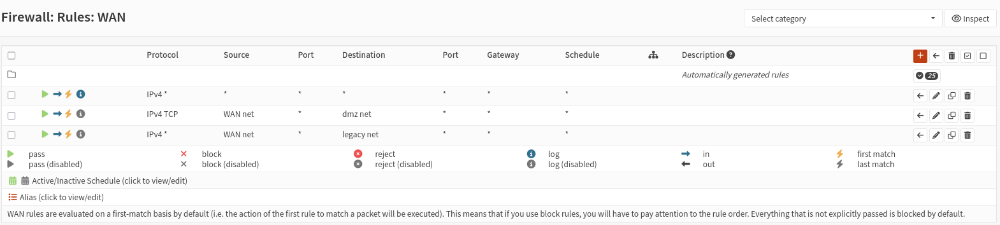
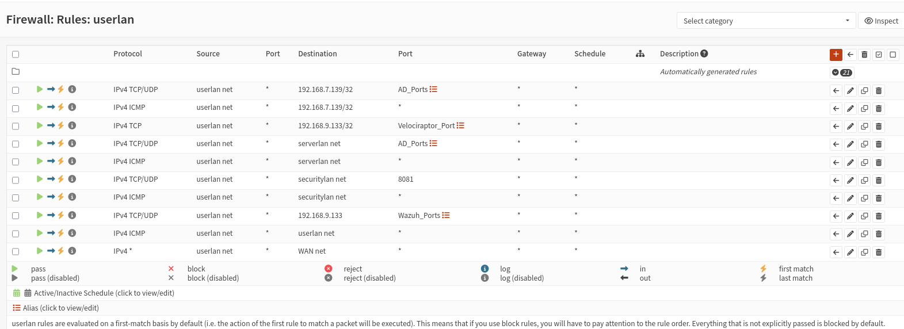
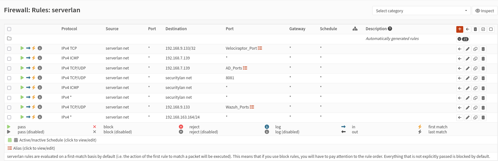
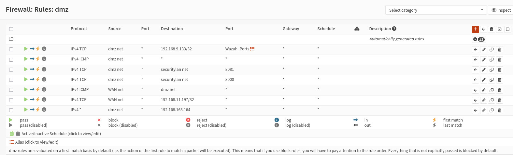
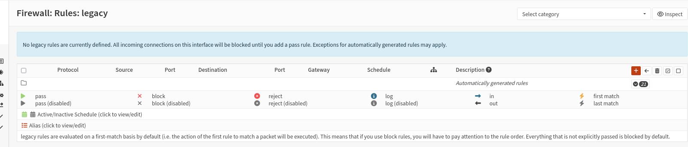
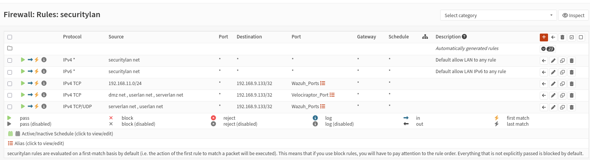

# OPNsense — Règles de pare-feu

Règles de pare-feu réelles, capturées interface par interface depuis OPNsense (`Firewall: Rules`). Les règles listées ci-dessous sont les règles **manuelles** ajoutées par-dessus les règles auto-générées (masquées par défaut dans chaque capture, comptées dans le badge "Automatically generated rules").

> ℹ️ Toutes les interfaces fonctionnent sur le principe **first-match** : la première règle qui correspond à un paquet est appliquée. Tout ce qui n'est pas explicitement autorisé est bloqué par défaut.

---

## 1. WAN

| Protocole | Source | Destination | Port dest. | Description |
|---|---|---|---|---|
| IPv4 TCP | WAN net | dmz net | * | Autorise le trafic entrant WAN vers la zone DMZ |
| IPv4 * | WAN net | legacy net | * | Autorise le trafic entrant WAN vers la zone Legacy |

**Constat :** l'attaquant (Kali, techniquement sur le WAN d'OPNsense dans ce lab) a un accès direct autorisé vers `dmz net` et `legacy net` — cohérent avec le scénario Red Team qui cible ces deux zones en premier (Simulations 1 et 2).

---

## 2. userlan (User_LAN)

| Protocole | Source | Destination | Port dest. | Description |
|---|---|---|---|---|
| IPv4 TCP/UDP | userlan net | `192.168.7.139/32` | AD_Ports | Accès AD-DC (authentification, DNS, LDAP, SMB, Kerberos — alias `AD_Ports`) |
| IPv4 ICMP | userlan net | `192.168.7.139/32` | * | Ping vers AD-DC |
| IPv4 TCP | userlan net | `192.168.9.133/32` | Velociraptor_Port | Agent Velociraptor → serveur |
| IPv4 TCP/UDP | userlan net | serverlan net | AD_Ports | Accès générique à la zone serveur pour l'authentification AD |
| IPv4 ICMP | userlan net | serverlan net | * | Ping vers la zone serveur |
| IPv4 TCP/UDP | userlan net | securitylan net | `8081` | Accès à un service Security_LAN sur le port 8081 (probablement MISP) |
| IPv4 ICMP | userlan net | securitylan net | * | Ping vers Security_LAN |
| IPv4 TCP/UDP | userlan net | `192.168.9.133` | Wazuh_Ports | Agent Wazuh → manager |
| IPv4 ICMP | userlan net | userlan net | * | Ping intra-zone |
| IPv4 * | userlan net | WAN net | * | Sortie WAN autorisée (tout protocole) |

**Constat :** c'est précisément la règle `userlan net → 192.168.7.139/32 (AD_Ports)` qui a permis la Simulation 4 (LLMNR poisoning → Pass-the-Hash) — le trafic SMB/NTLM vers l'AD-DC est légitimement nécessaire et donc autorisé, ce qui a aussi permis l'attaque (cf. `reports/phase-a-baseline/simulation-4-active-directory.md`, section 5.2).

---

## 3. serverlan (Server_LAN)

| Protocole | Source | Destination | Port dest. | Description |
|---|---|---|---|---|
| IPv4 TCP | serverlan net | `192.168.9.133/32` | Velociraptor_Port | Agent Velociraptor → serveur |
| IPv4 ICMP | serverlan net | `192.168.7.139` | * | Ping vers AD-DC (lui-même) |
| IPv4 TCP/UDP | serverlan net | `192.168.7.139` | AD_Ports | Accès AD-DC |
| IPv4 TCP/UDP | serverlan net | securitylan net | `8081` | Accès à un service Security_LAN (port 8081) |
| IPv4 ICMP | serverlan net | securitylan net | * | Ping vers Security_LAN |
| IPv4 * | serverlan net | securitylan net | * | Autorisation large supplémentaire vers Security_LAN (tout protocole) |
| IPv4 TCP/UDP | serverlan net | `192.168.9.133` | Wazuh_Ports | Agent Wazuh → manager |
| IPv4 * | serverlan net | `192.168.163.164/24` | * | Autorise tout le trafic serverlan → Kali (attaquant) |

**Constat :** la dernière règle (`serverlan → 192.168.163.164/24`, tout protocole) est notable — elle autorise explicitement le retour de trafic vers la machine attaquante depuis la zone serveur. À vérifier si elle a été ajoutée intentionnellement pour les besoins du lab (ex. reverse shell de test) ou s'il s'agit d'un résidu de configuration à revoir en Phase B.

---

## 4. dmz (DMZ_LAN)

| Protocole | Source | Destination | Port dest. | Description |
|---|---|---|---|---|
| IPv4 TCP | dmz net | `192.168.9.133/32` | Wazuh_Ports | Agent Wazuh → manager |
| IPv4 ICMP | dmz net | * | * | Ping sortant illimité |
| IPv4 TCP | dmz net | securitylan net | `8081` | Accès à un service Security_LAN (port 8081) |
| IPv4 TCP | dmz net | securitylan net | `8000` | Agent Velociraptor → serveur |
| IPv4 ICMP | WAN net | dmz net | * | Ping entrant depuis WAN vers la DMZ |
| IPv4 TCP | WAN net | `192.168.11.197/32` | * | Accès entrant WAN vers un hôte `192.168.11.197` sur l'interface DMZ |
| IPv4 * | dmz net | `192.168.163.164` | * | Autorise tout le trafic dmz → Kali (attaquant) |

⚠️ **Incohérence d'IP à noter :** la règle `WAN net → 192.168.11.197/32` apparaît sous l'interface **dmz**, alors que le [schéma de topologie](../docs/network-topology.md) assigne `192.168.11.0/24` à la zone **Legacy**, et que le rapport de la Simulation 1 (DVWA) utilise `192.168.11.177` comme IP cible DMZ. Cette règle suggère qu'un hôte `192.168.11.197` a bien existé (à un moment) sur l'interface DMZ — donc potentiellement une **troisième valeur d'IP** pour ce même host au fil du projet (`.177` → `.197`, zone DMZ vs Legacy). Voir [`troubleshooting-journal.md`](../docs/troubleshooting-journal.md) — entrée à ajouter/compléter.

---

## 5. legacy (Legacy_LAN)

**Aucune règle manuelle définie.** Seules les règles auto-générées sont présentes — tout le trafic entrant sur cette interface est bloqué par défaut sauf exception héritée des règles automatiques.

**Constat :** cohérent avec le design volontaire de la Simulation 2 — Legacy est la zone la moins instrumentée du lab (pas d'agent Wazuh/Velociraptor, pas de règle de sortie explicite), pour tester la segmentation "à l'aveugle" sans aucune règle de confiance particulière.

---

## 6. securitylan (Security_LAN)

| Protocole | Source | Destination | Port dest. | Description |
|---|---|---|---|---|
| IPv4 * | securitylan net | * | * | **Default allow LAN to any rule** (règle par défaut OPNsense) |
| IPv6 * | securitylan net | * | * | Default allow LAN IPv6 to any rule |
| IPv4 TCP | `192.168.11.0/24` | `192.168.9.133/32` | Wazuh_Ports | Autorise un hôte de `192.168.11.0/24` à contacter le manager Wazuh |
| IPv4 TCP | dmz net, userlan net, serverlan net | `192.168.9.133/32` | Velociraptor_Port | Agents Velociraptor → serveur, depuis 3 zones |
| IPv4 TCP/UDP | serverlan net, userlan net | `192.168.9.133/32` | Wazuh_Ports | Agents Wazuh → manager, depuis 2 zones |

⚠️ **Point notable :** la règle `192.168.11.0/24 → 192.168.9.133/32 (Wazuh_Ports)` autorise un hôte de la zone dont l'IP correspond à **Legacy** (selon le schéma de topologie) à parler à Wazuh — alors que le design du lab prévoit qu'**aucun agent Wazuh n'est déployé sur Legacy** (gap volontaire confirmé dans la Simulation 2). Cette règle est peut-être un résidu d'une configuration antérieure (avant l'inversion DMZ/Legacy), à clarifier.

---

## 7. Alias utilisés (à documenter précisément)

| Alias | Utilisation observée | Valeur(s) probable(s) |
|---|---|---|
| `Wazuh_Ports` | Ports agent Wazuh → manager | `1514/1515` (confirmé sur le schéma de topologie) |
| `Velociraptor_Port` | Port agent Velociraptor → serveur | `8000` (confirmé sur le schéma de topologie) |
| `AD_Ports` | Ports Active Directory (DNS, Kerberos, LDAP, SMB...) | Non confirmé — à documenter (capture de l'alias nécessaire) |

📄 Pour finaliser cette section, une capture de chaque alias (`Firewall → Aliases`) permettrait de documenter les ports exacts inclus dans `AD_Ports`.

---

