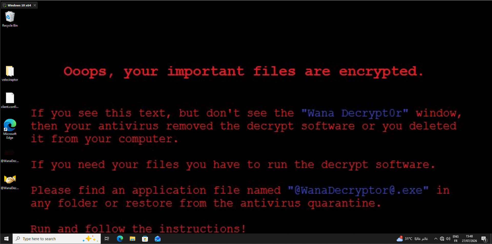
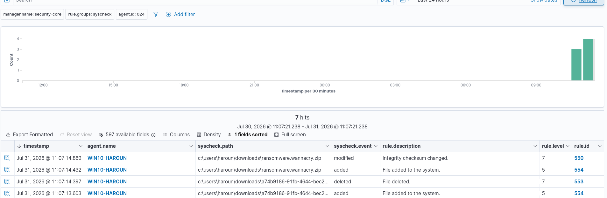
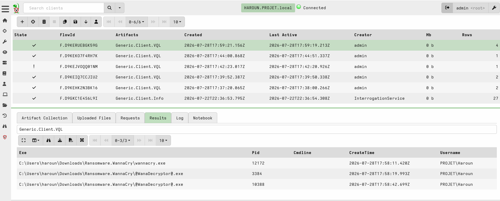
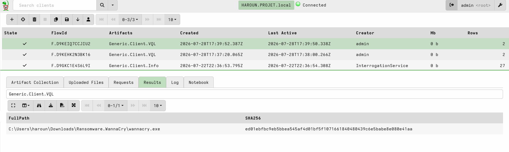
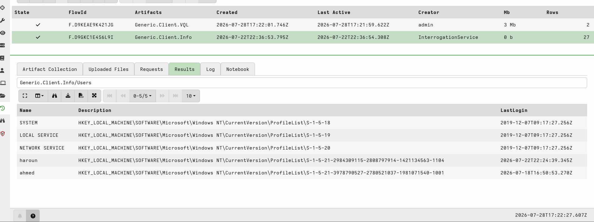
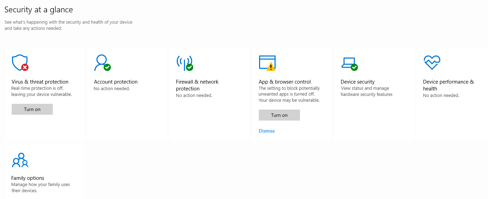
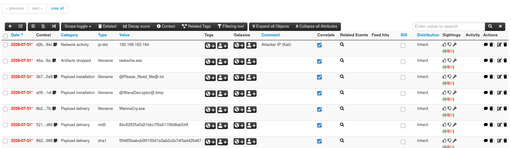
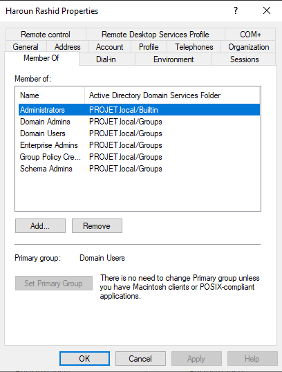

# Simulation 3: WannaCry Ransomware – Execution & Detection

## 1. Executive Summary

**Date of Incident:** 2026-07-31  
**Attacker IP:** 192.168.163.164 (Kali Linux – Attacker Zone)  
**Target:** Windows 10 Client (WIN10-HAROUN – IP 192.168.8.118)  
**Malware:** WannaCry Ransomware (from theZoo – SHA256: ed01ebfbc9eb5b8e5454f4d01bf5f1071661840480439c6e5babe8e080e41aa)  
**Domain:** PROJET.local  

A Red Team operator executed the WannaCry ransomware sample on a Windows 10 client in the User_LAN zone. The malware successfully executed, displayed the ransom note, attempted to encrypt files, created persistence mechanisms, and attempted to reach the killswitch domain (which was blocked by network segmentation). The attacker had local administrator privileges (via the `haroun` domain admin account), allowing the malware to disable Windows Defender and execute without restriction.



**Detection:** Wazuh FIM (syscheck) detected the file modifications in real‑time (TTD ≈ 9 seconds).  
**Investigation:** Velociraptor collected forensic evidence (encrypted files, registry persistence, processes).  
**CTI:** IOCs were collected and published in MISP for future threat intelligence sharing.  
**Segmentation:** No lateral movement was possible – pings to other zones failed.

---

## 2. SOC Triage (Wazuh Alerts)

### 2.1 – Alerts Triggered

| Rule ID | Description | MITRE Tactic | Status |
|---------|-------------|--------------|--------|
| 554 | File added to the system | T1486 (Impact) | ✅ True Positive |
| 553 | File deleted | T1070 (Defense Evasion) | ✅ True Positive |
| 550 | Integrity checksum changed | T1486 (Impact) | ✅ True Positive |
| 100001 (Custom) | .WNCRYT file creation | T1486 (Impact) | ✅ True Positive |



### 2.2 – Detection Gap & Custom Rules

**Gap Identified:**  
No alert specifically for process creation (e.g., `tasksche.exe` or `mssecsvc.exe`). While FIM detected the file creation, a process‑based rule would add an additional detection layer.

**Proposed Custom Rule** (add to `/var/ossec/etc/rules/local_rules.xml`):

```xml
<group name="ransomware,wannacry,process">
  <rule id="100102" level="12">
    <if_group>sysmon</if_group>
    <field name="win.eventdata.image" type="pcre2">(?i)(tasksche\.exe|mssecsvc\.exe)$</field>
    <description>WannaCry ransomware process detected: $(win.eventdata.image).</description>
  </rule>
</group>
```

### 2.3 – Time to Detect (TTD)

- **Attack Time:** `2026-07-31 11:09:08` (WannaCry.exe creation)
- **Wazuh Alert Time:** `2026-07-31 11:09:17` (Rule 554)
- **TTD:** **~9 seconds** (real‑time detection via FIM)

---

## 3. DFIR Investigation (Velociraptor)

### 3.1 – Methodology

Velociraptor VQL queries were executed on the `WIN10-HAROUN` client to collect:
- Running processes
- Encrypted files
- Registry modifications
- Network connections
- File hashes

### 3.2 – Key VQL Queries

| Purpose | VQL Query |
|---------|-----------|
| Find encrypted files | `SELECT FullPath, Size, Mtime FROM glob(globs='C:\\Users\\**\\*.WNCRYT')` |
| List ransomware processes | `SELECT Pid, Name, CommandLine FROM pslist() WHERE Name =~ 'mssecsvc\|tasksche\|WanaDecryptor\|taskhsvc'` |
| Read ransom note | `SELECT Data FROM read_file(filename='C:\\Users\\Public\\Desktop\\@Please_Read_Me@.txt')` |
| Check registry persistence | `SELECT * FROM read_reg_key(regpath='HKEY_LOCAL_MACHINE\\SOFTWARE\\Microsoft\\Windows\\CurrentVersion\\Run')` |
| Read WannaCry config | `SELECT * FROM read_reg_key(regpath='HKEY_LOCAL_MACHINE\\SOFTWARE\\WanaCrypt0r')` |
| Check network connections | `SELECT * FROM netstat() WHERE RemotePort = 445` |
| Hash dropped binaries | `SELECT FullPath, SHA256(FullPath) AS SHA256 FROM glob(globs='C:\\Windows\\*.exe')` |

### 3.3 – Findings

#### Processes (Ransomware Executables)

| PID | Name | CommandLine | User |
|-----|------|-------------|------|
| 12172 | tasksche.exe | `C:\Windows\tasksche.exe` | SYSTEM |
| 3384 | @WanaDecryptor@.exe | `C:\Users\haroun\Desktop\@WanaDecryptor@.exe` | haroun |
| 18388 | wannacry.exe | `C:\Users\haroun\Downloads\Ransomware.WannaCry\wannacry.exe` | haroun |




**Conclusion:** The attacker executed the ransomware manually, which spawned `tasksche.exe` (the encryption module) and the ransom note GUI (`@WanaDecryptor@.exe`).

#### File System Artifacts

| Path | Purpose | SHA256 |
|------|---------|--------|
| `C:\Users\haroun\Downloads\Ransomware.WannaCry\wannacry.exe` | Original malware sample | `ed01ebfbc9eb5b8e5454f4d01bf5f1071661840480439c6e5babe8e080e41aa` |
| `C:\Users\haroun\Desktop\@WanaDecryptor@.bmp` | Ransom note wallpaper | `d5e0e8694ddc0548d8e6b87c83d50f4ab85c1debadb106da6a794c3e746f4fa` |
| `C:\Users\haroun\AppData\Local\Temp\*.WNCRYT` | Encrypted files (7 files) | – |
| `C:\Users\haroun\Desktop\@Please_Read_Me@.txt` | Ransom note | – |




#### Registry Persistence

| Key | Value | Data |
|-----|-------|------|
| `HKLM\SOFTWARE\Microsoft\Windows\CurrentVersion\Run` | `WanaCrypt0r` | `C:\Windows\tasksche.exe` |
| `HKLM\SOFTWARE\WanaCrypt0r` | `Bitcoin` | `12t9YDPgwueZ9NyMgw519p7AA8isjr6SMw` |
| `HKLM\SOFTWARE\WanaCrypt0r` | `Killswitch` | `www.iuqerfsodp9ifjaposdfjhgosurijfaewrwergwea.com` |



### 3.4 – Chronology

| Time | Event |
|------|-------|
| `11:07:13` | WannaCry.exe created in Downloads (FIM alert Rule 554) |
| `11:08:00` | Ransomware executed manually |
| `11:09:08` | tasksche.exe dropped in `C:\Windows` |
| `11:09:17` | .WNCRYT files created in Temp folder |
| `11:09:18` | Ransom note displayed on Desktop |
| `11:21:43` | @WanaDecryptor@.bmp added to Desktop (FIM alert) |
| `11:21:45` | Registry persistence created (if Sysmon installed) |

### 3.5 – Privilege Escalation / Persistence Attempt

- **User Context:** The malware ran under `haroun`, who is a **Domain Admin** (from the AD screenshot, `haroun` is a member of `Domain Admins`).
- **Impact:** An attacker gaining access to `haroun`'s account could disable security controls (e.g., Windows Defender) without UAC elevation, as the account already has administrative privileges.



- **Evidence:** Windows Defender real‑time protection was turned off before execution, indicating the attacker had sufficient privileges.

---

## 4. CTI – Threat Intelligence (MITRE ATT&CK)


###  MISP Event

- **Event Created:** 2026-07-31
- **Event Info:** WannaCry Ransomware Simulation – Windows 10 Client
- **Threat Level:** High
- **Analysis:** Initial

**Attributes Added:**
- `ip-dst: 192.168.163.164`
- `filename: WannaCry.exe, tasksche.exe, @Please_Read_Me@.txt, @WanaDecryptor@.bmp`
- `md5: 84c82835a5d21bbc7f5a61706d8ab549`
- `sha1: 5ff465faabcb0f0150d1a3ab2c2e74f3a4426467`
- `sha256: ed01ebfbc9eb5b8e5454f4d01bf5f1071661840480439c6e5babe8e080e41aa`
- `domain: www.iuqerfsodp9ifjaposdfjhgosurijfaewrwergwea.com`
- `btc: 12t9YDPgwueZ9NyMgw519p7AA8isjr6SMw`




---

## 5. GRC – Compliance & Risk Assessment (NIST CSF 2.0)

### 5.1 – NIST CSF 2.0 Mapping

| Function | Category | Subcategory | Observation | Status |
|----------|----------|-------------|-------------|--------|
| **Govern** | GV.OC | GV.OC‑05: Cybersecurity policy is established | No endpoint security policy enforced | 🔴 Gap |
| **Identify** | ID.RA | ID.RA‑01: Vulnerabilities are identified | WannaCry executed successfully | 🔴 Gap |
| **Protect** | PR.PS | PR.PS‑04: Software is maintained | Windows 10 not fully patched | 🔴 Gap |
| **Protect** | PR.AT | PR.AT‑01: Personnel are aware of risks | User executed malware | 🔴 Gap |
| **Protect** | PR.AC | PR.AC‑04: Access permissions are managed | `haroun` is Domain Admin (over‑privileged) | 🔴 Gap |
| **Detect** | DE.CM | DE.CM‑03: Network activity is monitored | Wazuh detected file changes | ✅ Comply |
| **Detect** | DE.CM | DE.CM‑07: Personnel are trained on detection | SOC analyst triaged alerts | ✅ Comply |
| **Respond** | RS.AN | RS.AN‑04: Impact is estimated | Partial encryption (disk full) | ✅ Comply |
| **Respond** | RS.CO | RS.CO‑02: Internal communications | Incident reported to SOC | ✅ Comply |
| **Recover** | RC.RP | RC.RP‑01: Recovery plan is executed | Not yet (baseline phase) | ⏳ Pending |

### 5.2 – Segmentation Assessment

| Source → Destination | Result | Proof |
|----------------------|--------|-------|
| User_LAN (8.118) → Security_LAN (9.133) | ❌ Blocked | No SMB scans detected |
| User_LAN (8.118) → Server_LAN (7.139) | ❌ Blocked | Failed ping |
| User_LAN (8.118) → Legacy (6.141) | ❌ Blocked | Failed ping |

**Conclusion:** Network segmentation **held**. No lateral movement was possible from the compromised Windows 10 client to other zones. This demonstrates effective OPNsense firewall controls.

### 5.3 – Privilege Issue Identified

- **User `haroun` (PROJET\haroun):Had local admin privileges – could disable Windows Defender without UAC prompt.


  
- **Risk:** An attacker gaining access to these accounts could disable security controls.

**Phase B Fix:** Enforce **Least Privilege** – remove `haroun` from `Domain Admins` and `Administrators` groups; use dedicated admin accounts for privileged tasks.

### 5.4 – Remediation Plan

| Priority | Action | Owner |
|----------|--------|-------|
| **High** | Remove `haroun` and `ahmed` from `Domain Admins`; create separate admin accounts | IT Security |
| **High** | Enforce UAC to "Always notify" for all users (including admins) | IT Security |
| **High** | Implement Group Policy to prevent users from disabling Windows Defender | IT Security |
| **High** | Deploy Sysmon on all Windows endpoints for process and registry monitoring | SOC Team |
| **Medium** | Add Wazuh custom rule for `tasksche.exe` and `mssecsvc.exe` (Rule 100102) | SOC Team |
| **Medium** | Integrate MISP with Wazuh for automatic IOC correlation | SOC Team |
| **Medium** | Automate alert → MISP event creation using Shuffle SOAR | SOC Team |
| **Low** | Conduct regular phishing and security awareness training | HR / Security |

---

## 6. Phase B – Improvement Roadmap

### 6.1 – SOC (Wazuh)

| Improvement | Description |
|-------------|-------------|
| **VirusTotal Integration** | Add `rule_id>100001,100003,100004` to the VirusTotal integration block in `ossec.conf`. |
| **MISP Integration** | Add `<integration name="misp">` to auto‑correlate alerts with known IOCs. |
| **Vulnerability Detection** | Fix the Wazuh module (currently showing "No results"). Check indexer connectivity and `vulnerability-detection` configuration. |
| **Custom Rules** | Add Rule 100102 for process detection (`tasksche.exe`, `mssecsvc.exe`). |
| **Sysmon Deployment** | Deploy Sysmon on all Windows endpoints to collect process creation (Event ID 1) and network connections (Event ID 3). |
| **File Extension Rules** | Add rule for `.WNCRYT` and `.WNRY` extensions (already done – Rule 100001). |

### 6.2 – DFIR (Velociraptor)

| Improvement | Description |
|-------------|-------------|
| **Automated Hunt** | Create a Velociraptor hunt for `.WNCRYT` files across all Windows endpoints. |
| **WannaCry Artifact** | Pre‑build a "WannaCry" artifact that collects processes, registry, and file hashes in one go. |
| **Periodic Collection** | Schedule regular forensic collections (e.g., daily) for critical endpoints. |

### 6.3 – CTI (MISP)

| Improvement | Description |
|-------------|-------------|
| **MISP ↔ Wazuh Sync** | Automate Wazuh alerts → MISP event creation via API integration. |
| **Galaxy Tags** | Add MITRE ATT&CK Galaxy to MISP events for better context mapping. |
| **Feed Sharing** | Share MISP events with other analysts (or external partners) for collaborative threat intelligence. |

### 6.4 – GRC (Privilege & Segmentation)

| Improvement | Description |
|-------------|-------------|
| **Least Privilege** | Remove `haroun` and `ahmed` from `Domain Admins`; create separate admin accounts (e.g., `svc-admin`) for privileged tasks. |
| **UAC Enforcement** | Ensure UAC is set to **Always notify** for all users (including admins). |
| **Antivirus Control** | Implement Group Policy to prevent users from disabling Windows Defender (GPO: `Turn off Windows Defender Antivirus` → Disabled). |
| **Network Segmentation** | Maintain OPNsense rules; document and audit them regularly. |
| **Logging & Monitoring** | Enable Windows Event Log forwarding to Wazuh for all critical events (Security, System, Application). |

### 6.5 – Automation (Shuffle / SOAR)

| Improvement | Description |
|-------------|-------------|
| **Shuffle Integration** | Use Shuffle SOAR to automatically create MISP events from Wazuh alerts and notify the SOC via email/teams. |
| **Automated Response** | Create a Shuffle workflow to automatically isolate compromised endpoints (OPNsense block rule) when a ransomware alert fires. |

---


## 7. Conclusion

The WannaCry ransomware simulation successfully demonstrated the detection, investigation, and response capabilities of the SOC lab:

- **Detection worked** – Wazuh FIM alerted on file additions in real‑time (TTD ≈ 9 seconds).
- **Investigation worked** – Velociraptor collected comprehensive forensic evidence.
- **CTI worked** – IOCs were published in MISP for future sharing.
- **Segmentation worked** – No lateral movement from User_LAN to other zones.

**However, critical security gaps were identified:**

- **Privilege Misconfiguration:** The user `haroun` is a Domain Admin, allowing attackers to disable security controls.
- **Endpoint Hardening:** Windows Defender was disabled, and real‑time protection was off.
- **Detection Gaps:** No process‑based alerts for `tasksche.exe` or `mssecsvc.exe`.

**Phase B will focus on:**
- Enforcing least privilege and UAC.
- Deploying Sysmon and adding process‑based rules.
- Automating threat intelligence flows (MISP ↔ Wazuh ↔ Shuffle).
- Hardening Windows endpoints against ransomware.

---
*Report Generated by SOC Analyst & DFIR Investigator – Phase A Baseline Assessment*
