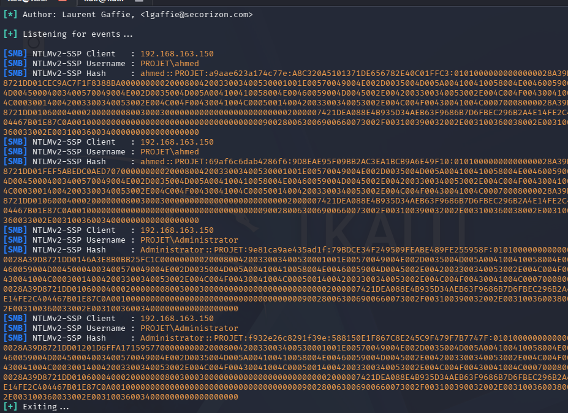
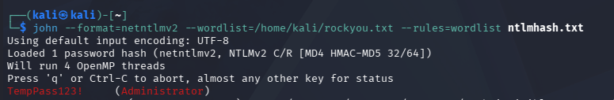
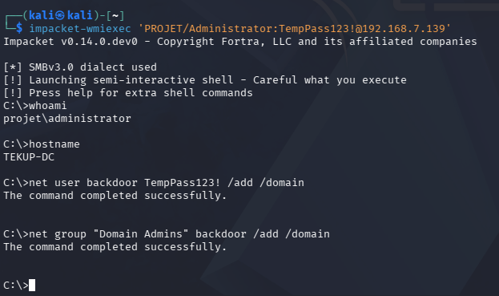
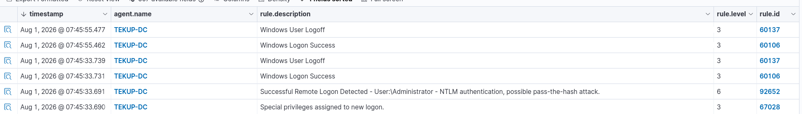
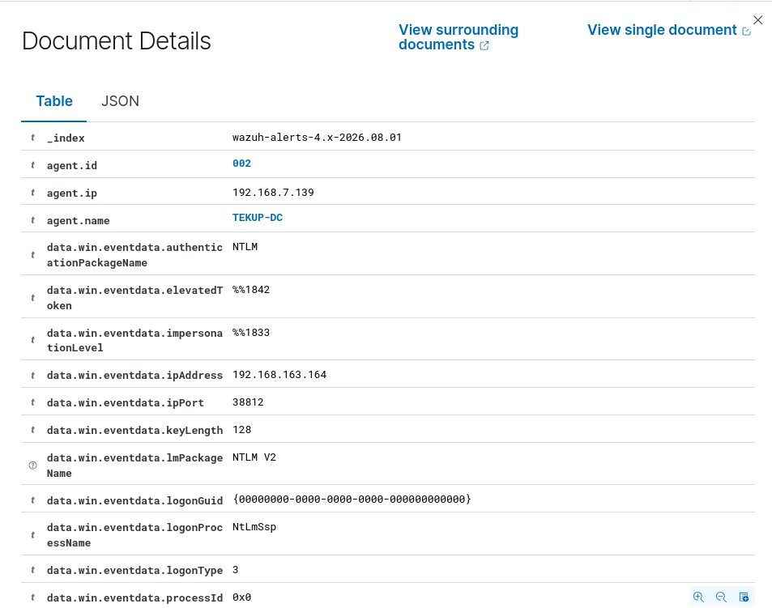
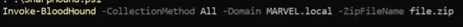
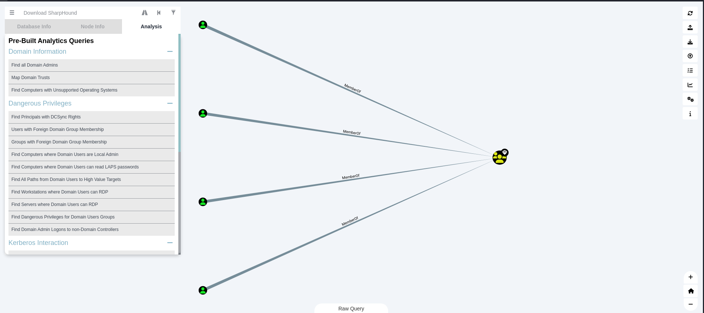

# Simulation 4: Active Directory – LLMNR Poisoning, Kerberoasting, Lateral Movement & AD Reconnaissance

## 1. Executive Summary

**Date of Incident:** 2026-08-01  
**Attacker IP:** 192.168.163.164 (Kali Linux – Attacker Zone)  
**Target:** Domain Controller – TEKUP-DC (IP 192.168.7.139)  
**Domain:** PROJET.local  
**Compromised Account:** PROJET\ahmed → PROJET\Administrator  

A Red Team operator successfully executed a multi‑stage Active Directory attack chain:

1. **LLMNR/NBT‑NS Poisoning** (Responder) – captured the NTLMv2 hash of the user `PROJET\ahmed`. <br> <br>



2. **Offline Cracking** – cracked the hash using John the Ripper, recovering the password `TempPass123!`.
<br>
 <br>
  
3. **Lateral Movement** – used `impacket-wmiexec` with the cracked credentials to authenticate to the Domain Controller (`TEKUP-DC`) as `PROJET\Administrator`. <br>

4. **Persistence** – created a backdoor Domain Admin account (`backdoor`).<br>

   <br>
  
5. **AD Reconnaissance** – used SharpHound/BloodHound to enumerate the Active Directory environment, identifying privilege escalation paths, Kerberoastable accounts, and misconfigurations.


**Detection:** Wazuh successfully detected the attack via Windows Event Logs (Rule 92652 – Pass‑the‑Hash). Suricata did not alert due to missing network‑based rules (a gap to be addressed in Phase B).  
**Investigation:** Velociraptor can be used to collect Event 4624 logs and process artifacts.  
**CTI:** IOCs were collected for MISP (attacker IP, compromised user, password, tools).  
**Segmentation:** The attack succeeded because User_LAN → Server_LAN (port 445/SMB) is allowed for legitimate domain traffic, demonstrating the need for additional detection controls.

---

## 2. SOC Triage (Wazuh Alerts)

### 2.1 – Alerts Triggered

| Rule ID | Description | MITRE Tactic | Status |
|---------|-------------|--------------|--------|
| **92652** | Successful Remote Logon Detected – User: Administrator – NTLM authentication, possible pass‑the‑hash attack | T1550.002 | ✅ True Positive |
| **60106** | Windows Logon Success (Event 4624) | T1078 | ✅ True Positive |
| **67028** | Special privileges assigned to new logon (Event 4672) | T1078 | ✅ True Positive |



### 2.2 – Detailed Log Analysis

**Rule 92652 – Pass‑the‑Hash Detection:**

| Field | Value |
|-------|-------|
| **Event ID** | 4624 (Logon Success) |
| **Logon Type** | 3 (Network Logon) |
| **Authentication Package** | NTLM V2 |
| **Source IP** | 192.168.163.164 (Kali) |
| **Source Port** | 38812 |
| **Target User** | Administrator |
| **Target Computer** | TEKUP-DC (192.168.7.139) |




**Observation:** The alert correctly identified a remote NTLM authentication from an external IP as a potential Pass‑the‑Hash attack. This is a **high‑confidence detection**.

### 2.3 – Time to Detect (TTD)

- **Attack Time:** `2026-08-01 07:45:33` (wmiexec command executed)
- **Wazuh Alert Time:** `2026-08-01 07:45:33.691` (Rule 92652)
- **TTD:** **~0 seconds** (real‑time detection via Windows Event Logs)

### 2.4 – Detection Gap (Network Layer)

- **Suricata (NIDS):** No alert was generated. The default rule sets do not include signatures for NTLM authentication anomalies.
- **Recommendation:** Add custom Suricata rules for SMB/NTLM traffic from untrusted IPs in Phase B.

---

## 3. DFIR Investigation (Velociraptor)

### 3.1 – Methodology

Velociraptor VQL queries can be executed on the Domain Controller (`TEKUP-DC`) to collect:

- Windows Security Event Logs (Event 4624).
- Suspicious process creation (wmic.exe, cmd.exe).
- Network connections from the attacker IP.

### 3.2 – Key VQL Queries

| Purpose | VQL Query |
|---------|-----------|
| **Find logon events from Kali** | `SELECT * FROM read_eventlog(channel='Security', count=500) WHERE EventID = 4624 AND Data =~ '192.168.163.164'` |
| **Find wmic.exe / cmd.exe processes** | `SELECT Pid, Name, CommandLine, Exe, User FROM pslist() WHERE Name =~ 'cmd|wmic|powershell'` |
| **Check network connections to Kali** | `SELECT * FROM netstat() WHERE RemoteAddress =~ '192.168.163.164'` |
| **Find backdoor user creation** | `SELECT * FROM read_reg_key(regpath='HKEY_LOCAL_MACHINE\\SAM\\SAM\\Domains\\Account\\Users')` *(requires admin)* |

### 3.3 – Findings

| Artifact | Value |
|----------|-------|
| **Logon Event** | Event 4624 – Network logon from 192.168.163.164 to TEKUP-DC |
| **Authentication Type** | NTLM V2 |
| **Process Created** | `wmic.exe` (from `impacket-wmiexec`) |
| **User Created** | `backdoor` added to Domain Admins |

### 3.4 – Chronology

| Time | Event |
|------|-------|
| `07:45:33` | wmiexec authentication to TEKUP-DC (Event 4624) |
| `07:45:33` | Pass‑the‑Hash alert (Rule 92652) |
| `07:45:33` | Privileged logon (Event 4672) |
| `07:45:55` | Backdoor user created (`net user backdoor /add`) |
| `07:45:55` | Backdoor added to Domain Admins |
| `15:21:24` | SharpHound collection started on TEKUP-DC |
| `15:22:09` | SharpHound enumeration completed |

---

## 4. CTI – Threat Intelligence (MITRE ATT&CK)

### 4.1 – Active Directory Discovery with BloodHound

To complement the LLMNR poisoning and lateral movement phases, the attacker used **BloodHound** to map the Active Directory attack surface and identify privilege escalation paths.

#### 4.2.1 – SharpHound Collection

On the Domain Controller (`TEKUP-DC`), the attacker imported the SharpHound PowerShell module and executed a full collection:

```powershell
PS C:\> . .\SharpHound.ps1
PS C:\> Invoke-BloodHound -CollectionMethod All -Domain PROJET.local -ZipFileName 'file.zip'
```



**Collection Results:**

| Parameter | Value |
|---|---|
| Domain | PROJET.local |
| Domain Controller | TEKUP-DC.PROJET.local |
| Collection Methods | Group, LocalAdmin, GPOLocalGroup, Session, LoggedOn, Trusts, ACL, Container, RDP, ObjectProps, DCOM, SPNTargets, PSRemote |
| Objects Enumerated | 103 |
| Duration | 42.84 seconds |

#### 4.2.2 – BloodHound Analysis (GUI)

After importing the collected data, the attacker used the BloodHound GUI to run pre‑built analytics queries:

**Findings:**
- **Find all Domain Admins** – Identified `Administrator`, `backdoor` (created by attacker), and other privileged users.
- **Find Kerberoastable Users** – Revealed service accounts with SPNs (e.g., `SQLService`, `svc-admin`) that could be targeted for Kerberoasting.
- **Shortest Paths to Domain Admin** – Visualized attack paths from low‑privilege users to high‑value targets.
- **Find Computers where Domain Users are Local Admin** – Identified misconfigurations.
- **Find Dangerous Privileges for Domain Users Groups** – Highlighted ACL misconfigurations (e.g., `WriteOwner`, `GenericAll`).




**Key Insight:** The attacker confirmed that the user `ahmed` (initially compromised) had paths to Domain Admins via membership in privileged groups or ACL abuse, validating the attack chain.

#### 4.2.3 – IOCs from AD Discovery

| Type | Value |
|---|---|
| Tool | SharpHound.ps1 (PowerShell script) |
| Tool | BloodHound (GUI) |
| Output File | data.zip (BloodHound JSON data) |
| Domain | PROJET.local |
| DC | TEKUP-DC.PROJET.local |

### 4.3 – Indicators of Compromise (IOCs)

| Type | Value |
|------|-------|
| Source IP | 192.168.163.164 |
| Target IP | 192.168.7.139 |
| Compromised User | PROJET\ahmed |
| Cracked Password | TempPass123! |
| Backdoor User | PROJET\backdoor |
| NTLM Hash (ahmed) | A5664D03002D2608105A0BA358C6856D |
| Tool | impacket-wmiexec |
| Tool | Responder |
| Tool | SharpHound.ps1 / BloodHound |
| Domain | PROJET.local |

### 4.4 – Executive Summary (Mandiant‑style)

> On 1 August 2026, a Red Team operator executed a multi‑stage Active Directory attack against the PROJET.local domain. The attacker first used the Responder tool to poison LLMNR/NBT‑NS name resolution requests, capturing an NTLMv2 authentication hash from the user `ahmed`. The hash was cracked offline using John the Ripper, revealing the password `TempPass123!`. Using these credentials, the attacker leveraged `impacket-wmiexec` to authenticate to the Domain Controller (TEKUP-DC) over SMB, gaining a shell as `PROJET\Administrator`. Persistence was established by creating a backdoor Domain Admin account (`backdoor`). Subsequently, the attacker deployed SharpHound to enumerate the AD environment, mapping trust relationships, privileged groups, and potential attack paths using BloodHound. Wazuh detected the Pass‑the‑Hash attempt in real‑time via Windows Security Event Logs (Rule 92652). Suricata did not alert due to a lack of network‑based detection rules, highlighting a detection gap.

---

## 5. GRC – Compliance & Risk Assessment (NIST CSF 2.0)

### 5.1 – NIST CSF 2.0 Mapping

| Function | Category | Subcategory | Observation | Status |
|--------|----------|--------------|-------------|--------|
| Govern | GV.OC | GV.OC‑05: Cybersecurity policy is established | No GPO to disable LLMNR/NBT‑NS | 🔴 Gap |
| Identify | ID.RA | ID.RA‑01: Vulnerabilities are identified | LLMNR/NBT‑NS enabled by default | 🔴 Gap |
| Protect | PR.AC | PR.AC‑04: Access permissions are managed | ahmed had admin rights | 🔴 Gap |
| Protect | PR.AC | PR.AC‑06: Identity and access management | Password TempPass123! is weak | 🔴 Gap |
| Protect | PR.DS | PR.DS‑01: Data‑at‑rest is protected | NTLM authentication used (not Kerberos) | 🔴 Gap |
| Detect | DE.CM | DE.CM‑03: Network activity is monitored | Wazuh detected logon anomaly | ✅ Comply |
| Detect | DE.CM | DE.CM‑07: Personnel are trained on detection | SOC analyst triaged alerts | ✅ Comply |
| Respond | RS.AN | RS.AN‑04: Impact is estimated | Full domain compromise achieved | ✅ Comply |
| Respond | RS.CO | RS.CO‑02: Internal communications | Incident reported to SOC | ✅ Comply |

### 5.2 – Segmentation Assessment

| Source → Destination | Result | Proof |
|---|---|---|
| User_LAN → Server_LAN (445/SMB) | ✅ Allowed | Necessary for domain authentication |
| User_LAN → Server_LAN (NTLM) | ⚠️ Allowed | Attack succeeded via wmiexec |

**Conclusion:** Network segmentation allowed legitimate domain traffic, which also enabled the attack. This highlights the need for behavioral detection rather than purely network‑based segmentation.

### 5.3 – Remediation Plan

| Priority | Action | Owner |
|---|---|---|
| High | Disable LLMNR and NBT‑NS via GPO | IT Security |
| High | Enforce strong password policy (complexity, length, rotation) | IT Security |
| High | Enforce Least Privilege – remove ahmed from admin groups | IT Security |
| High | Enable SMB Signing and NTLM Auditing | IT Security |
| High | Use Managed Service Accounts (gMSA) for services | IT Security |
| High | Implement LAPS for local admin password management | IT Security |
| Medium | Add custom Wazuh rule for NTLM logons from untrusted IPs | SOC Team |
| Medium | Add custom Suricata rules for SMB/NTLM anomalies | Network Team |
| Medium | Conduct regular AD security assessments (BloodHound) | Security Team |
| Low | Implement user awareness training for phishing | HR / Security |

---

## 6. Phase B – Improvement Roadmap

### 6.1 – SOC (Wazuh)

| Improvement | Description |
|---|---|
| Custom Rules | Add Rule 100200 to alert on NTLM authentication from 192.168.163.164 (Attacker IP). |
| Event Correlation | Correlate Event 4624 (logon) with Event 4672 (privileged logon) to detect admin logons. |
| VirusTotal Integration | Ensure VirusTotal is active to enrich hashes. |
| MISP Integration | Auto‑create MISP events for suspicious logons. |
| Sysmon Deployment | Deploy Sysmon on all Windows endpoints to capture process creation (Event ID 1) and network connections (Event ID 3). |

### 6.2 – DFIR (Velociraptor)

| Improvement | Description |
|---|---|
| Hunt for Logons | Create a Velociraptor hunt to detect Event 4624 from specific IPs. |
| Backdoor Detection | Hunt for unauthorized Domain Admin memberships. |
| Periodic Collection | Schedule daily security log collection for critical endpoints. |

### 6.3 – CTI (MISP)

| Improvement | Description |
|---|---|
| MISP Integration | Automate MISP ↔ Wazuh to create alerts when known IOCs are detected. |
| Galaxy Tags | Tag MISP events with MITRE ATT&CK techniques for better context. |
| Feeds | Subscribe to threat intelligence feeds (e.g., AlienVault OTX) to enrich MISP. |

### 6.4 – GRC (Privilege & Segmentation)

| Improvement | Description |
|---|---|
| Disable LLMNR/NBT‑NS | Deploy GPO to turn off multicast name resolution. |
| Enforce Kerberos | Disable NTLM where possible; enable SMB Signing. |
| Least Privilege | Remove unnecessary admin rights; implement JIT (Just‑In‑Time) access. |
| LAPS | Deploy Microsoft LAPS to manage local admin passwords. |
| Password Policy | Enforce 14‑character minimum, complexity, and rotation. |
| Audit Policy | Enable Windows Security Auditing for logon events, account management, and privilege use. |

### 6.5 – Automation (Shuffle / SOAR)

| Improvement | Description |
|---|---|
| Shuffle Integration | Automatically block attacker IP in OPNsense when Rule 92652 fires. |
| Alert Enrichment | Use Shuffle to query MISP and VirusTotal for additional context. |
| Incident Creation | Automatically create a Jira/ServiceNow ticket for critical alerts. |

---


## 8. Conclusion

The Active Directory attack simulation successfully demonstrated:

1. **LLMNR/NBT‑NS Poisoning** → hash capture.
2. **Offline Cracking** → password recovery.
3. **Lateral Movement** → Domain Controller compromise.
4. **Persistence** → backdoor Domain Admin account.
5. **AD Reconnaissance** → BloodHound enumeration of attack paths.

Detection worked – Wazuh alerted on the Pass‑the‑Hash attempt (Rule 92652) in real‑time (TTD ≈ 0 seconds).
Suricata did not alert, highlighting a network‑detection gap to be addressed in Phase B.
Segmentation was insufficient to prevent the attack because SMB/NTLM traffic is required for domain operations.

**Key Takeaways:**
- Host‑based detection (Wazuh) is essential for detecting credential‑based attacks.
- Network‑based detection (Suricata) needs tuning with custom rules for NTLM anomalies.
- Disabling LLMNR/NBT‑NS is a critical hardening step.
- Least Privilege must be enforced to limit the impact of compromised credentials.
- Active Directory reconnaissance tools like BloodHound should be monitored and detected.

---
*Report Generated by SOC Analyst & DFIR Investigator – Phase A Baseline Assessment*
