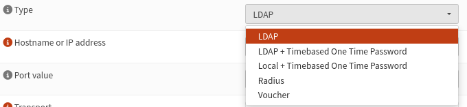
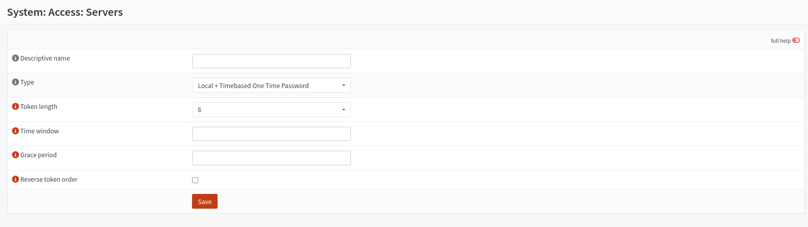
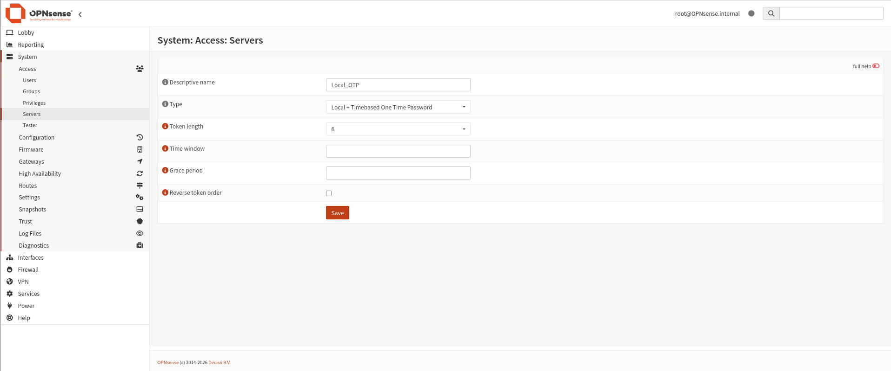
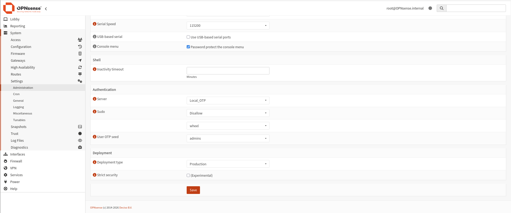

# Installation & Configuration — MFA sur OPNsense (admin GUI)

MFA natif OPNsense (TOTP) pour protéger l'accès à l'interface d'administration — sans dépendance à FreeRADIUS/privacyIDEA (abandonnés pour ce point précis par choix, voir section 4).

---

## 1. Principe

OPNsense propose un type de serveur d'authentification intégré : **"Local + Timebased One Time Password"**. Il combine la base d'utilisateurs locale existante avec une vérification TOTP — sans service externe.

⚠️ **Piège identifié :** définir un secret OTP ("OTP seed") sur un compte utilisateur (`System → Access → Users`) **ne suffit pas seul**. Le champ **"Server"** dans `System → Settings → Administration` doit explicitement être changé de `Local Database` vers ce nouveau type de serveur — sinon OPNsense continue d'authentifier avec mot de passe seul, sans jamais vérifier l'OTP, même si le secret existe sur le compte.

---

## 2. Configuration mise en place

### 2.1 – Création du serveur d'authentification

**System → Access → Servers → Add**, champ **Type** :

*Options disponibles : LDAP, LDAP + Timebased OTP, Local + Timebased OTP, Radius, Voucher.*

Sélection : **`Local + Timebased One Time Password`**.

| Paramètre | Valeur |
|---|---|
| Descriptive name | `Local_OTP` |
| Type | Local + Timebased One Time Password |
| Token length | 6 |
| Time window | (laissé vide — défaut) |
| Grace period | (laissé vide — défaut) |
| Reverse token order | Décoché (format attendu : `mot_de_passe` + `code_OTP` collés, sans espace) |

### 2.2 – Bascule du serveur d'authentification par défaut

**System → Settings → Administration → Authentication** :

| Champ | Valeur |
|---|---|
| Server | `Local_OTP` *(remplace `Local Database`)* |
| Sudo | Disallow |
| User OTP seed | `admins` *(groupe — remplace "Nothing selected")* |

Le compte `root` étant membre du groupe `admins`, il est désormais soumis à la vérification OTP.

### 2.3 – Génération du secret OTP sur le compte utilisateur

**System → Access → Users → (édition du compte) → OTP seed** : cocher l'option de génération, sauvegarder — un QR code et le secret en base32 s'affichent. Scanner avec une app TOTP (Google Authenticator/FreeOTP).

---

## 3. Test de connexion

**Format attendu au login :** `mot_de_passe` + `code_OTP`, collés sans espace dans le champ mot de passe (ex. `MonMotDePasse123456`).

**Procédure de test recommandée :**
1. Déconnexion complète (Logout explicite, pas juste fermer l'onglet).
2. Navigation privée (évite tout cookie de session résiduel).
3. Connexion avec mot de passe + OTP collés.

> 🚧 **Statut : configuration terminée, test de connexion final à reconfirmer** — la configuration ci-dessus a été validée écran par écran, mais la confirmation explicite d'un login réussi avec OTP (et d'un rejet sans OTP) reste à documenter avec une capture finale.

---

## 4. Choix d'architecture — pourquoi pas FreeRADIUS/privacyIDEA ici

⚠️ **Limite à documenter en GRC :** ce choix crée **deux mécanismes MFA distincts** dans le lab (TOTP natif OPNsense, PAM Google Authenticator sur Security-Core — voir `config/security-core-ssh-mfa.md`), plutôt qu'une solution centralisée unique. Compromis assumé par contrainte de temps ; recommandation pour itération future : centraliser via privacyIDEA une fois sa stabilité en production confirmée.
