# Phase B — Durcissement Active Directory

Actions de durcissement menées sur le domaine `PROJET.local` en réponse directe aux failles identifiées en Phase A (Simulations 3 et 4).

---

## 1. Contexte

**Domaine :** `PROJET.local`
**Contrôleur de domaine :** `TEKUP-DC` (Windows Server 2022, `192.168.7.139`)

### 1.1 – Failles identifiées en Phase A à corriger

| Faille | Source | Détail |
|---|---|---|
| `haroun` cumulait Domain Admin, Enterprise Admin et Schema Admin | Sim 3, Sim 4 | A permis au ransomware WannaCry de désactiver Windows Defender sans invite UAC (`reports/phase-a-baseline/simulation-3-wannacry-ransomware.md`, section 3.5) |
| LLMNR et NBT-NS activés | Sim 4 | Empoisonnement LLMNR → capture de hash NTLMv2 (`reports/phase-a-baseline/simulation-4-active-directory.md`, section 4.1) |
| Authentification NTLM autorisée | Sim 4 | A permis l'attaque Pass-the-Hash via `impacket-wmiexec` |
| Signature SMB non forcée | Sim 4 | Trafic SMB/NTLM non protégé, facilitant le mouvement latéral |
| UAC mal configuré | Sim 3 | Permettait la désactivation de protections sans confirmation d'identité |
| Mots de passe locaux faibles/réutilisés | Sim 4 | `TempPass123!` cassé offline après capture du hash |

---

## 2. Suppression des comptes sur-privilégiés

### 2.1 – État avant durcissement (vérification de référence)

```powershell
Get-ADGroupMember -Identity "Domain Admins" | Select-Object Name
```
```
Name
----
Administrator
Haroun Rashid
SQL service
backdoor
```

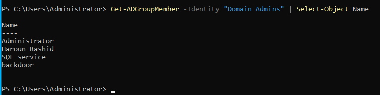

```powershell
Get-ADGroupMember -Identity "Enterprise Admins"
```
Résultat : `SQL service`, `Haroun Rashid`, `Administrator` — confirmant la même sur-exposition sur Enterprise Admins.

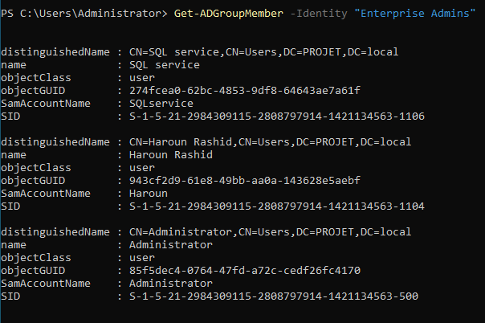

### 2.2 – Retrait effectué

```powershell
Remove-ADGroupMember -Identity "Domain Admins" -Members "SQLservice"
Remove-ADGroupMember -Identity "Schema Admins" -Members "SQLservice"
Remove-ADGroupMember -Identity "Enterprise Admins" -Members "SQLservice"
Remove-ADGroupMember -Identity "Domain Admins" -Members "Haroun Rashid"
Remove-ADGroupMember -Identity "Schema Admins" -Members "Haroun Rashid"
Remove-ADGroupMember -Identity "Enterprise Admins" -Members "Haroun Rashid"


```

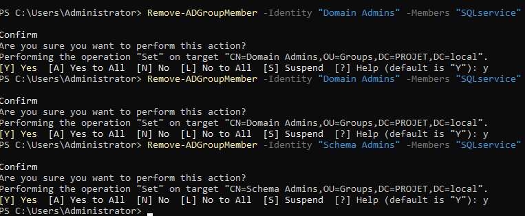
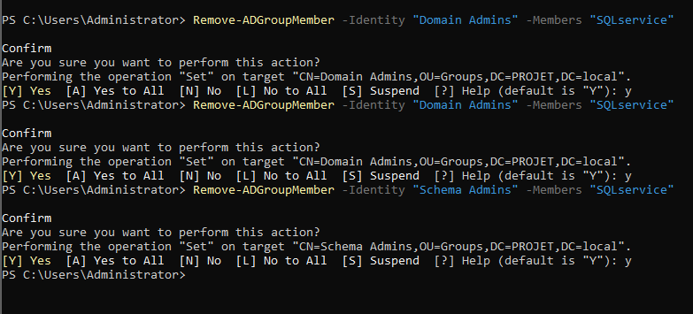


---

## 3. Désactivation de LLMNR et NBT-NS

### 3.1 – LLMNR (Link-Local Multicast Name Resolution)

**GPO :** Computer Configuration → Policies → Administrative Templates → Network → DNS Client → **"Turn off multicast name resolution"** → **Enabled**

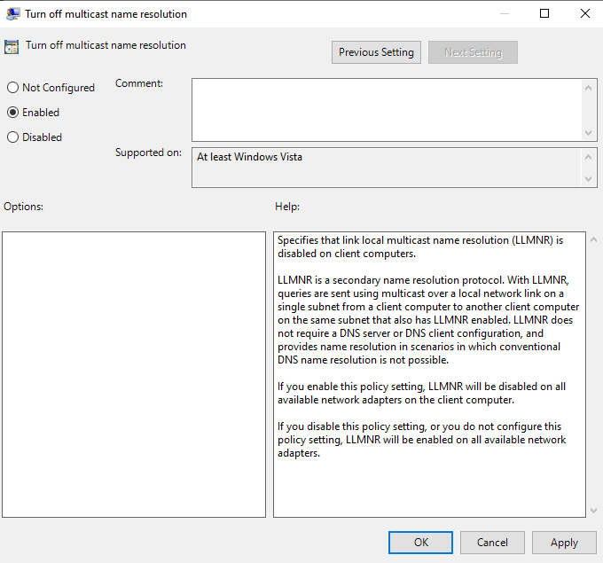
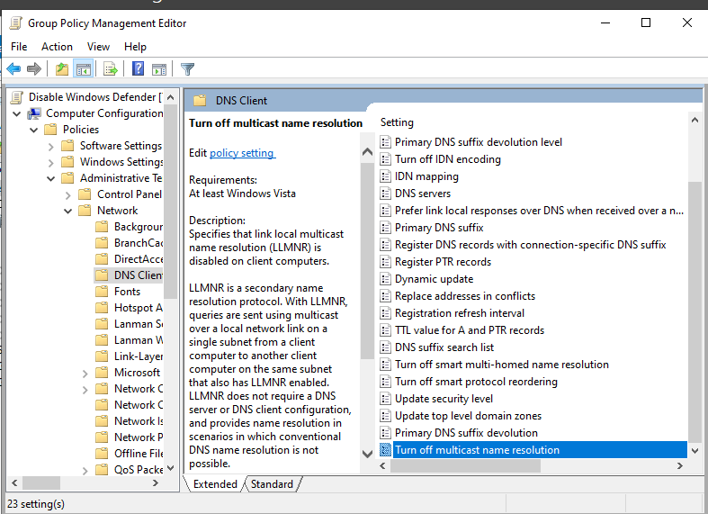

### 3.2 – Durcissement complémentaire (bonus, non demandé initialement)

**GPO :** Network → DNS Client → **"Turn off smart multi-homed name resolution"** → **Enabled**

Ce réglage empêche le client DNS d'émettre des requêtes LLMNR/NetBIOS en parallèle des requêtes DNS classiques en cas de configuration multi-homed — une surface d'attaque LLMNR supplémentaire au-delà du réglage simple.

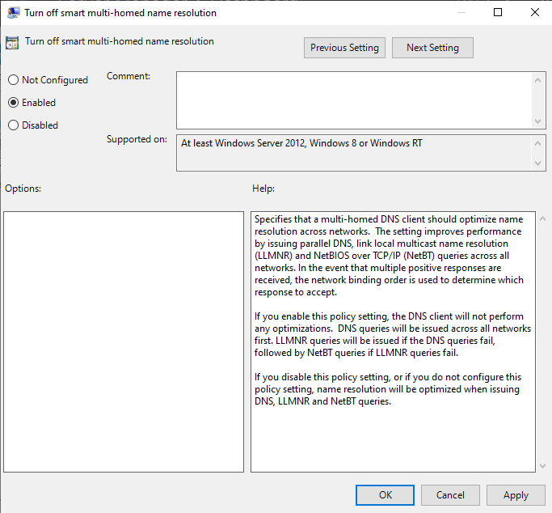
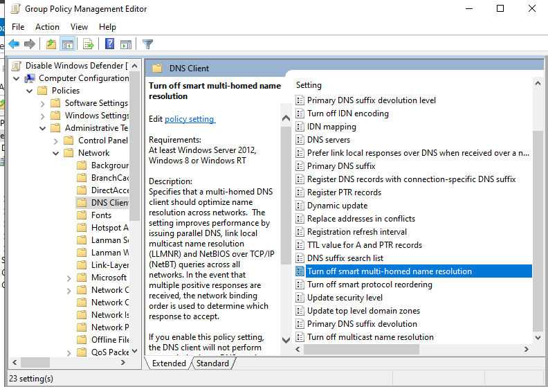

### 3.3 – NBT-NS (NetBIOS over TCP/IP)

Pas de GPO native dédiée — appliqué via une **Préférence de registre GPO** :

**GPO Preferences :** Computer Configuration → Preferences → Windows Settings → Registry → **New Registry Item**

| Champ | Valeur |
|---|---|
| Hive | `HKEY_LOCAL_MACHINE` |
| Key Path | `SYSTEM\CurrentControlSet\Services\NetBT\Parameters\Interfaces` |
| Value name | `NetbiosOptions` |
| Value type | `REG_DWORD` |
| Value data | `2` *(désactive NetBIOS sur toutes les interfaces)* |

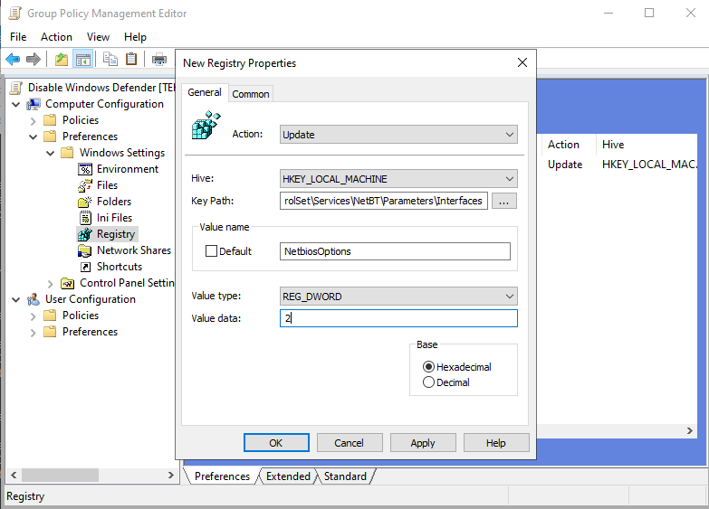

### 3.4 – Application et vérification

```powershell
gpupdate /force
```
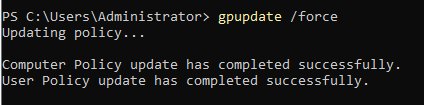

```powershell
reg query HKLM\SYSTEM\CurrentControlSet\Services\NetBT\Parameters\Interfaces /v NetbiosOptions
```
```
NetbiosOptions    REG_DWORD    0x2
```
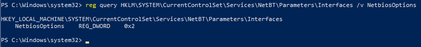

✅ **Confirmé** — NetBIOS effectivement désactivé sur l'interface testée.

---

## 4. Activation de la signature SMB

**GPO :** Computer Configuration → Policies → Windows Settings → Security Settings → Local Policies → Security Options

| Politique | Valeur |
|---|---|
| `Microsoft network server: Digitally sign communications (if client agrees)` | **Enabled** |
| `Microsoft network server: Digitally sign communications (always)` | **Enabled** |

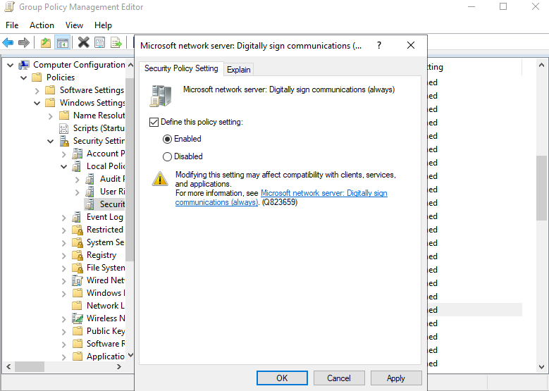
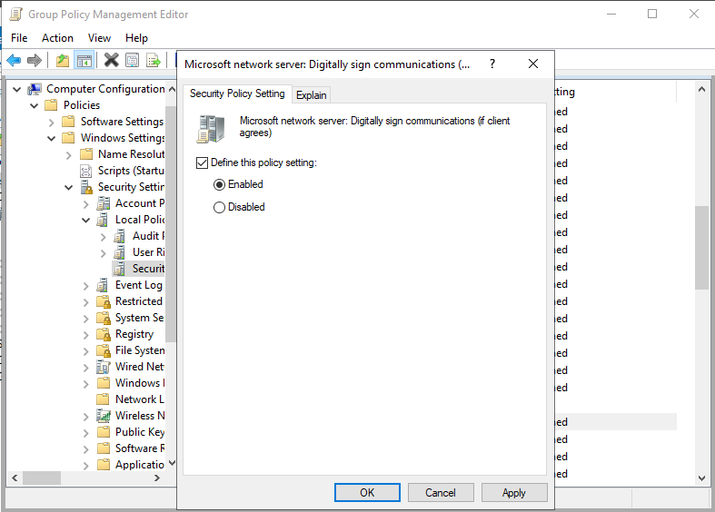
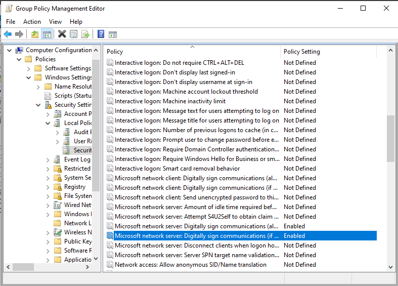


---

## 5. Renforcement de l'UAC (User Account Control)


**GPO Preference :** Registry → `HKEY_LOCAL_MACHINE\SOFTWARE\Microsoft\Windows\CurrentVersion\Policies\System`, valeur `ConsentPromptBehaviorAdmin` = `2` (REG_DWORD) — force l'invite de consentement sur le bureau sécurisé, y compris pour les comptes administrateurs.

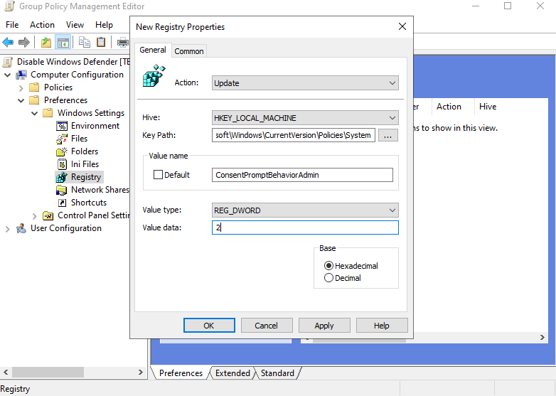

### 5.1 – Vérification en conditions réelles

Testé sur deux machines distinctes du domaine — une élévation de privilège (Registry Editor, PowerShell) déclenche désormais systématiquement une invite UAC demandant explicitement les identifiants du compte `PROJET\Haroun`, plutôt qu'une simple confirmation :

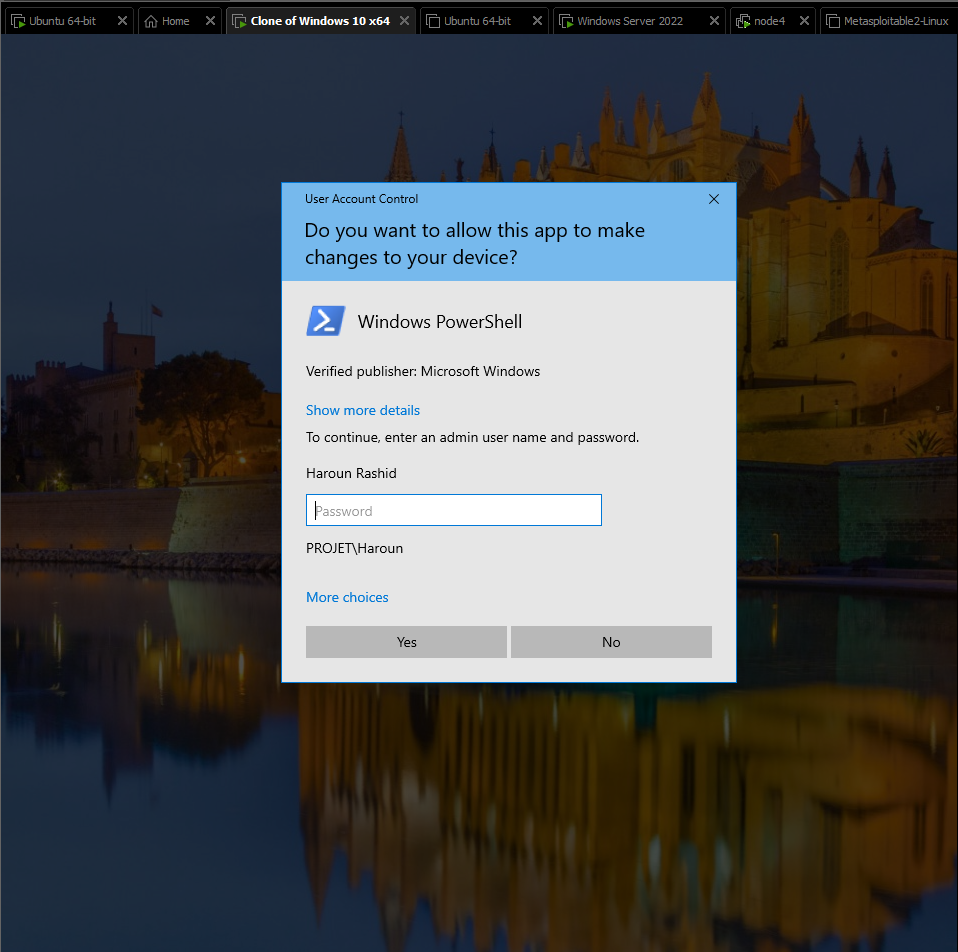
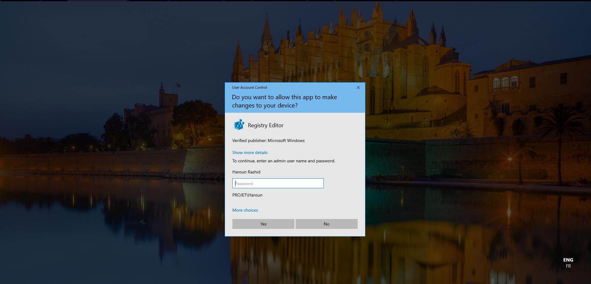

✅ **Confirmé** — ce comportement corrige directement le gap de la Simulation 3 : même avec des droits d'administration locale, une action sensible (comme désactiver Windows Defender) nécessite désormais une saisie explicite d'identifiants, pas une simple validation en un clic.

---


