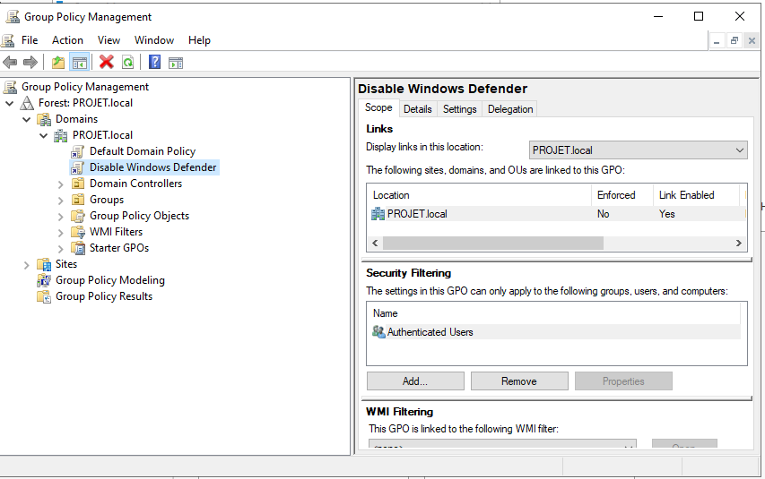

# Phase B — Durcissement Active Directory

Actions de durcissement menées sur le domaine `PROJET.local` en réponse directe aux failles identifiées en Phase A (Simulations 3 et 4).

---

## 1. Contexte

**Domaine :** `PROJET.local`
**Contrôleur de domaine :** `TEKUP-DC` (Windows Server 2022, `192.168.7.139`)

### 1.1 – Failles identifiées en Phase A à corriger

| Faille | Source | Détail |
|---|---|---|
| `haroun` cumulait Domain Admin, Enterprise Admin et Schema Admin | Sim 3, Sim 4 | A permis au ransomware WannaCry de désactiver Windows Defender sans invite UAC (`reports/phase-a-baseline/simulation-3-wannacry-ransomware.md`, section 3.5) |
| LLMNR et NBT-NS activés | Sim 4 | Empoisonnement LLMNR → capture de hash NTLMv2 (`reports/phase-a-baseline/simulation-4-active-directory.md`, section 4.1) |
| Authentification NTLM autorisée | Sim 4 | A permis l'attaque Pass-the-Hash via `impacket-wmiexec` |
| Signature SMB non forcée | Sim 4 | Trafic SMB/NTLM non protégé, facilitant le mouvement latéral |
| UAC mal configuré | Sim 3 | Permettait la désactivation de protections sans confirmation d'identité |
| Mots de passe locaux faibles/réutilisés | Sim 4 | `TempPass123!` cassé offline après capture du hash |

---

## 2. Suppression des comptes sur-privilégiés

### 2.1 – État avant durcissement (vérification de référence)

```powershell
Get-ADGroupMember -Identity "Domain Admins" | Select-Object Name
```
```
Name
----
Administrator
Haroun Rashid
SQL service
backdoor
```


```powershell
Get-ADGroupMember -Identity "Enterprise Admins"
```
Résultat : `SQL service`, `Haroun Rashid`, `Administrator` — confirmant la même sur-exposition sur Enterprise Admins.


### 2.2 – Retrait effectué

```powershell
Remove-ADGroupMember -Identity "Domain Admins" -Members "SQLservice"
Remove-ADGroupMember -Identity "Schema Admins" -Members "SQLservice"
```


### 2.3 – ⚠️ Statut réel — à compléter

Les captures fournies confirment le retrait de **`SQLservice`** de **Domain Admins** et **Schema Admins**. Les actions suivantes, mentionnées comme terminées, **ne sont pas encore confirmées par une capture** :

| Action prévue | Confirmé par capture ? |
|---|---|
| Retrait de `SQLservice` de Domain Admins | ✅ Oui (section 2.2) |
| Retrait de `SQLservice` de Schema Admins | ✅ Oui (section 2.2) |
| Retrait de `SQLservice` de Enterprise Admins | ❌ Non — la capture de référence (2.1) montre encore `SQL service` membre d'Enterprise Admins ; aucune commande `Remove-ADGroupMember -Identity "Enterprise Admins"` n'apparaît dans les captures fournies |
| Retrait de `haroun` des groupes admin | ❌ Non — aucune commande visible ciblant `Haroun` |
| Retrait/suppression du compte `backdoor` | ❌ Non — aucune commande visible |
| Création du compte `svc-admin` (`New-ADUser`) | ❌ Non — aucune capture ne montre cette commande |

**Recommandation :** relancer une vérification finale une fois ces actions confirmées :
```powershell
Get-ADGroupMember -Identity "Domain Admins" | Select-Object Name
Get-ADGroupMember -Identity "Enterprise Admins" | Select-Object Name
Get-ADGroupMember -Identity "Schema Admins" | Select-Object Name
```
Le résultat attendu ne doit plus contenir ni `Haroun Rashid`, ni `SQL service`, ni `backdoor` — uniquement `Administrator` et, une fois créé, `svc-admin`.

---

## 3. Désactivation de LLMNR et NBT-NS

### 3.1 – LLMNR (Link-Local Multicast Name Resolution)

**GPO :** Computer Configuration → Policies → Administrative Templates → Network → DNS Client → **"Turn off multicast name resolution"** → **Enabled**


### 3.2 – Durcissement complémentaire (bonus, non demandé initialement)

**GPO :** Network → DNS Client → **"Turn off smart multi-homed name resolution"** → **Enabled**

Ce réglage empêche le client DNS d'émettre des requêtes LLMNR/NetBIOS en parallèle des requêtes DNS classiques en cas de configuration multi-homed — une surface d'attaque LLMNR supplémentaire au-delà du réglage simple.


### 3.3 – NBT-NS (NetBIOS over TCP/IP)

Pas de GPO native dédiée — appliqué via une **Préférence de registre GPO** :

**GPO Preferences :** Computer Configuration → Preferences → Windows Settings → Registry → **New Registry Item**

| Champ | Valeur |
|---|---|
| Hive | `HKEY_LOCAL_MACHINE` |
| Key Path | `SYSTEM\CurrentControlSet\Services\NetBT\Parameters\Interfaces` |
| Value name | `NetbiosOptions` |
| Value type | `REG_DWORD` |
| Value data | `2` *(désactive NetBIOS sur toutes les interfaces)* |


### 3.4 – Application et vérification

```powershell
gpupdate /force
```


```powershell
reg query HKLM\SYSTEM\CurrentControlSet\Services\NetBT\Parameters\Interfaces /v NetbiosOptions
```
```
NetbiosOptions    REG_DWORD    0x2
```


✅ **Confirmé** — NetBIOS effectivement désactivé sur l'interface testée.

---

## 4. Activation de la signature SMB

**GPO :** Computer Configuration → Policies → Windows Settings → Security Settings → Local Policies → Security Options

| Politique | Valeur |
|---|---|
| `Microsoft network server: Digitally sign communications (if client agrees)` | **Enabled** |
| `Microsoft network server: Digitally sign communications (always)` | **Enabled** |


⚠️ **À compléter :** seules les politiques **serveur** (`Microsoft network server: ...`) sont confirmées par capture. Les politiques **client** correspondantes (`Microsoft network client: Digitally sign communications (always)` / `(if server agrees)`) ne sont pas visibles dans les captures fournies — la signature SMB doit être activée des deux côtés (client ET serveur) pour empêcher tout retour à un mode non-signé lors d'une communication entre deux hôtes du domaine.

**Vérification recommandée une fois complété :**
```powershell
Get-SmbServerConfiguration | Select-Object EncryptData, RequireSecuritySignature, EnableSecuritySignature
Get-SmbClientConfiguration | Select-Object RequireSecuritySignature, EnableSecuritySignature
```

---

## 5. Renforcement de l'UAC (User Account Control)

Non demandé explicitement dans la liste initiale des tâches, mais directement lié à la faille de la Simulation 3 (Defender désactivé sans invite) — traité en parallèle.

**GPO Preference :** Registry → `HKEY_LOCAL_MACHINE\SOFTWARE\Microsoft\Windows\CurrentVersion\Policies\System`, valeur `ConsentPromptBehaviorAdmin` = `2` (REG_DWORD) — force l'invite de consentement sur le bureau sécurisé, y compris pour les comptes administrateurs.


### 5.1 – Vérification en conditions réelles

Testé sur deux machines distinctes du domaine — une élévation de privilège (Registry Editor, PowerShell) déclenche désormais systématiquement une invite UAC demandant explicitement les identifiants du compte `PROJET\Haroun`, plutôt qu'une simple confirmation :


✅ **Confirmé** — ce comportement corrige directement le gap de la Simulation 3 : même avec des droits d'administration locale, une action sensible (comme désactiver Windows Defender) nécessite désormais une saisie explicite d'identifiants, pas une simple validation en un clic.

---

## 6. Point non traité — GPO "Disable Windows Defender" (héritée de la Phase A)

La GPO `Disable Windows Defender`, créée intentionnellement en Phase A pour permettre l'exécution du ransomware WannaCry sans détection AV (voir `config/active-directory.md`, section 6), a été **consultée** mais son état n'a pas été modifié dans les captures fournies — le champ "Security Filtering" montre toujours `Authenticated Users` comme portée.



⚠️ **Action recommandée pour compléter le durcissement :** désactiver ou supprimer cette GPO (`Link Enabled` → `No`, ou suppression du lien), sans quoi Windows Defender reste désactivé domaine entier malgré tous les autres correctifs appliqués — ce qui neutraliserait une bonne partie de l'effet du renforcement UAC (section 5).

---

## 7. Synthèse des vérifications

| Contrôle | Commande / méthode de vérification | Statut |
|---|---|---|
| Retrait `SQLservice` de Domain Admins | `Get-ADGroupMember -Identity "Domain Admins"` | ✅ Confirmé (SQLservice absent après retrait — capture à refaire post-action pour preuve finale) |
| Retrait `SQLservice` de Schema Admins | idem | ✅ Confirmé |
| Retrait `SQLservice`/`haroun`/`backdoor` de Enterprise Admins et Domain Admins | idem | ❌ Non confirmé — voir section 2.3 |
| Création `svc-admin` | `Get-ADUser -Identity svc-admin` | ❌ Non confirmé |
| LLMNR désactivé | `gpresult /r` ou test Responder (ne doit plus capturer de requêtes LLMNR) | ✅ GPO confirmée active |
| NBT-NS désactivé | `reg query ... NetbiosOptions` | ✅ Confirmé (`0x2`) |
| Signature SMB (serveur) | GPO confirmée | ✅ Confirmé |
| Signature SMB (client) | `Get-SmbClientConfiguration` | ❌ Non confirmé |
| UAC renforcé | Test d'élévation réel | ✅ Confirmé (invite avec identifiants) |
| GPO Defender désactivée | `Get-GPO -Name "Disable Windows Defender"` → Link Enabled = No | ❌ Non traité |

---

## 8. Conclusion

Sur les 6 chantiers de durcissement prévus, **4 sont confirmés par capture** (LLMNR, NBT-NS, signature SMB côté serveur, UAC), et **2 restent partiellement ou totalement non confirmés** (retrait complet des comptes sur-privilégiés d'Enterprise Admins, création de `svc-admin`). Un point supplémentaire, non prévu initialement mais directement lié aux findings Phase A, a été identifié comme non traité : la GPO `Disable Windows Defender` héritée de la Phase A reste active.

**Impact sur les failles de Phase A :**
- La capture de hash NTLMv2 via LLMNR (Simulation 4) est désormais bloquée à la source (LLMNR + NBT-NS désactivés).
- Le mouvement latéral par SMB non signé est atténué côté serveur (signature côté client à confirmer).
- L'exploitation de Defender désactivé sans confirmation (Simulation 3) est corrigée par le renforcement UAC — **à condition que la GPO `Disable Windows Defender` soit elle-même désactivée** (section 6), sans quoi la protection reste absente indépendamment de l'UAC.

**Prochaines étapes** avant de considérer ce chantier terminé : compléter les retraits de groupes manquants (section 2.3), créer et documenter `svc-admin`, confirmer la signature SMB côté client, et traiter la GPO Defender héritée.
