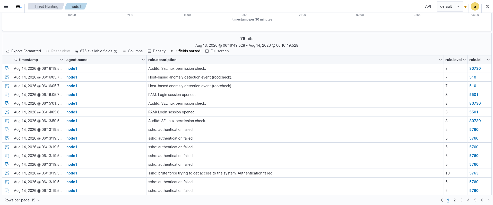
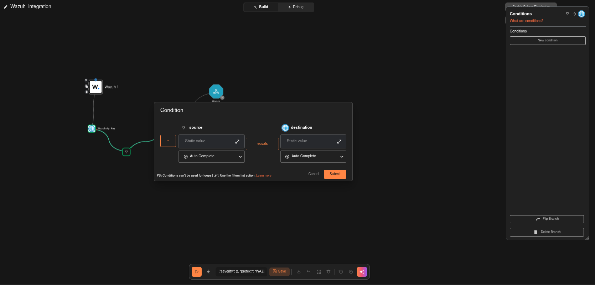
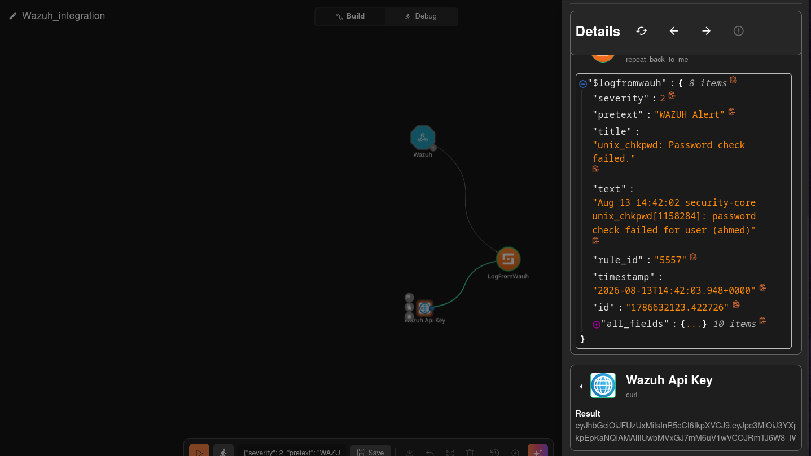
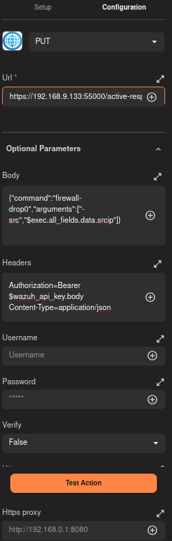
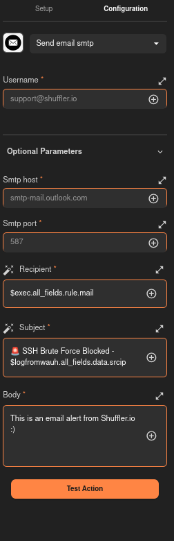
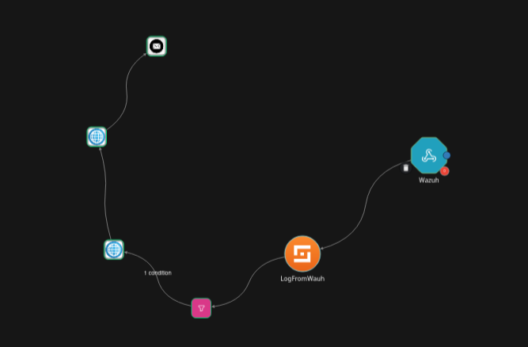
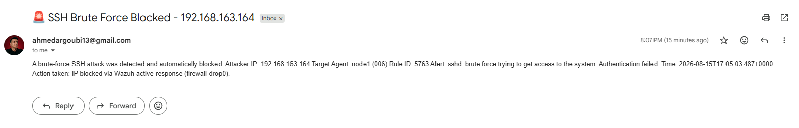

# Phase B — Automated Brute-Force Detection, Blocking & Case Management

**Author:** Ahmed
**Lab environment:** Home SOC Lab
**Date:** August 2026

---

## 1. Introduction

Brute-force attacks against exposed services (SSH, RDP, FTP) remain one of the
most common initial-access techniques observed in real-world intrusions
(MITRE ATT&CK **T1110 – Brute Force**). A single analyst manually watching a
SIEM cannot reliably catch and respond to these attempts fast enough —
especially outside working hours. The goal of this phase was to build a fully
automated detection → containment → case-management pipeline so that:

1. **Wazuh** detects the brute-force pattern in near real time.
2. **Shuffle** (SOAR) receives the alert, validates it, and automatically
   blocks the attacker's IP at the target host.
3. **TheHive** automatically receives the alert as a case-management ticket,
   so a human analyst still reviews, documents, and formally closes the
   incident — automation handles containment speed, the analyst handles
   judgment and record-keeping.
4. The analyst is notified by **email** the moment the block happens.

> **Architecture note:** the original design considered blocking the
> attacker at the network edge (OPNsense firewall alias). During
> implementation, the pipeline was built and fully tested using **Wazuh's
> native Active Response** (`firewall-drop0`) to block the attacker's IP
> directly on the targeted host via `iptables`. This was proven to work
> end-to-end (detection → block → verified loss of connectivity from the
> attacker). OPNsense-level blocking is documented as a **future
> enhancement** in Section 9, rather than described here as implemented,
> since it was not part of the tested configuration.

### High-level flow (as implemented)

```
Kali (attacker) --hydra--> Target host (SSH)
        |
        v
Wazuh Manager detects repeated auth failures (rule 5763, level 10)
        |
        v
Wazuh webhook --> Shuffle workflow
        |
        +--> Filter: only rule_id == 5763 continues
        |
        +--> Wazuh Api Key node (fetch JWT)
        |
        +--> Active-response HTTP call (blocks attacker IP on target host)
        |
        +--> Email notification to SOC analyst
        |
Wazuh Manager (custom-w2thive integration, restricted to rule_id 5763)
        |
        v
TheHive Alert --> promoted to Case --> analyst tasks --> Case closed
```

---

## 2. Prerequisites

Components already deployed and reachable before this phase began:

| Component        | Role                              | Address                     |
|-------------------|-----------------------------------|------------------------------|
| Wazuh Manager     | SIEM / detection engine           | `security-core` (`192.168.9.133`) |
| Wazuh Agent       | Target host being protected       | `node1` (`192.168.8.127`)   |
| Shuffle           | SOAR / workflow automation        | `192.168.9.144:3001`        |
| TheHive           | Case management                   | `security-core:9000`        |
| Kali Linux        | Attacker simulation (`hydra`)     | `192.168.163.164`           |

Required credentials/keys generated during this phase:

- **Wazuh API** user/password (used to obtain a short-lived JWT via
  `GET /security/user/authenticate?raw=true`).
- **Shuffle** personal API key (Settings → API) — required for the
  cloud-relay Email action, later replaced by a standard SMTP action.
- **Gmail App Password** (16-character token, generated under
  Google Account → Security → App Passwords) — required because Gmail
  rejects plain password SMTP logins for third-party apps.
- **TheHive API key** — generated in TheHive (per-user), used by the Wazuh
  integration script to push alerts automatically.

---

## 3. Wazuh Configuration

### 3.1 Detection rule

Two detection strategies were evaluated:

1. A **custom rule** (5764) chained to sid `5710` — fires only when the
   attacker guesses a **non-existent username**.
2. Wazuh's **built-in aggregate rule `5763`** — *"sshd: brute force trying
   to get access to the system. Authentication failed."* This fires
   regardless of whether the guessed username exists, based on repeated
   authentication failures from the same source IP within a time window.

**Rule `5763` (level 10) was selected as the trigger for automation**,
because the lab's attack used a real system account (`ansible`) with a
wrong password — a custom rule scoped only to non-existent usernames would
have missed it entirely. This is an important lesson: brute-force detection
logic must not assume the attacker only tries invalid usernames.

The custom rule that was authored during initial testing (kept for
reference / defense-in-depth) is shown below:


*Custom Wazuh rule (id 5764) chained to sid 5710, MITRE T1110 tagged.*

### 3.2 Verifying detections in the Wazuh dashboard

Both the noisy per-attempt alert (`5760`, level 5) and the aggregate
brute-force alert (`5763`, level 10) were confirmed firing correctly for
the same `hydra` session:


*Wazuh dashboard confirming rule 5763 fires as the aggregate brute-force
detection, distinct from the noisy per-attempt rule 5760.*

### 3.3 Webhook to Shuffle

A Wazuh **Integrator/webhook** trigger was configured in Shuffle
(Environment: `onprem`) to receive every alert Wazuh generates. Filtering
down to only the relevant alert type happens downstream in Shuffle (Section
5), not at the Wazuh webhook level, since the webhook simply forwards all
alerts.

---

## 4. TheHive Integration (Wazuh → TheHive, native)

In addition to Shuffle orchestrating the response, Wazuh was configured to
push matching alerts **directly into TheHive** using the community
`custom-w2thive` integration script, independent of Shuffle. This keeps
case-management alerting resilient even if the Shuffle workflow is down.

### 4.1 Install `thehive4py` in Wazuh's embedded Python

Wazuh ships its own Python interpreter without a standalone `pip3` binary,
so the module form of pip must be used:

```bash
sudo /var/ossec/framework/python/bin/python3 -m pip install thehive4py
```

### 4.2 Deploy the integration script

```bash
cd /opt/
sudo git clone https://github.com/crow1011/wazuh2thehive.git
sudo /var/ossec/framework/python/bin/python3 -m pip install -r /opt/wazuh2thehive/requirements.txt

sudo cp /opt/wazuh2thehive/custom-w2thive.py /var/ossec/integrations/custom-w2thive.py
sudo cp /opt/wazuh2thehive/custom-w2thive /var/ossec/integrations/custom-w2thive

sudo chmod 755 /var/ossec/integrations/custom-w2thive.py
sudo chmod 755 /var/ossec/integrations/custom-w2thive
sudo chown root:wazuh /var/ossec/integrations/custom-w2thive.py
sudo chown root:wazuh /var/ossec/integrations/custom-w2thive
```

### 4.3 Register the integration in `ossec.conf`

Initial configuration used no rule restriction, which flooded TheHive with
331 unrelated alerts (an internal `rule=86003` "Docker: Error message"
noise rule). The fix was to scope the integration to the specific
brute-force rule:

```xml
<integration>
  <name>custom-w2thive</name>
  <hook_url>http://security-core:9000</hook_url>
  <api_key><THEHIVE_API_KEY></api_key>
  <rule_id>5763</rule_id>
  <alert_format>json</alert_format>
</integration>
```

Restart the manager to apply:

```bash
sudo systemctl restart wazuh-manager
```

After this fix, only the true brute-force alert reached TheHive:


*Only rule 5763 alerts arrive after scoping the integration — noise from
unrelated rules eliminated.*

---

## 5. Shuffle Workflow Creation

Workflow name: **`Wazuh_integration`**

### 5.1 Webhook trigger → LogFromWauh

A **Webhook** node ("Wazuh") receives every alert Wazuh forwards. A
**"Repeat back to me"** node (`LogFromWauh`) captures and re-exposes the
alert fields (`severity`, `rule_id`, `timestamp`, `all_fields`, etc.) for
use by downstream nodes.

### 5.2 Filter node

A **Shuffle Tools → "Filter list"** action checks the incoming alert's
`rule_id` field. Alerts that are not `5763` are marked `invalid` and
discarded at this stage.


*Filter list action: input `[$exec]`, field `rule_id`.*

### 5.3 Condition gate on the connection

Marking data `invalid` inside the Filter node's own output does **not**
stop workflow execution by itself — Shuffle still passes execution to the
next node regardless. The actual gate has to live on the **connection
line** between nodes. A condition was added directly on the arrow from
`Filter` → `Wazuh Api Key`:

```
$exec.rule_id  equals  5763
```


*Condition editor on the connection line — this is what actually halts
execution for non-brute-force alerts.*

This was confirmed working: alerts with `rule_id` 5760, 5501, 651, and 40112
all correctly stopped at this point, while only `5763` alerts passed
through to the block action.

### 5.4 Fetch a Wazuh API token

An **Http** app node (`Wazuh Api Key`, method `GET`, using `curl` syntax)
authenticates against the Wazuh manager API and retrieves a short-lived
JWT:

```bash
curl -k -u 'wazuh:<password>' -X GET \
  'https://192.168.9.133:55000/security/user/authenticate?raw=true'
```


*Curl-based Http node used to authenticate to the Wazuh REST API.*

> Note: the Wazuh app's own "Run command" action node (with a locked
> `Apikey`/`Url` authentication object) was evaluated first, but its
> credential fields do not accept dynamic per-run variables — only static
> values. Since the Wazuh JWT expires roughly every 15 minutes, that node
> was replaced with a plain **Http** app action instead (see 5.5), which
> allows fully dynamic variables in every field.

### 5.5 Active-response call — the actual IP block

A plain **Http** app node performs a `PUT` request against Wazuh's
`active-response` REST endpoint. This was the most debugged part of the
pipeline; the final, working configuration is:

- **Method:** `PUT`
- **URL:** `https://192.168.9.133:55000/active-response?agents_list=$exec.all_fields.agent.id`
- **Headers:**
  ```
  Authorization=Bearer $wazuh_api_key.body
  Content-Type=application/json
  ```
- **Body:**
  ```json
  {"command":"firewall-drop0","alert":{"data":{"srcip":"$exec.all_fields.data.srcip"}}}
  ```
- **Ssl verify:** `False`


*Final working configuration of the block action.*

**Key lesson learned:** the `firewall-drop` active-response script reads
the source IP from the **`alert.data.srcip`** JSON path — *not* from a
generic `arguments`/`extra_args` array. An early version of this body used
`"arguments":["-src","$exec.all_fields.data.srcip"]`, which the manager
accepted (HTTP 200) but the agent-side script rejected with
`Cannot read 'srcip' from data`, silently failing to block anything despite
the API reporting success. This was only caught by reviewing
`/var/ossec/logs/active-responses.log` on the target host.

### 5.6 Alert passing the full gate — confirmed live

A real hydra-triggered `5763` alert was captured passing every stage:


*Real alert data: `agent.id = "006"`, `data.srcip = "192.168.163.164"`,
Filter result `valid: 1 item`.*

### 5.7 Email notification

An **Email → "Send email smtp"** action was added after the active-response
node. (A cloud-relay "Send email shuffle" action was tried first but
returned `404 page not found` — this action depends on Shuffle's hosted
cloud relay, which the on-prem Shuffle instance used in this lab cannot
reach. It was replaced with a standard SMTP action.)

- **Smtp host:** `smtp.gmail.com`
- **Smtp port:** `587`
- **Username:** SOC analyst's Gmail address
- **Password:** Gmail **App Password** (regular account passwords are
  rejected by Gmail for SMTP — error `530 5.7.0 Authentication Required`)
- **Recipient:** SOC analyst's email address
- **Subject:** `🚨 SSH Brute Force Blocked - $logfromwauh.all_fields.data.srcip`
- **Body:**
  ```
  A brute-force SSH attack was detected and automatically blocked.

  Attacker IP: $logfromwauh.all_fields.data.srcip
  Target Agent: $logfromwauh.all_fields.agent.name ($logfromwauh.all_fields.agent.id)
  Rule ID: $logfromwauh.rule_id
  Alert: $logfromwauh.title
  Time: $logfromwauh.timestamp

  Action taken: IP blocked via Wazuh active-response (firewall-drop0).
  ```


*Working SMTP configuration after switching away from the cloud-relay
action.*

### 5.8 Final workflow canvas


*End-to-end chain: Webhook → LogFromWauh → Filter/condition gate → Wazuh
Api Key → Active-response block → Email.*

---

## 6. Testing the Workflow

### 6.1 Simulating the attack from Kali

```bash
hydra -L users.txt -P password.txt ssh://192.168.8.127
```

This successfully found a valid credential pair (`ansible:ahmed`),
confirming the target was genuinely vulnerable to brute-force before
containment was applied.

### 6.2 Verifying the block

After the workflow executed, the target host's firewall rules were
inspected directly:

```bash
sudo iptables -L -n -v
```

```
Chain INPUT (policy ACCEPT 141 packets, 7955 bytes)
 pkts bytes target     prot opt in     out     source               destination
    0     0 DROP       all  --  *      *       192.168.163.164      0.0.0.0/0
Chain FORWARD (policy ACCEPT 0 packets, 0 bytes)
 pkts bytes target     prot opt in     out     source               destination
    0     0 DROP       all  --  *      *       192.168.163.164      0.0.0.0/0
```

And the active-response log confirmed a clean execution with no errors:

```
2026/08/14 08:00:36 active-response/bin/firewall-drop: Starting
2026/08/14 08:00:36 active-response/bin/firewall-drop:
  {"command":"add","parameters":{"alert":{"data":{"srcip":"192.168.163.164"}}}}
2026/08/14 08:00:36 active-response/bin/firewall-drop:
  {"command":"check_keys","parameters":{"keys":["192.168.163.164"]}}
2026/08/14 08:00:36 active-response/bin/firewall-drop:
  {"command":"continue", ...}
```

Finally, from Kali itself, connectivity was confirmed lost:


*Top: hydra successfully brute-forces a valid credential. Bottom: after the
automated block, `ping` to the target shows 100% packet loss — the
attacker's own IP is now blocked.*

### 6.3 Verifying the TheHive alert


*10 observables (attacker IP, in various data-type formats), auto-tagged
`TLP:AMBER` / `PAP:GREEN`.*


*Full rule metadata (level, MITRE ATT&CK ID `T1110`, tactic "Credential
Access", technique "Brute Force") automatically populated from the Wazuh
alert.*

### 6.4 Verifying the email notification


*SOC analyst inbox — subject and body correctly populated with the real
attacker IP, target agent, rule ID, and timestamp from the live execution.*

---

## 7. Case Management in TheHive

Detection and containment are automated, but a human analyst is still
responsible for reviewing, documenting, and formally closing every
incident. The alert was promoted into a working case:


*Alert promoted to an "Empty case," inheriting title, description,
severity, and observables.*


*Case #1 created, linked to the originating alert, tags carried over
(`agent_id`, `agent_ip`, `agent_name`, `rule`).*

### 7.1 Classification

- **TLP (Traffic Light Protocol)** — controls how widely the case
  information may be shared. Set to **TLP:AMBER** (internal
  organization only).
- **PAP (Permissible Actions Protocol)** — controls what actions are
  permitted based on this intel. Set to **PAP:GREEN**, since an active
  defensive action (the IP block) had already been taken.

### 7.2 Analyst tasks

A standard investigation checklist was added to the case:


*Investigation tasks: confirm the block is active, review auth logs for
any successful login before containment, verify account integrity, confirm
SOC notification delivery, and close the case.*

Each task was independently verified on the target host, for example:

```bash
sudo grep "Accepted password" /var/log/secure | grep 192.168.163.164
sudo last ansible
```

and marked **Completed** once confirmed:


*"Confirm SOC notification delivered" task marked Completed after the
email was verified received.*

### 7.3 Case documentation

A full incident summary was recorded on the case itself:


> Automated detection and response executed successfully via Wazuh +
> Shuffle SOAR pipeline.
>
> **Summary:**
> - Wazuh detected repeated SSH authentication failures from
>   `192.168.163.164` targeting `node1` (agent 006), matching rule 5763
>   (level 10, brute force).
> - Shuffle workflow automatically retrieved a Wazuh API token and
>   triggered active-response (`firewall-drop0`), blocking the source IP
>   on `node1`.
> - Alert was automatically forwarded to TheHive for case management via
>   Wazuh's `custom-w2thive` integration.
> - Email notification delivered to the SOC analyst.
>
> **Verification:** block confirmed active via `iptables`. No successful
> authentication observed from the source IP prior to blocking. No signs
> of account compromise.
>
> **Classification:** True Positive — automated containment successful.

Once all tasks were completed, the case was closed with resolution status
**TruePositive**.

---

## 8. Lessons Learned / Troubleshooting Summary

| Issue | Root cause | Fix |
|---|---|---|
| Shuffle rejected `localhost` in URLs | Shuffle cannot resolve `localhost` from its own container/host context | Replaced with the Wazuh manager's real LAN IP |
| Filter node didn't stop execution on no-match | "Filter list" only labels data `valid`/`invalid`; it does not halt the workflow branch by itself | Added an explicit **condition** on the connection line (`$exec.rule_id equals 5763`) |
| Custom rule 5764 (sid 5710) never fired during the real test | The attacker guessed a password for a **real** account (`ansible`), not a non-existent username | Used Wazuh's built-in aggregate rule `5763` instead, which fires on repeated failures regardless of username validity |
| Active-response accepted (`HTTP 200`) but never actually blocked anything | `firewall-drop` script reads `alert.data.srcip`, not a generic `arguments` array | Changed the Body payload to `{"command":"firewall-drop0","alert":{"data":{"srcip":"..."}}}` |
| Locked `Apikey`/`Url` fields on the dedicated Wazuh app node rejected dynamic variables | That action's Authentication object only supports static credentials, incompatible with a JWT that expires every ~15 minutes | Replaced with a plain **Http** app node, which allows dynamic variables in every field |
| Email action failed with `404 page not found` | "Send email shuffle" depends on Shuffle's hosted cloud relay (`shuffler.io`), unreachable from this on-prem instance | Switched to a standard **SMTP** email action |
| Email failed with `530 5.7.0 Authentication Required` | Gmail rejects plain-password SMTP logins for third-party senders | Generated a Gmail **App Password** and used it in place of the account password |
| TheHive flooded with 331 irrelevant alerts | `custom-w2thive.py` had no severity/rule filtering — every Wazuh alert (including unrelated Docker log noise, rule 86003) was forwarded | Added `<rule_id>5763</rule_id>` to the `ossec.conf` integration block to scope it to brute-force alerts only |
| Wazuh's embedded Python had no standalone `pip3` binary | Some Wazuh builds ship Python without a separate `pip3` executable at the expected path | Used `python3 -m pip install ...` instead |

---

## 9. Future Enhancements

- **OPNsense-level blocking**: extend the workflow to also add the
  attacker's IP to an OPNsense firewall alias, blocking at the network
  edge in addition to the host-level `iptables` block already implemented.
  This would provide defense-in-depth if the target host's own firewall is
  ever bypassed or reset.
- **Auto-unblock / TTL**: the current active-response block has no
  automatic expiry (`timeout no` in `ossec.conf`). Consider adding a
  time-bound unblock, or a manual "unblock" task in the TheHive case
  workflow.
- **Case templates**: build a reusable TheHive case template
  ("SSH Brute Force Response") pre-populated with the standard task
  checklist used in Section 7.2, instead of adding tasks manually each
  time.
- **Multi-service coverage**: extend detection beyond SSH to RDP and FTP
  brute-force patterns, as originally scoped.

---

## 10. Conclusion

This phase delivered a working, tested automation pipeline that takes a
brute-force SSH attack from first detection to a fully documented, closed
incident with no manual intervention required for containment:

- **Detection:** Wazuh correctly identifies brute-force patterns using its
  built-in aggregate rule (`5763`), validated against a real attack using
  valid-but-guessed credentials.
- **Containment:** Shuffle automatically blocks the attacker's IP on the
  target host within seconds of detection, verified via `iptables` and the
  active-response logs.
- **Case management:** Every qualifying alert is automatically pushed into
  TheHive as a case-ready alert, complete with MITRE ATT&CK mapping,
  observables, and TLP/PAP classification, ready for analyst review.
- **Notification:** The SOC analyst is emailed immediately with the
  attacker IP, target host, and rule details.

The most valuable lessons from this phase were not architectural but
operational: verifying that "the API returned success" is not the same as
"the action actually happened," and that filter/condition logic in a SOAR
tool must be explicitly enforced on the workflow path, not assumed from a
node's internal output.
