# Phase B — Automated Brute-Force Detection, Blocking & Case Management

---

## 1. Introduction

Brute-force attacks against exposed services (SSH, RDP, FTP) remain one of the
most common initial-access techniques observed in real-world intrusions
(MITRE ATT&CK **T1110 – Brute Force**). A single analyst manually watching a
SIEM cannot reliably catch and respond to these attempts fast enough —
especially outside working hours. The goal of this phase was to build a fully
automated detection → containment → case-management pipeline so that:

1. **Wazuh** detects the brute-force pattern in near real time.  <br>


2. **Shuffle** (SOAR) receives the alert, validates it, and automatically
   blocks the attacker's IP at the target host.  <br>

 <br>

3. **TheHive** turns the qualifying alert into a case-management ticket, so a
   human analyst still reviews, documents, and formally closes the incident —
   automation handles containment speed, the analyst handles judgment and
   record-keeping. <br>
 <br>
   
4. The analyst is notified by **email** the moment the block happens.


### High-level flow

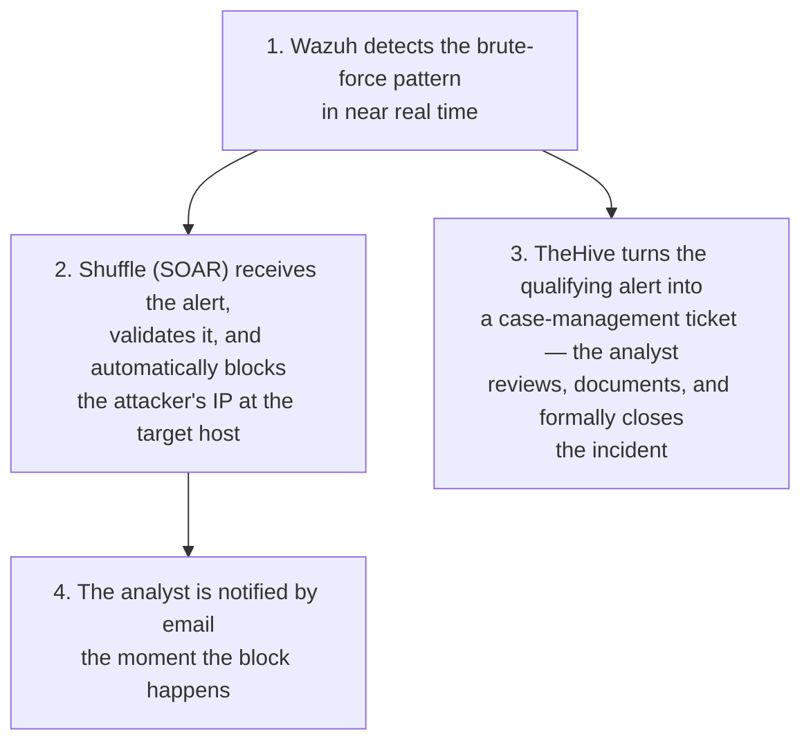
```mermaid
flowchart TD
    A["1. Wazuh detects the brute-force pattern<br/>in near real time"]
    B["2. Shuffle (SOAR) receives the alert,<br/>validates it, and automatically blocks<br/>the attacker's IP at the target host"]
    C["3. TheHive turns the qualifying alert into<br/>a case-management ticket — the analyst<br/>reviews, documents, and formally closes<br/>the incident"]
    D["4. The analyst is notified by email<br/>the moment the block happens"]

    A --> B
    A --> C
    B --> D
```

Automation (steps 1–2 and 4) handles containment speed; the analyst (step
3) still handles judgment and record-keeping — the goal is fast, reliable
first response, not removing the human from the loop entirely.

### Detailed implementation flow

The diagram above shows the narrative; the flow actually implemented maps
each step onto specific components as follows:

```
Kali (attacker) --hydra--> Target host (SSH)
        |
        v
Wazuh Manager detects repeated auth failures (rule 5763, level 10)
        |
        v
Wazuh webhook --> Shuffle workflow
        |
        +--> Filter: only rule_id == 5763 continues
        |
        +--> Wazuh Api Key node (fetch JWT)
        |
        +--> Active-response HTTP call (blocks attacker IP on target host)
        |
        +--> Email notification to SOC analyst
        |
Wazuh Manager --> TheHive Alert (scoped to rule_id 5763)
        |
        v
Alert promoted to Case --> analyst tasks --> Case closed
```

---

## 2. Prerequisites

Components already deployed and reachable before this phase began:

| Component        | Role                              | Address                     |
|-------------------|-----------------------------------|------------------------------|
| Wazuh Manager     | SIEM / detection engine           | `security-core` (`192.168.9.133`) |
| Wazuh Agent       | Target host being protected       | `node1` (`192.168.8.127`)   |
| Shuffle           | SOAR / workflow automation        | `192.168.9.144:3001`        |
| TheHive           | Case management                   | `security-core:9000`        |
| Kali Linux        | Attacker simulation (`hydra`)     | `192.168.163.164`           |

Required credentials/keys generated during this phase:

- **Wazuh API** user/password (used to obtain a short-lived JWT via
  `GET /security/user/authenticate?raw=true`).
- **Shuffle** personal API key (Settings → API) — this is where the key
  lives if you want to use Shuffle's hosted cloud-relay Email action; see
  the note in Section 4.6 on why this lab ended up using standard SMTP
  instead.
- **Gmail App Password** (16-character token, generated under
  Google Account → Security → App Passwords) — required because Gmail
  rejects plain-password SMTP logins from third-party apps.
- **TheHive API key** — generated per-user in TheHive, used so that Wazuh
  can push matching alerts into TheHive automatically. Wazuh's integration
  is scoped to only forward alerts matching `rule_id 5763` — this is what
  keeps TheHive's Alerts queue limited to genuine brute-force detections
  instead of every log line the manager processes.

---

## 3. Wazuh Configuration

### 3.1 Detection rule

Two detection strategies were evaluated:

1. A **custom rule** (5764) chained to sid `5710` — fires only when the
   attacker guesses a **non-existent username**.
2. Wazuh's **built-in aggregate rule `5763`** — *"sshd: brute force trying
   to get access to the system. Authentication failed."* This fires
   regardless of whether the guessed username exists, based on repeated
   authentication failures from the same source IP within a time window.

**Rule `5763` (level 10) was selected as the trigger for automation**,
because the lab's attack used a real system account (`ansible`) with a
wrong password — a custom rule scoped only to non-existent usernames would
have missed it entirely. This is an important lesson: brute-force detection
logic must not assume the attacker only tries invalid usernames.

The custom rule that was authored during initial testing (kept for
reference / defense-in-depth) is shown below:

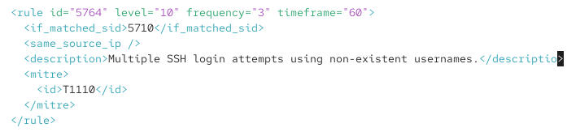
*Custom Wazuh rule (id 5764) chained to sid 5710, MITRE T1110 tagged.*

### 3.2 Webhook to Shuffle

A Wazuh **Integrator/webhook** trigger was configured in Shuffle
(Environment: `onprem`) to receive every alert Wazuh generates. Filtering
down to only the relevant alert type happens downstream in Shuffle
(Section 4), since the webhook itself simply forwards everything.

---

## 4. Shuffle Workflow Creation

Workflow name: **`Wazuh_integration`**. This section documents how each
node was built and configured. Proof that the finished pipeline actually
works end-to-end is covered separately in Section 6.

### 4.1 Webhook trigger → LogFromWauh

A **Webhook** node ("Wazuh") receives every alert Wazuh forwards. A
**"Repeat back to me"** node (`LogFromWauh`) captures and re-exposes the
alert fields (`severity`, `rule_id`, `timestamp`, `all_fields`, etc.) for
use by downstream nodes.

### 4.2 Filter node

A **Shuffle Tools → "Filter list"** action checks the incoming alert's
`rule_id` field.

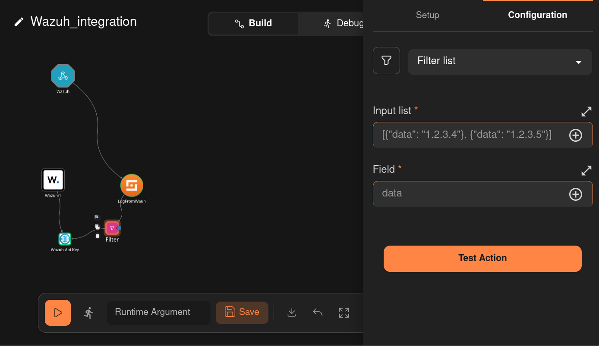 <br>
*Filter list action: input `[$exec]`, field `rule_id`.*

### 4.3 Condition gate on the connection

Marking data `invalid` inside the Filter node's own output does not stop
workflow execution by itself — Shuffle still passes execution to the next
node regardless of the filter's verdict. The actual gate has to live on the
**connection line** between nodes:

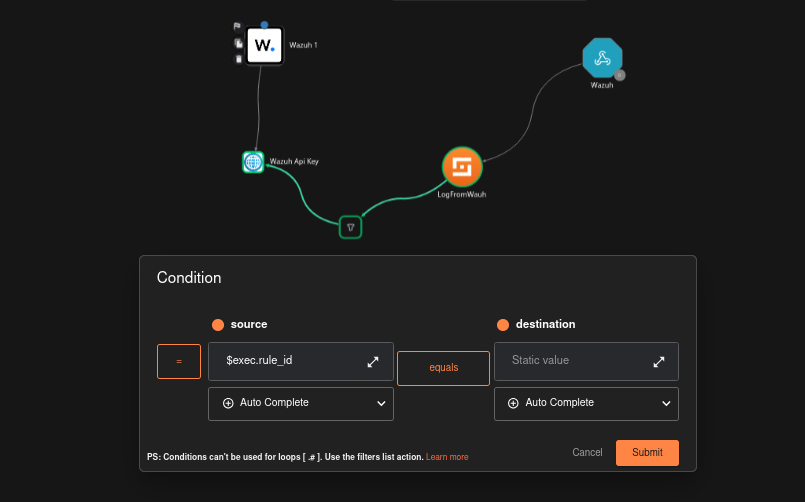 <br>
*Condition editor placed directly on the connection line from `Filter` →
`Wazuh Api Key`: `$exec.rule_id equals 5763`.*

### 4.4 Fetch a Wazuh API token

An **Http** app node (`Wazuh Api Key`, method `GET`, using `curl` syntax)
authenticates against the Wazuh manager API and retrieves a short-lived
JWT:

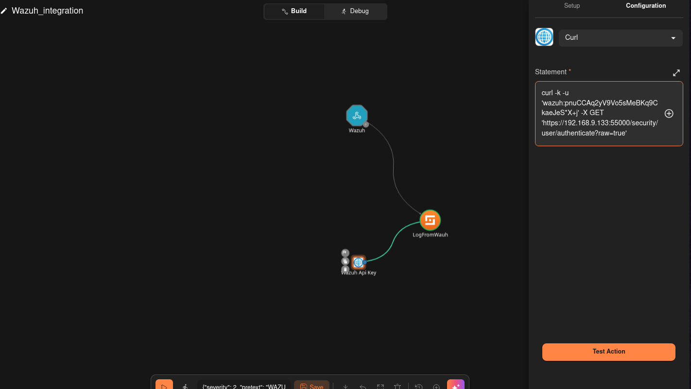 <br>
*Curl-based Http node authenticating to the Wazuh REST API, using the
manager's real IP instead of `localhost` (Shuffle cannot resolve
`localhost` from its own container context).*


### 4.5 Active-response call — the actual IP block

A plain **Http** app node performs a `PUT` request against Wazuh's
`active-response` REST endpoint. Each field was verified individually via
Shuffle's Autocomplete panel while building the node:

**URL:**

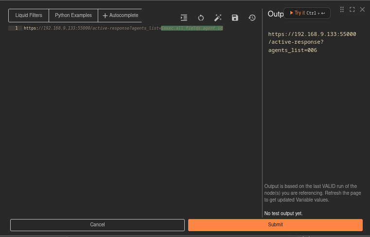 <br>
*`https://192.168.9.133:55000/active-response?agents_list=$exec.all_fields.agent.id`*

**Headers:**

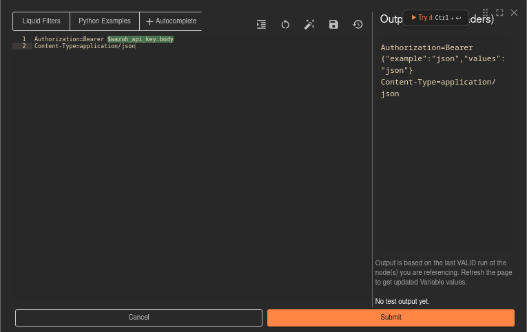 <br>
*`Authorization=Bearer $wazuh_api_key.body` and
`Content-Type=application/json`.*

**Body:**

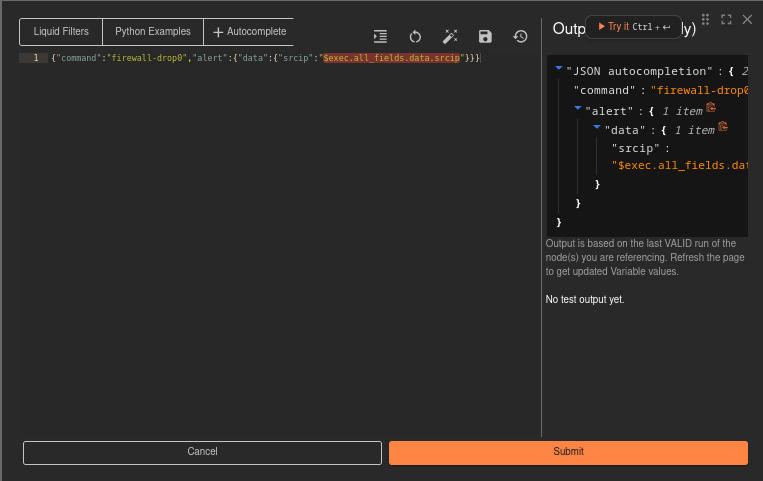 <br>
*`{"command":"firewall-drop0","alert":{"data":{"srcip":"$exec.all_fields.data.srcip"}}}`*

**Ssl verify:** `False` (the Wazuh manager uses a self-signed certificate).

### 4.6 Email notification

An **Email → "Send email smtp"** action was added after the active-response
node.


> 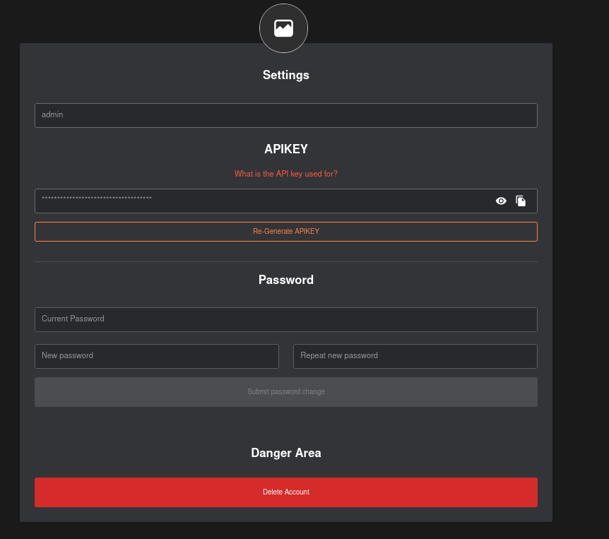 <br>


**SMTP configuration:**

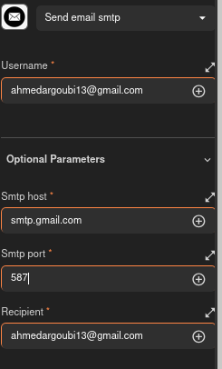 <br>
*`smtp.gmail.com`, port `587`, username and recipient set to the SOC
analyst's Gmail address.*

Gmail rejects plain-password SMTP logins for third-party senders
(`530 5.7.0 Authentication Required`), so a Gmail **App Password** was
generated instead of using the normal account password:

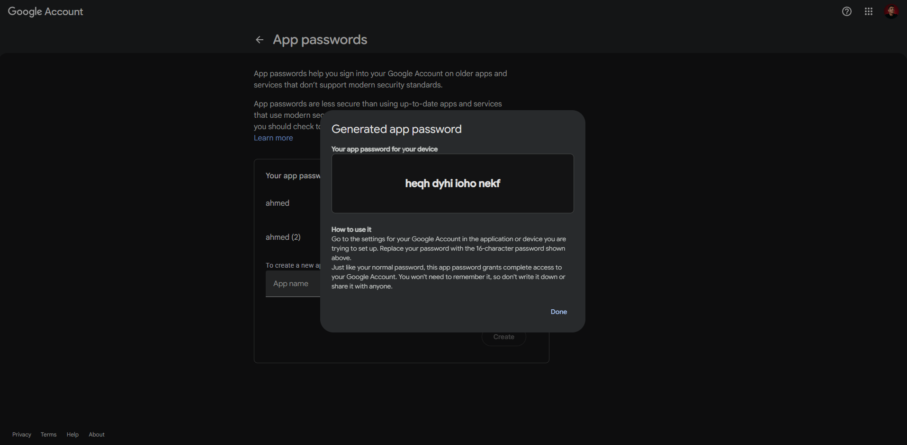 <br>
*Google Account → Security → App Passwords → generate a 16-character
password, used in the SMTP node's Password field instead of the normal
login password.*

**Subject** and **Body** were built using variables from `LogFromWauh`:

```
Subject: 🚨 SSH Brute Force Blocked - $logfromwauh.all_fields.data.srcip

Body:
A brute-force SSH attack was detected and automatically blocked.

Attacker IP: $logfromwauh.all_fields.data.srcip
Target Agent: $logfromwauh.all_fields.agent.name ($logfromwauh.all_fields.agent.id)
Rule ID: $logfromwauh.rule_id
Alert: $logfromwauh.title
Time: $logfromwauh.timestamp

Action taken: IP blocked via Wazuh active-response (firewall-drop0).
```

### 4.7 Final workflow canvas

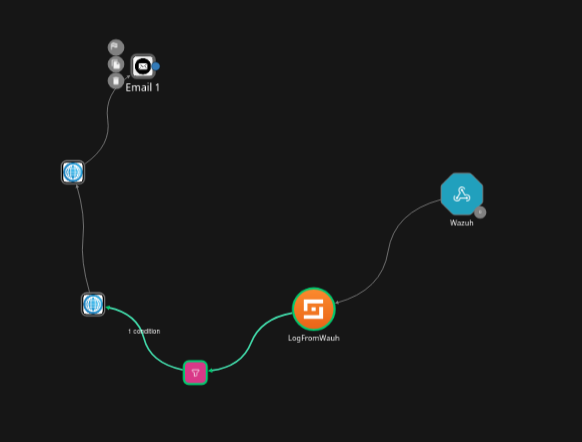 <br>
*End-to-end chain: Webhook → LogFromWauh → Filter/condition gate → Wazuh
Api Key → Active-response block → Email.*

---

## 5. Attack Simulation

With the detection rule and the full Shuffle workflow in place, a real
brute-force attack was launched from Kali against the target host to
trigger the entire pipeline under real conditions — not a manual test run.

```bash
hydra -L users.txt -P password.txt ssh://192.168.8.127
```

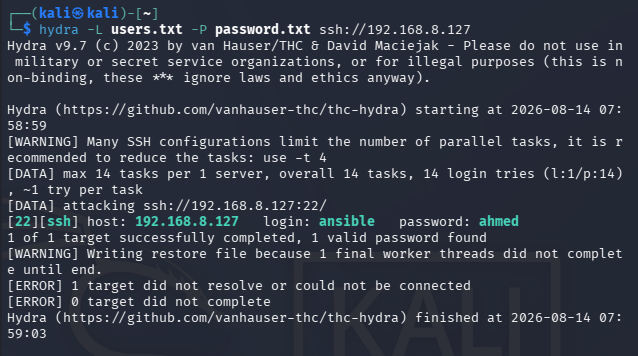


At this point, before any response has happened, the target is still fully
reachable from Kali — this is confirmed as the "before" state in the next
section.

---

## 6. Validation — Wazuh & Shuffle

This section proves the detection and containment side of the pipeline
actually worked, not just that it was configured correctly.

### 6.1 Wazuh fired the correct rule

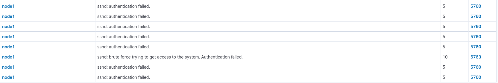 <br>
*Wazuh dashboard confirming rule `5763` (level 10, aggregate brute-force)
fired alongside the noisier per-attempt rule `5760` for the same hydra
session.*

### 6.2 The Shuffle gate correctly separates real detections from noise

A real `5763` alert was captured passing every stage of the workflow:

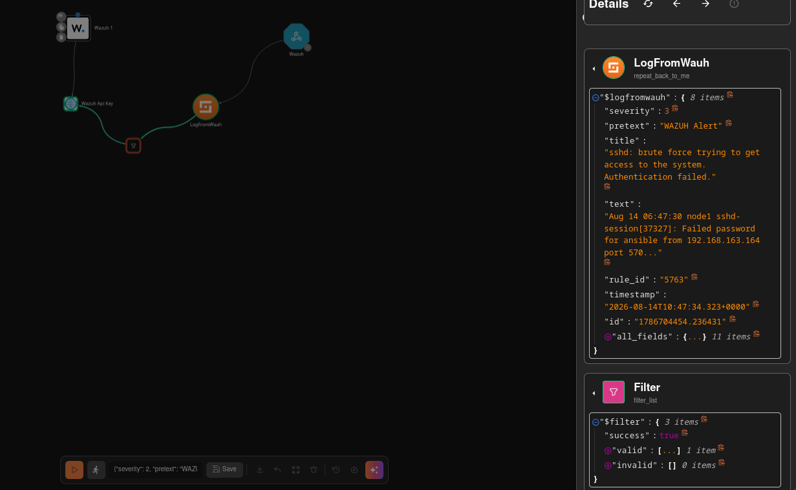 <br>
*Real alert data: `agent.id = "006"`, `data.srcip = "192.168.163.164"`,
Filter result `valid: 1 item`.*


### 6.3 The block is actually present in iptables

```bash
sudo iptables -L -n -v
```

```
Chain INPUT (policy ACCEPT 141 packets, 7955 bytes)
 pkts bytes target     prot opt in     out     source               destination
    0     0 DROP       all  --  *      *       192.168.163.164      0.0.0.0/0
Chain FORWARD (policy ACCEPT 0 packets, 0 bytes)
 pkts bytes target     prot opt in     out     source               destination
    0     0 DROP       all  --  *      *       192.168.163.164      0.0.0.0/0
```

### 6.4 The attacker can no longer reach the target

This is the real-world proof that matters: after the automated response,
the attacker's own machine loses connectivity to the target it was just
attacking.

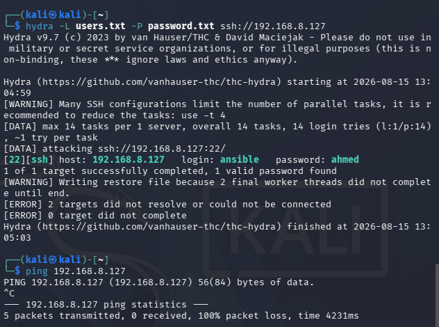  <br>
*Top: hydra successfully brute-forces a valid credential (same attack as
Section 5). Bottom: immediately after, `ping 192.168.8.127` from Kali
returns **100% packet loss** — the attacker's own IP is now blocked by the
automated response, with zero manual intervention.*

### 6.5 Repeated executions confirm stability

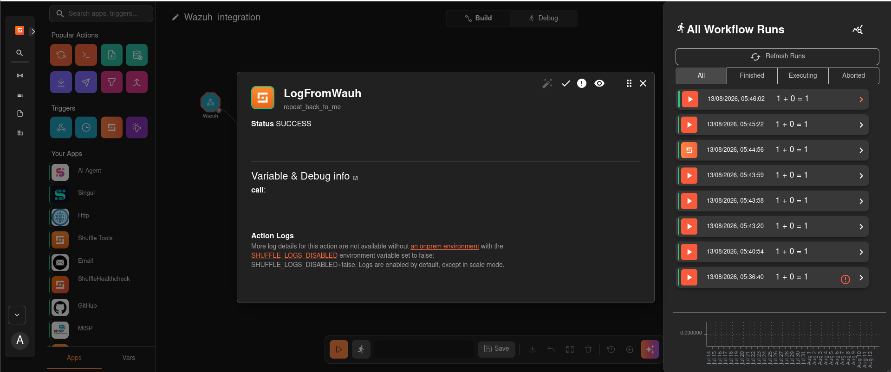  <br>
*Multiple consecutive `SUCCESS` executions in Shuffle's run history,
confirming the pipeline is stable across repeated triggers, not a one-off
result.*

---

## 7. Validation — Email

Delivery of the SOC notification email was confirmed three separate ways.

**1. The node's own execution result:**

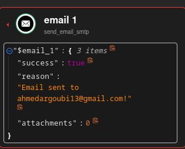  <br>
*`"success": true`, `"reason": "Email sent to ahmedargoubi13@gmail.com!"`.*

**2. The variables actually resolved correctly before sending** — checked
via Shuffle's Autocomplete preview against a real prior execution:

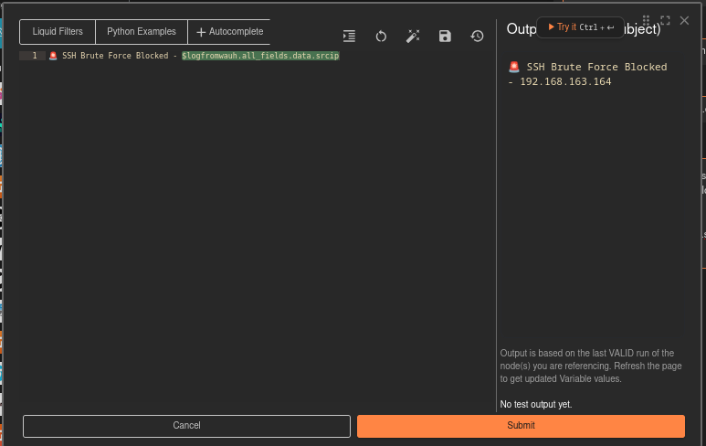  <br>
*Subject resolves to the real attacker IP: `🚨 SSH Brute Force Blocked -
192.168.163.164`.*

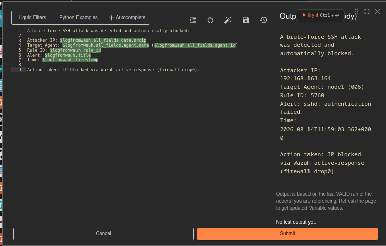  <br>
*Body correctly resolving attacker IP, target agent (`node1`, id `006`),
rule ID, alert title, and timestamp from the live alert.*

**3. The email actually arrived, with all data correct, in the analyst's
real inbox:**

  <br>
*Gmail inbox showing the alert, subject line correctly populated with the
real attacker IP.*

  <br>
*Full email body confirming every variable resolved with real data:
attacker IP `192.168.163.164`, target agent `node1 (006)`, rule ID `5763`,
alert title, timestamp, and the action taken.*

---

## 8. Case Management in TheHive

Detection and containment are automated, but a human analyst is still
responsible for reviewing, documenting, and formally closing every
incident. This section covers what happens once an alert lands in
TheHive.

### 8.1 How alerts reach TheHive

Wazuh is configured to forward matching alerts directly into TheHive,
scoped specifically to `rule_id 5763` so that only genuine brute-force
detections create alerts — without this scoping, TheHive's Alerts queue
fills with unrelated internal log noise (an early misconfiguration flooded
TheHive with 331 irrelevant "Docker: Error message" alerts from a
completely different rule before the scope restriction was added).

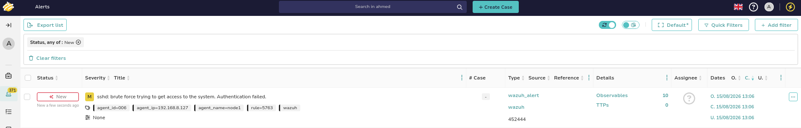  <br>
*Only rule 5763 alerts arrive after scoping — one alert, correctly tagged
`agent_id=006`, `agent_ip=192.168.8.127`, `agent_name=node1`, `rule=5763`.*

### 8.2 Reviewing the alert before promoting it

Before turning an alert into a case, the analyst reviews what Wazuh
actually sent. TheHive automatically maps the raw alert into a structured
table on the alert's **General** tab:

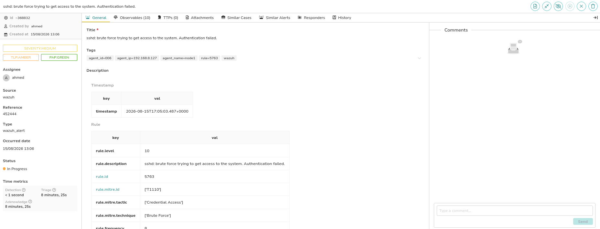  <br>
*Full rule metadata surfaced automatically: `rule.level = 10`,
`rule.description`, `rule.id = 5763`, and — critically —
`rule.mitre.id = ['T1110']`, `rule.mitre.tactic = ['Credential Access']`,
`rule.mitre.technique = ['Brute Force']`. This MITRE ATT&CK mapping comes
straight from Wazuh's rule metadata and gives the analyst immediate
context without needing to look anything up manually.*

The alert's **Observables** tab lists every indicator Wazuh's alert
contained, automatically extracted and classified by data type:

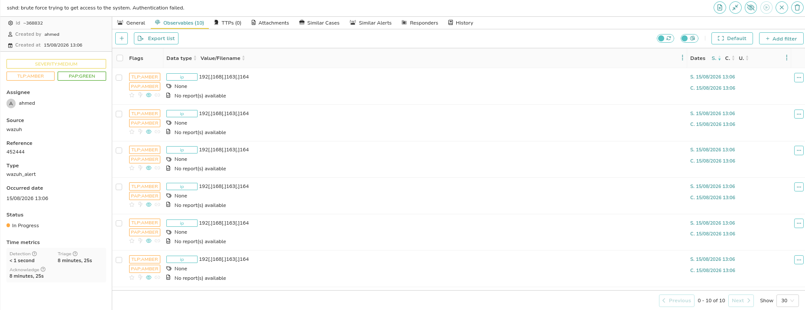  <br>
*10 observables — the attacker IP `192.168.163.164`, represented in
several formats/contexts extracted from the raw alert. All inherit
`TLP:AMBER` / `PAP:AMBER` by default from the alert's classification.*

At this stage the alert also carries a default classification:

- **TLP (Traffic Light Protocol)** — controls how widely the case
  information may be shared. Left at **TLP:AMBER**, meaning share within
  the organization only — appropriate for internal network activity data
  that shouldn't be published externally, but isn't sensitive enough to
  restrict to a named few individuals (`TLP:RED`).
- **PAP (Permissible Actions Protocol)** — controls what actions are
  permitted based on this intel. Set to **PAP:GREEN** on the case level,
  since an active defensive action (the automated IP block) had already
  been taken — `PAP:RED`/`AMBER` would imply the analyst should only
  observe, not act, which no longer applied once containment already
  happened automatically.

### 8.3 Promoting the alert to a case

Every alert in TheHive is a raw notification; a **Case** is what an
analyst actually works. The alert is promoted via **Create Case**:

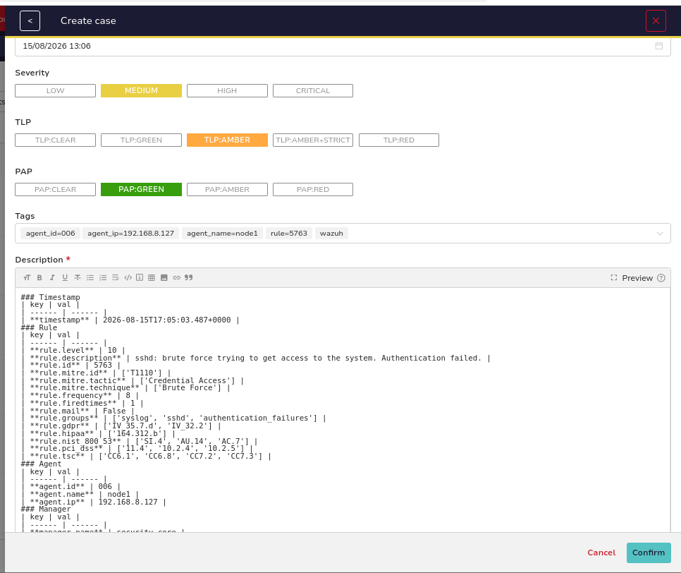  <br>
*"Empty case" was chosen over "From template" — no reusable brute-force
response template existed yet at this stage of the lab (see Section 10 for
a planned improvement here). "Empty case" still inherits the alert's
title, description, severity, tags, and observables automatically.*

The resulting case is automatically linked back to its originating alert,
and both records stay associated:

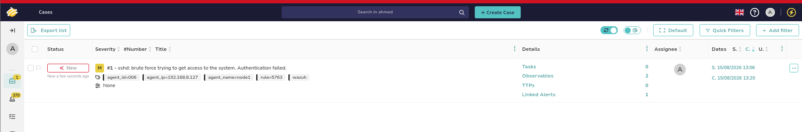  <br>
*Case #1 created — severity Medium (inherited), 2 observables carried
over, 1 linked alert, tags preserved (`agent_id`, `agent_ip`,
`agent_name`, `rule`).*

### 8.4 Building the analyst task checklist

A working case in TheHive is driven by **Tasks** — the actual
investigation checklist an analyst works through, each independently
trackable (`Waiting` → `InProgress` → `Completed`). Five tasks were
created for this case:

1. **Confirm active-response block is active on node1** — verify via
   `sudo iptables -L -n -v` that the source IP is present in the DROP
   rules on both `INPUT` and `FORWARD` chains.
2. **Check auth logs for successful login before block** — rule out that
   the attacker got in before containment kicked in.
3. **Verify ansible account integrity** — check for unusual sessions,
   sudo usage, new SSH keys, or cron jobs on the compromised-attempt
   account.
4. **Confirm SOC notification delivered** — confirm the automated email
   alert was actually received with the correct attacker IP, target
   agent, and rule details.
5. **Close case** — document findings and set the final resolution once
   every prior task is verified.

Each task is added through TheHive's task-creation form, which also
supports assignment, mandatory-log enforcement (forces at least one
activity log entry before a task can be marked complete — useful for
audit trails), flagging, and due dates:

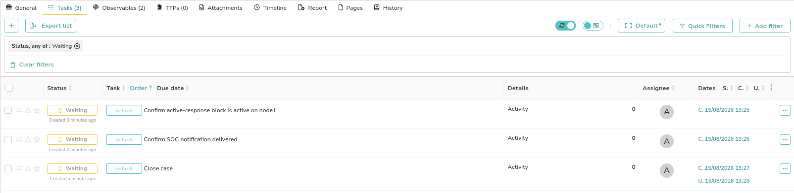  <br>
*Tasks start in `Waiting` status the moment they're created — creating a
task does not, by itself, mean anything has been verified yet.*

### 8.5 Working and completing tasks

Each task was independently verified against the real environment before
being marked complete — for example, Task 1 was confirmed against the
actual `iptables` output already captured in Section 6.4, and Task 4 was
confirmed against the actual email shown in Section 7. Marking a task
complete records the outcome directly on the task itself:

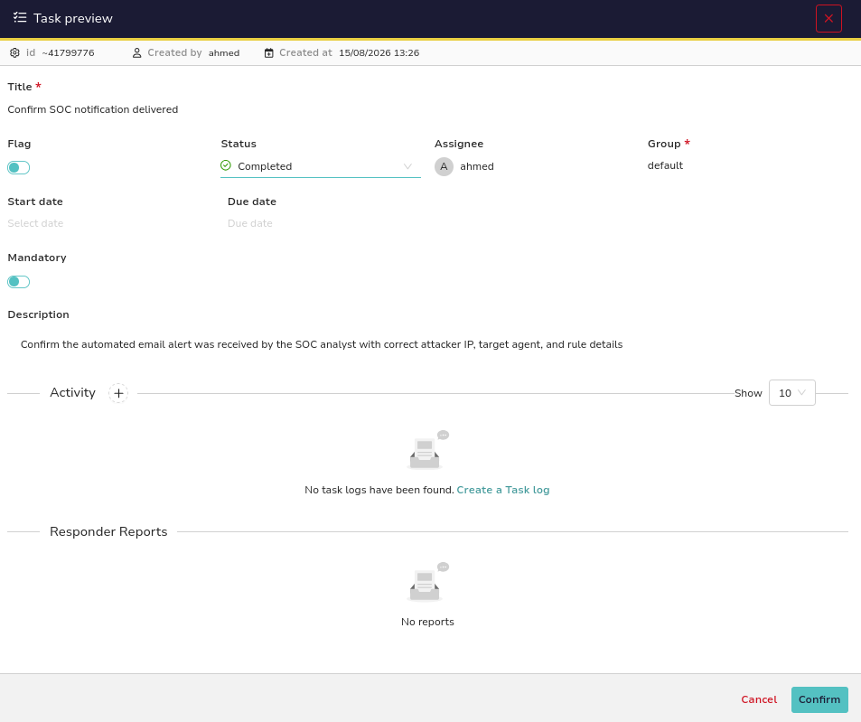  <br>
*"Confirm SOC notification delivered" task, status `Completed`, assignee
`ahmed`, with its description preserved as the audit record of what was
being verified.*

This task-by-task discipline matters: automation moved fast (detection to
containment happened in seconds), but the **case record** is what proves,
after the fact, that each assumption behind the automated response was
actually checked by a human — not just that the block fired successfully.

### 8.6 Documenting the case

Once the investigative tasks are underway, the case's **General** tab
carries the full narrative summary an incoming analyst (or an auditor)
would need, without having to reconstruct it from the raw alert or the
Shuffle execution logs:

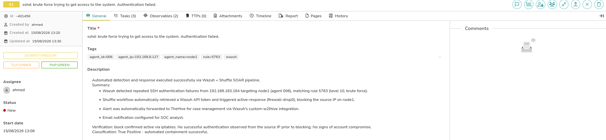  <br>

> Automated detection and response executed successfully via Wazuh +
> Shuffle SOAR pipeline.
>
> **Summary:**
> - Wazuh detected repeated SSH authentication failures from
>   `192.168.163.164` targeting `node1` (agent 006), matching rule 5763
>   (level 10, brute force).
> - Shuffle workflow automatically retrieved a Wazuh API token and
>   triggered active-response (`firewall-drop0`), blocking the source IP
>   on `node1`.
> - Alert was automatically forwarded to TheHive for case management,
>   scoped to rule 5763 only.
> - Email notification delivered to the SOC analyst.
>
> **Verification:** block confirmed active via `iptables`. No successful
> authentication observed from the source IP prior to blocking. No signs
> of account compromise.
>
> **Classification:** True Positive — automated containment successful.

### 8.7 Closing the case

Once every task is marked `Completed`, the case status is changed from
`New`/`In Progress` to **Closed**, with a resolution type of
**TruePositive** — the classification TheHive uses for incidents that were
real, correctly detected, and appropriately handled. This closes the loop:
Wazuh detected it, Shuffle contained it, and the analyst formally verified
and signed off on it inside TheHive's audit trail.

---

## 9. Lessons Learned / Troubleshooting Summary

| Issue | Root cause | Fix |
|---|---|---|
| Shuffle rejected `localhost` in URLs | Shuffle cannot resolve `localhost` from its own container/host context | Replaced with the Wazuh manager's real LAN IP |
| Filter node didn't stop execution on no-match | "Filter list" only labels data `valid`/`invalid`; it does not halt the workflow branch by itself | Added an explicit **condition** on the connection line (`$exec.rule_id equals 5763`) |
| Custom rule 5764 (sid 5710) never fired during the real test | The attacker guessed a password for a **real** account (`ansible`), not a non-existent username | Used Wazuh's built-in aggregate rule `5763` instead, which fires on repeated failures regardless of username validity |
| Active-response accepted (`HTTP 200`) but never actually blocked anything | `firewall-drop` script reads `alert.data.srcip`, not a generic `arguments` array | Changed the Body payload to `{"command":"firewall-drop0","alert":{"data":{"srcip":"..."}}}` |
| Locked `Apikey`/`Url` fields on the dedicated Wazuh app node rejected dynamic variables | That action's Authentication object only supports static credentials, incompatible with a JWT that expires every ~15 minutes | Replaced with a plain **Http** app node, which allows dynamic variables in every field |
| Email action failed with `404 page not found` | "Send email shuffle" depends on Shuffle's hosted cloud relay (`shuffler.io`), unreachable from this on-prem instance | Switched to a standard **SMTP** email action |
| Email failed with `530 5.7.0 Authentication Required` | Gmail rejects plain-password SMTP logins for third-party senders | Generated a Gmail **App Password** and used it in place of the account password |
| TheHive flooded with 331 irrelevant alerts | The Wazuh→TheHive forwarding had no rule filtering — every alert (including unrelated internal noise) was forwarded | Scoped the integration to `rule_id 5763` only |

---

## 10. Future Enhancements

- **OPNsense-level blocking**: extend the workflow to also add the
  attacker's IP to an OPNsense firewall alias, blocking at the network
  edge in addition to the host-level `iptables` block already implemented.
  This would provide defense-in-depth if the target host's own firewall is
  ever bypassed or reset.
- **Auto-unblock / TTL**: the current active-response block has no
  automatic expiry (`timeout no` in `ossec.conf`). Consider adding a
  time-bound unblock, or a manual "unblock" task in the TheHive case
  workflow.
- **Case templates**: build a reusable TheHive case template
  ("SSH Brute Force Response") pre-populated with the standard 5-task
  checklist used in Section 8.4, instead of adding tasks manually each
  time an alert is promoted.
- **Multi-service coverage**: extend detection beyond SSH to RDP and FTP
  brute-force patterns, as originally scoped.

---

## 11. Conclusion

This phase delivered a working, tested automation pipeline that takes a
brute-force SSH attack from first detection to a fully documented, closed
incident with no manual intervention required for containment:

- **Detection:** Wazuh correctly identifies brute-force patterns using its
  built-in aggregate rule (`5763`), validated against a real attack using
  valid-but-guessed credentials.
- **Containment:** Shuffle automatically blocks the attacker's IP on the
  target host within seconds of detection, verified via `iptables`, the
  active-response logs, and a real loss of connectivity from the attacker.
- **Case management:** Every qualifying alert is automatically pushed into
  TheHive as a case-ready alert, complete with MITRE ATT&CK mapping,
  observables, and TLP/PAP classification, and turned into a fully
  task-tracked, documented, and formally closed case.
- **Notification:** The SOC analyst is emailed immediately with the
  attacker IP, target host, and rule details — confirmed delivered three
  separate ways.

The most valuable lessons from this phase were not architectural but
operational: verifying that "the API returned success" is not the same as
"the action actually happened," and that filter/condition logic in a SOAR
tool must be explicitly enforced on the workflow path, not assumed from a
node's internal output.
