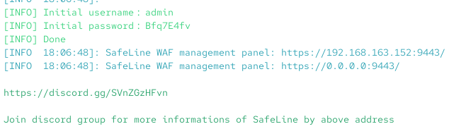
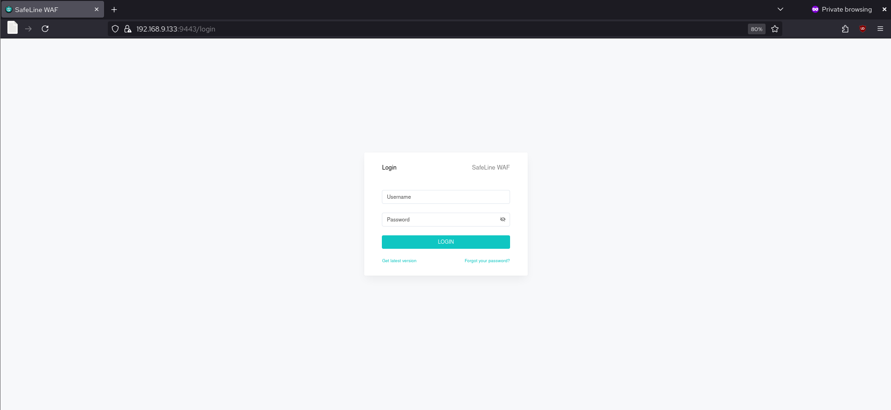
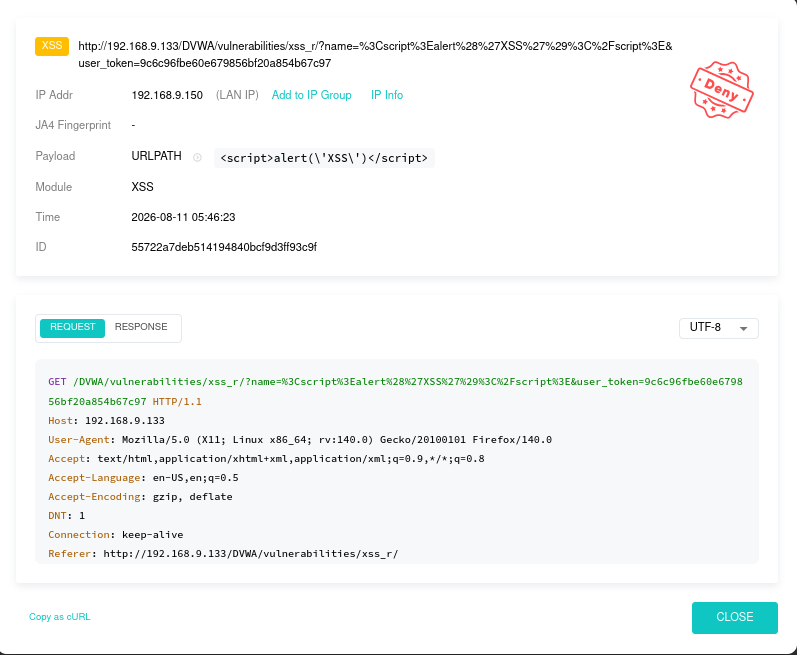
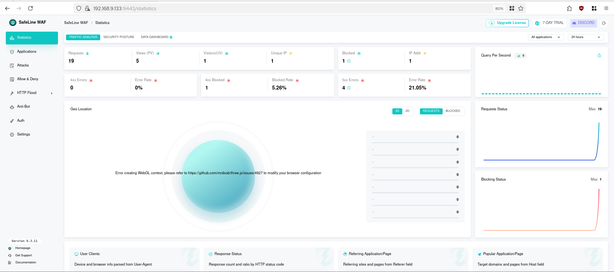
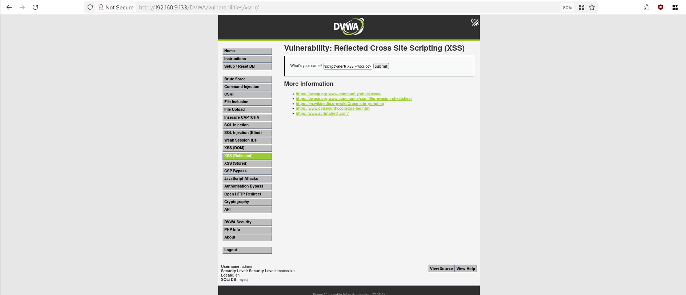
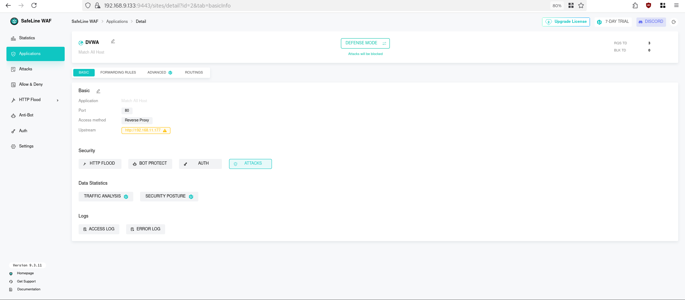
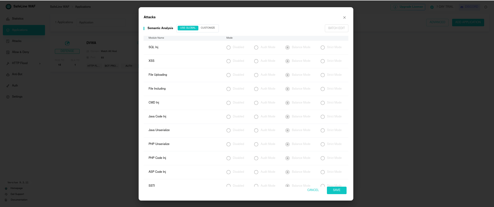
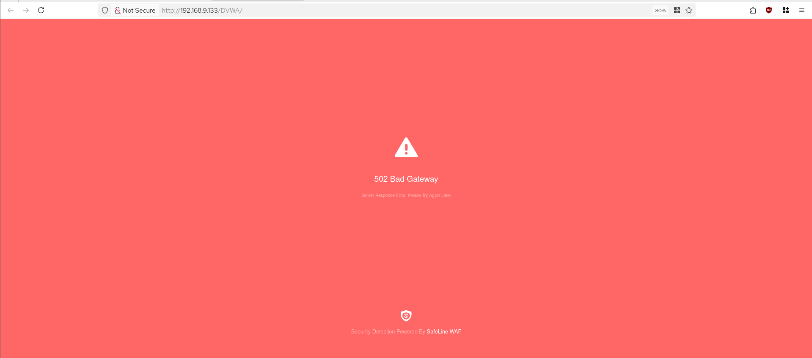
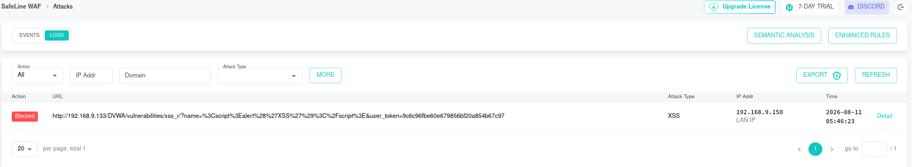

# Installation & Configuration — SafeLine WAF (protection de la zone DMZ)

Déploiement d'un WAF (Web Application Firewall) en reverse proxy devant DVWA, pour combler directement le gap identifié en **Simulation 1 (Phase A)** : *"No WAF or input validation"* (`reports/phase-a-baseline/simulation-1-dvwa.md`, section 5.1).

---

## 1. Environnement du lab

| Composant | IP | Zone | Rôle |
|---|---|---|---|
| Security-Core | `192.168.9.133` | Security_LAN | Wazuh, MISP, Velociraptor, Shuffle, **et maintenant SafeLine WAF** |
| DMZ-Web (DVWA) | `192.168.11.177` | DMZ | Application web volontairement vulnérable (Apache + DVWA) |
| OPNsense | `192.168.9.1` (LAN) / `192.168.11.1` (DMZ) | Pare-feu | Route le trafic entre zones |
| Poste analyste | `192.168.9.150` | Security_LAN | Poste utilisé pour accéder au WAF et à DVWA |

Segmentation réseau : la DMZ est isolée de Security_LAN par défaut. OPNsense autorise Security_LAN → DMZ sur le port 80 (HTTP) pour la supervision/administration (cf. `network/opnsense-firewall-rules.md`).

---

## 2. Installation

### 2.1 – Prérequis

- Docker installé sur Security-Core (SafeLine WAF s'installe et tourne en conteneurs).
- Accès réseau sortant depuis Security-Core (téléchargement du script et des images Docker).
- Règle OPNsense autorisant Security_LAN → DMZ sur le port 80, déjà en place (nécessaire pour que le WAF, en tant que reverse proxy, puisse atteindre DVWA en amont).

### 2.2 – Commande d'installation

```bash
sudo bash -c "$(curl -fsSLk https://waf.chaitin.com/release/latest/setup.sh)" -- --en
```

### 2.3 – Vérification

À la fin de l'installation, le script affiche l'URL du panneau d'administration et les identifiants initiaux :



```
[INFO] Initial username: admin
[INFO] Initial password: Bfq7E4fv
[INFO] SafeLine WAF management panel: https://192.168.163.152:9443/
[INFO] SafeLine WAF management panel: https://0.0.0.0:9443/
```

⚠️ **Changer ce mot de passe initial dès la première connexion** — il apparaît en clair dans les logs d'installation.

Accès confirmé : `https://192.168.9.133:9443/`.


---

## 3. Configuration de l'application web (DVWA)

Dans SafeLine : **Applications → Add Application**.

| Champ | Valeur | Explication |
|---|---|---|
| Application Name | `DVWA` | Nom d'affichage, libre |
| Domain | `192.168.11.177` (ou `*`) | Le nom d'hôte/IP que les clients utilisent pour joindre le WAF lui-même |
| Port | `80` | Port d'écoute du WAF pour cette application |
| Protocol | `HTTP` | Protocole côté client (WAF ↔ navigateur) |
| Access method | `Reverse Proxy` | Le WAF s'intercale entre le client et le serveur réel |
| **Upstream** | `http://192.168.11.177:80` | **L'adresse réelle du serveur DVWA** — voir point critique ci-dessous |



### ⚠️ Point critique — pourquoi l'upstream doit être l'IP réelle du serveur, pas celle du WAF

L'**upstream** est l'adresse vers laquelle le WAF *retransmet* le trafic une fois qu'il l'a inspecté et jugé légitime — c'est-à-dire le vrai serveur DVWA. Si l'upstream pointait vers le WAF lui-même (`192.168.9.133`), on créerait une boucle infinie (le WAF s'enverrait le trafic à lui-même indéfiniment) — le WAF doit toujours pointer vers la machine finale qu'il protège, jamais vers lui-même.

C'est exactement le sens du triangle d'avertissement visible sur la capture ci-dessus, à côté du champ Upstream — SafeLine signale que cette adresse (`192.168.11.177`) est externe à sa propre machine, ce qui est normal et attendu dans ce schéma.

---

## 4. Pourquoi le WAF doit être dans le chemin du trafic

### 4.1 – Principe du reverse proxy

Un WAF en reverse proxy ne fonctionne que si **le client se connecte au WAF, pas directement au serveur protégé**. Le WAF reçoit la requête, l'inspecte (signatures SQLi/XSS/etc.), puis — seulement si elle est jugée légitime — la retransmet au serveur réel (l'upstream) et relaie la réponse au client.

```
Client → SafeLine WAF (192.168.9.133:80) → inspection → DVWA (192.168.11.177:80)
```

Si le client contacte directement `192.168.11.177`, il **contourne entièrement le WAF** — la requête arrive directement sur DVWA sans jamais passer par l'inspection.

### 4.2 – Confirmation empirique dans ce lab

| Méthode d'accès | Protection WAF ? | Observation |
|---|---|---|
| `http://192.168.9.133/DVWA/` | ✅ OUI | Le trafic passe par le WAF. Les attaques XSS sont détectées et bloquées (voir logs section 5). |
| `http://192.168.11.177/DVWA/` | ❌ NON | Accès direct, contourne totalement le WAF. Aucune inspection, aucun log, aucun blocage. |


*Accès direct via `192.168.11.177` — la page DVWA répond normalement, sans passer par SafeLine.*

**Constat clé :** le WAF ne protège que lorsque le trafic transite par son IP (`192.168.9.133`). L'accès direct à l'IP de la DMZ contourne totalement la protection — c'est la limite structurelle que la section 6 vise à corriger.

---

## 5. Tests de validation

### 5.1 – Test XSS (réalisé, confirmé bloqué)

Payload utilisé :
```
<script>alert('XSS')</script>
```

Soumis via `http://192.168.9.133/DVWA/vulnerabilities/xss_r/?name=<script>alert('XSS')</script>`.


*Requête marquée "Deny" — module XSS, payload détecté dans l'URL.*


*Attacks → Logs : `Blocked`, type `XSS`, IP source `192.168.9.150` (poste analyste), horodatage confirmé.*

**Vérification dans SafeLine :** menu **Attacks → Logs**, filtrable par IP/domaine/type d'attaque.

### 5.2 – Test SQL Injection (à réaliser — pas encore exécuté)

Payloads recommandés, du plus simple au plus avancé, pour compléter la validation :
```
' OR '1'='1
' UNION SELECT user, password FROM users-- -
```
À soumettre sur `http://192.168.9.133/DVWA/vulnerabilities/sqli/`, puis vérifier l'apparition d'une entrée `Blocked` / type `SQL Inj` dans **Attacks → Logs**, au même titre que le test XSS ci-dessus.

### 5.3 – Configuration des modules de détection

Les modules actifs sont visibles dans **Applications → DVWA → Attacks → Semantic Analysis** :


*SQL Inj, XSS, File Uploading, File Including, CMD Inj, Java/PHP/ASP Code Inj, SSTI — tous en **Balance Mode** par défaut (hérité de la config globale).*

`Balance Mode` est un compromis raisonnable pour un lab (détection efficace, faux positifs limités). `Strict Mode` serait plus agressif mais risquerait de bloquer du trafic légitime — à envisager uniquement si un test de charge applicative est prévu en parallèle.

### 5.4 – Dépannage : erreur 502 Bad Gateway



Cette erreur signifie que le WAF **reçoit bien la requête** mais **ne parvient pas à joindre l'upstream** (DVWA). Causes possibles à vérifier dans l'ordre :
1. La VM DVWA est-elle démarrée et le service Apache actif ?
2. La règle OPNsense Security_LAN → DMZ (port 80) est-elle toujours active ? (cf. `network/opnsense-firewall-rules.md`)
3. L'adresse upstream configurée dans SafeLine correspond-elle exactement à l'IP actuelle de DVWA ? (rappel : ce projet a une historique d'instabilité d'IP entre DMZ et Legacy, voir `docs/troubleshooting-journal.md`)

### 5.5 – Tableau de bord


*Vue d'ensemble : requêtes totales, taux de blocage, erreurs 4xx/5xx — utile pour un suivi dans le temps une fois le WAF en production sur plusieurs applications.*

---

## 6. Forcer tout le trafic à passer par le WAF (DNAT sur OPNsense)

Le constat de la section 4.2 (contournement possible via l'IP directe de la DMZ) est une vraie limite opérationnelle : rien n'empêche aujourd'hui un client de taper `192.168.11.177` pour éviter le WAF, volontairement ou par habitude. Deux options pour fermer ce trou.

### Option 1 — Utiliser uniquement l'IP du WAF (recommandé, déjà en place)

La solution la plus simple : ne communiquer/utiliser que l'adresse du WAF (`192.168.9.133`) pour accéder à DVWA — via un enregistrement DNS interne, un bookmark, ou simplement la convention documentée dans ce repo. Aucune configuration réseau supplémentaire requise. **Limite :** repose sur la discipline des utilisateurs/scripts ; n'empêche pas techniquement un accès direct.

### Option 2 — Redirection transparente (DNAT) + blocage de l'accès direct

Pour rendre le contournement **techniquement impossible**, deux règles OPNsense combinées :

**2.1 — Règle de redirection (Port Forward / DNAT)**

**Firewall → NAT → Port Forward → Add** :

| Champ | Valeur |
|---|---|
| Interface | DMZ |
| Protocol | TCP |
| Destination | `192.168.11.177` |
| Destination port range | `80` (HTTP) à `80` (HTTP) |
| Redirect target IP | `192.168.9.133` |
| Redirect target port | `80` |
| Description | "Force tout le trafic HTTP vers DVWA à transiter par SafeLine WAF" |

OPNsense crée automatiquement une règle de pare-feu associée pour autoriser ce trafic redirigé — vérifier qu'elle est bien active dans **Firewall → Rules → DMZ**.

**2.2 — Règle de blocage de l'accès direct (indispensable, sans elle l'Option 2 ne ferme rien)**

Sans cette seconde règle, la redirection DNAT s'applique seulement à certains chemins réseau mais un client peut souvent encore atteindre `192.168.11.177:80` directement selon la topologie. Ajouter une règle explicite :

**Firewall → Rules → DMZ → Add** :

| Champ | Valeur |
|---|---|
| Action | Block |
| Protocol | TCP |
| Source | Tout sauf `192.168.9.133` (WAF) |
| Destination | `192.168.11.177` |
| Destination port | `80` |
| Description | "Bloque tout accès direct à DVWA:80 sauf depuis le WAF" |
| Position | **Au-dessus** de toute règle plus permissive existante (l'ordre des règles OPNsense est first-match) |

⚠️ Cette règle doit être positionnée avec soin — si elle est placée après une règle "allow" plus large déjà en place pour Security_LAN → DMZ, elle ne sera jamais évaluée. Vérifier l'ordre final dans **Firewall → Rules → DMZ** après sauvegarde.

**Test de validation de l'Option 2 :** après application, `http://192.168.11.177/DVWA/` (accès direct) doit être **rejeté par le pare-feu** (timeout ou connexion refusée), tandis que `http://192.168.9.133/DVWA/` continue de fonctionner normalement via le WAF.

---

## 7. Lien avec la Phase A

Ce déploiement répond directement à la recommandation formulée dans `reports/phase-a-baseline/simulation-1-dvwa.md` (section 6.4, "GRC — Privilège & Segmentation") : *"Deploy ModSecurity WAF on the DMZ web server to block SQLi and command injection attempts"*. SafeLine WAF remplit ce rôle ici, avec une couverture plus large (XSS, injections de code Java/PHP/ASP, SSTI, upload de fichiers) que la recommandation initiale ne mentionnait.

---

## 8. Limites connues (à documenter en GRC)

| Limite | Détail |
|---|---|
| Contournement par IP directe (avant Option 2) | Documenté section 4.2 — corrigé par la redirection DNAT + blocage (section 6, Option 2) |
| Mot de passe admin initial en clair dans les logs d'installation | À changer immédiatement après la première connexion |
| Test SQL Injection non encore réalisé | Seul le test XSS a été validé à ce stade (section 5.1) ; SQLi reste à confirmer (section 5.2) |
| Mode de détection "Balance" (pas "Strict") | Compromis détection/faux-positifs par défaut — à réévaluer si le lab pousse vers un mode plus agressif |
| Une seule application protégée (DVWA) | Le WAF n'est pas encore étendu aux autres services web du lab, s'il y en a d'autres à exposer |
