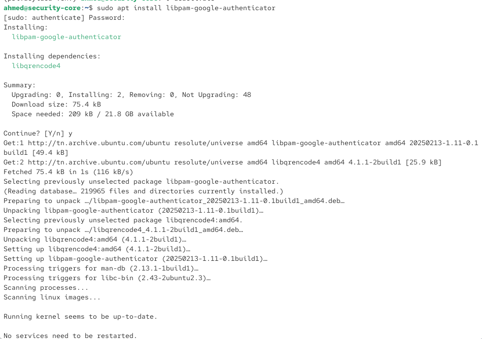
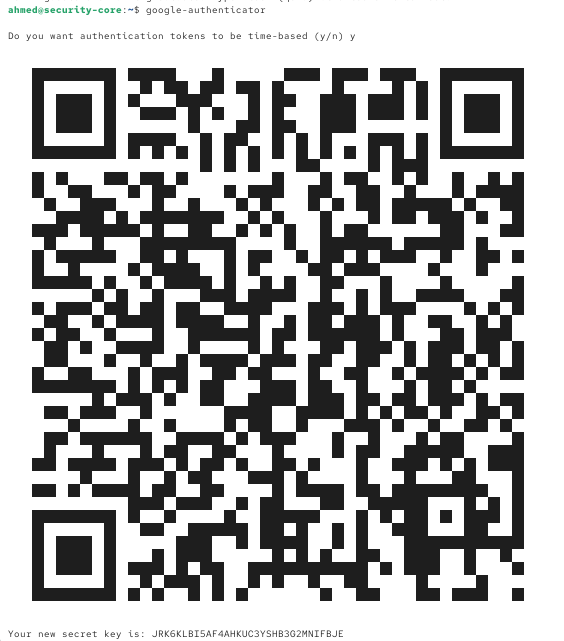
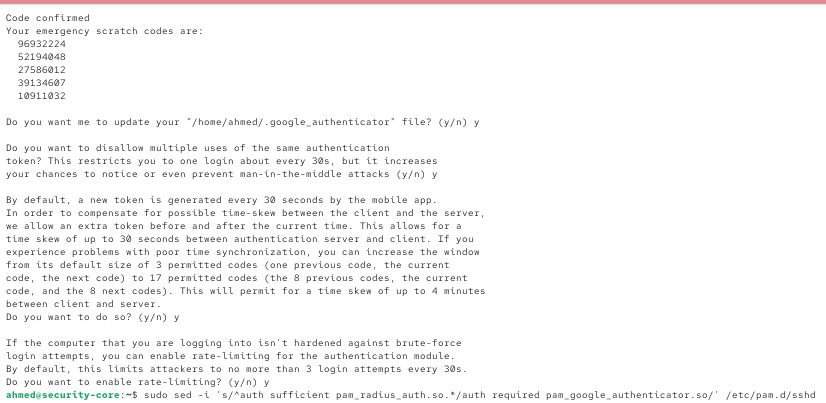
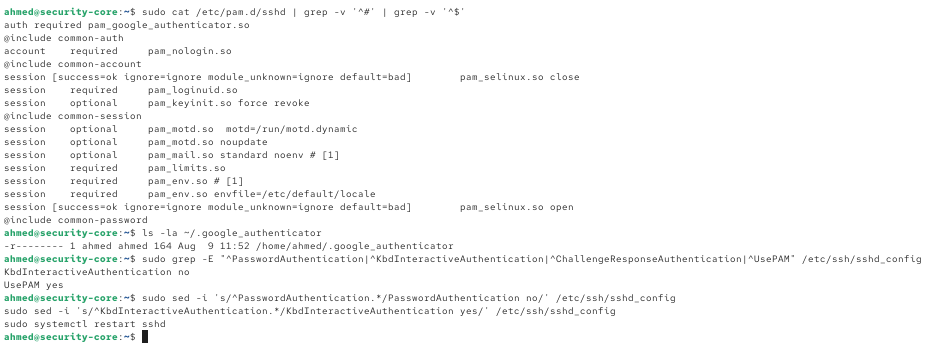
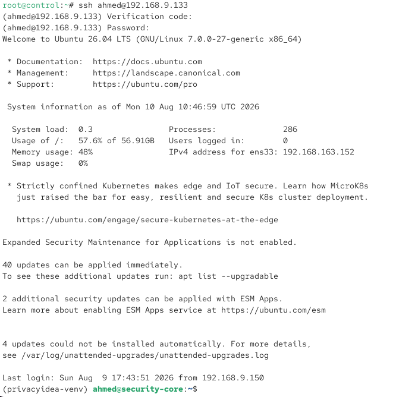

# Installation & Configuration — MFA SSH sur Security-Core (Google Authenticator PAM)

MFA pour l'accès SSH à la VM Security-Core, via `libpam-google-authenticator` — secret TOTP local à la machine, sans dépendance à un serveur externe.

---

## 1. Principe

Contrairement à l'approche privacyIDEA/FreeRADIUS (tentée initialement pour SSH, abandonnée par contrainte de temps — voir section 4), `libpam-google-authenticator` est un module PAM autonome : le secret TOTP est stocké localement (`~/.google_authenticator`), sans serveur RADIUS ni API externe à maintenir.

---

## 2. Installation et configuration

### 2.1 – Installation du module

```bash
sudo apt install libpam-google-authenticator
```



### 2.2 – Génération du token TOTP (par utilisateur, ici `ahmed`)

```bash
google-authenticator
```

Réponses données aux questions interactives :

| Question | Réponse |
|---|---|
| Authentication tokens time-based? | y |
| Update `~/.google_authenticator`? | y |
| Disallow multiple uses of the same token? | y (empêche la réutilisation d'un code) |
| Increase time skew window (17 codes)? | n (défaut suffisant) |
| Enable rate-limiting? | y |


*Secret : `JRK6KLBI5AF4AHKUC3YSHB3G2MNIFBJE` (à ne pas divulguer).*



⚠️ **Codes de récupération générés** (à conserver en lieu sûr, permettent l'accès si le téléphone est perdu) :
```
96932224
52194048
27586012
39134607
10911032
```

Fichier de secret confirmé avec permissions strictes :
```
-r-------- 1 ahmed ahmed 164 Aug 9 11:52 /home/ahmed/.google_authenticator
```

### 2.3 – Configuration PAM (`/etc/pam.d/sshd`)

```bash
sudo sed -i 's/^auth sufficient pam_radius_auth.so.*/auth required pam_google_authenticator.so/' /etc/pam.d/sshd
```

Résultat confirmé (ligne ajoutée **avant** `@include common-auth`) :
```
auth required pam_google_authenticator.so
@include common-auth
account    required     pam_nologin.so
@include common-account
...
```



⚠️ **Effet de cet ordre :** le prompt "Verification code" apparaît **avant** le prompt "Password" à la connexion (plutôt que l'inverse, plus intuitif) — sans impact fonctionnel, juste une question d'ordre des lignes dans le fichier. Non corrigé, fonctionne correctement tel quel.

### 2.4 – Configuration SSH (`/etc/ssh/sshd_config`)

Le mode `pam_google_authenticator` nécessite l'authentification **keyboard-interactive** (deux prompts distincts), pas le mode `password` classique (un seul prompt, incompatible avec un second prompt PAM) :

```bash
sudo sed -i 's/^PasswordAuthentication.*/PasswordAuthentication no/' /etc/ssh/sshd_config
sudo sed -i 's/^KbdInteractiveAuthentication.*/KbdInteractiveAuthentication yes/' /etc/ssh/sshd_config
sudo systemctl restart sshd
```

---

## 3. Validation — test réussi

```
root@control:~# ssh ahmed@192.168.9.133
(ahmed@192.168.9.133) Verification code:
(ahmed@192.168.9.133) Password:
Welcome to Ubuntu 26.04 LTS (GNU/Linux 7.0.0-27-generic x86_64)
...
(privacyidea-venv) ahmed@security-core:~$
```



✅ Confirmé : connexion refusée sans le bon code OTP, acceptée avec code + mot de passe corrects.

---

## 4. Limites connues et choix assumés (à documenter en GRC)

| Limite | Détail |
|---|---|
| Secret local à la machine | Pas de vue centralisée ; chaque VM Linux protégée nécessiterait sa propre installation et son propre secret |
| Pas d'audit trail unifié | Contrairement à privacyIDEA (journal centralisé des authentifications MFA) |
| Pas de révocation centralisée | Révoquer l'accès d'un utilisateur nécessite d'intervenir sur chaque machine individuellement |
| Approche abandonnée : privacyIDEA + FreeRADIUS pour SSH | Techniquement fonctionnelle (validée via `radtest`) mais instable en usage réel (serveur de développement Flask non persistant, cascades de pannes lors de la fermeture de terminaux) ; stabilisée ensuite en service systemd (gunicorn) mais le choix a finalement été fait de basculer sur Google Authenticator PAM par contrainte de temps |


