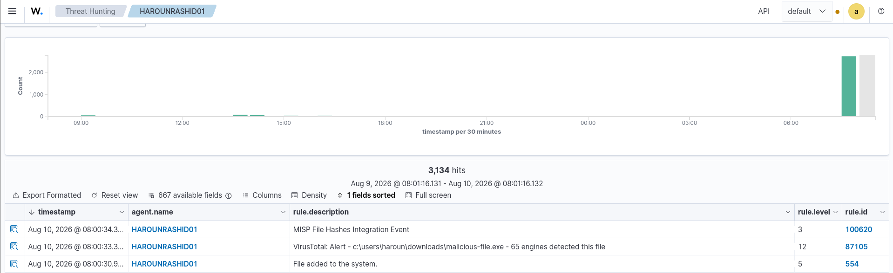
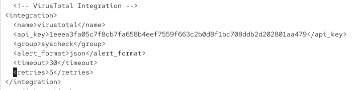
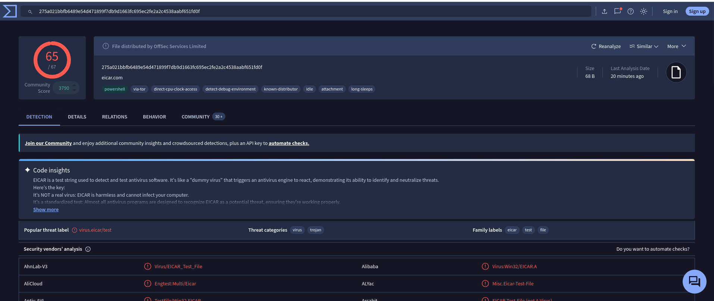
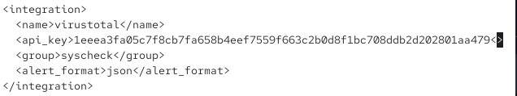

# Phase B — Intégration Wazuh ↔ VirusTotal

Enrichissement des alertes Wazuh (FIM/syscheck) avec le renseignement VirusTotal — score de détection, moteurs déclenchés — pour qualifier automatiquement un fichier suspect détecté sur un agent.

---

## 1. Contexte

**Wazuh Manager :** Security-Core (`192.168.9.133`)
**Clé API VirusTotal :** configurée dans `/var/ossec/etc/ossec.conf`

**Pourquoi cette intégration :** Wazuh détecte qu'un fichier a été ajouté (FIM/syscheck, Rule 554), mais ne sait pas nativement si ce fichier est malveillant. VirusTotal agrège les verdicts de dizaines de moteurs antivirus à partir d'un simple hash — brancher les deux permet de qualifier automatiquement chaque nouveau fichier détecté, sans intervention manuelle de l'analyste.


Cette intégration complète celle déjà en place avec MISP (`config/wazuh-misp-integration.md`) — les deux tournent en parallèle sur les mêmes événements Rule 554, MISP interrogeant la base de connaissance interne du lab, VirusTotal apportant un verdict externe indépendant.

---

## 2. Configuration

### 2.1 – Bloc d'intégration dans `ossec.conf`

```xml
<!-- VirusTotal Integration -->
<integration>
    <name>virustotal</name>
    <api_key>1eeea3fa05c7f8cb7fa658b4eef7559f663c2b0d8f1bc708ddb2d202801aa479</api_key>
    <group>syscheck</group>
    <alert_format>json</alert_format>
    <timeout>30</timeout>
    <retries>5</retries>
</integration>
```




| Paramètre | Rôle |
|---|---|
| `name` | Nom de l'intégration native Wazuh — `virustotal` est reconnue nativement, contrairement à MISP qui nécessite un script externe |
| `api_key` | Clé API VirusTotal (compte gratuit — limite de 4 requêtes/minute) |
| `group` | `syscheck` — l'intégration se déclenche sur les événements FIM |
| `timeout` / `retries` | Tolérance réseau — 30s de délai, 5 tentatives avant abandon |

### 2.2 – Redémarrage du Wazuh Manager

```bash
sudo systemctl restart wazuh-manager
```

### 2.3 – Règle utilisée : règle native, pas de règle personnalisée créée

L'alerte enrichie observée (section 4) utilise la **Rule 87105**, une règle **native du jeu de règles Wazuh par défaut** (fichier `virustotal_rules.xml`, livré avec Wazuh) — aucune règle personnalisée n'a été créée séparément pour cette intégration dans les captures fournies. Contrairement à l'intégration MISP (qui nécessite des règles `100620-100622` écrites à la main, cf. `config/wazuh-misp-integration.md`), VirusTotal est une intégration native : le jeu de règles par défaut suffit pour générer une alerte correctement formatée dès que l'intégration renvoie une détection positive.

> Si une règle personnalisée a été ajoutée en plus (mentionnée comme optionnelle dans la demande initiale), elle n'apparaît dans aucune capture fournie — à documenter séparément si elle existe.

---

## 3. Test — fichier EICAR sur client Windows

### 3.1 – Fichier de test utilisé

Fichier standard de test antivirus (inoffensif, reconnu par la quasi-totalité des moteurs) :
- Nom : `malicious-file.exe` (renommage volontaire du fichier EICAR pour le test, dans `c:\users\haroun\downloads\`)
- Hash SHA256 : `275a021bbfb6489e54d471899f7db9d1663fc695ec2fe2a2c4538aabf651fd0f`

### 3.2 – Vérification indépendante sur VirusTotal


*Score confirmé : **65 moteurs sur 67** identifient le fichier comme `Virus.EICAR_Test_File` — comportement standard et attendu pour ce fichier de test.*

### 3.3 – Dépôt sur l'agent surveillé

Le fichier a été placé dans un dossier surveillé par syscheck (`realtime="yes"`) sur l'agent `HAROUNRASHID01`, déclenchant l'événement FIM Rule 554, qui a ensuite déclenché l'appel à l'intégration VirusTotal.

---

## 4. Résultats — alerte enrichie confirmée



| Timestamp | Rule ID | Niveau | Description |
|---|---|---|---|
| 08:00:30.9... | **554** | 5 | File added to the system |
| 08:00:33.3... | **87105** | **12** | **VirusTotal: Alert - c:\users\haroun\downloads\malicious-file.exe - 65 engines detected this file** |
| 08:00:34.3... | 100620 | 3 | MISP File Hashes Integration Event |

✅ **Confirmé** — la chaîne complète fonctionne : détection FIM (Rule 554) → enrichissement VirusTotal (Rule 87105, niveau 12 — sévérité haute, cohérente avec un score de détection de 65/67) → en parallèle, la même Rule 554 a également déclenché l'intégration MISP (Rule 100620).

**Point notable :** les trois alertes se déclenchent en cascade sur le **même événement source** (un seul fichier ajouté), en moins de 4 secondes. Cela confirme que **MISP et VirusTotal tournent bien en parallèle sans conflit** sur le même point d'entrée FIM — utile à documenter comme preuve que les deux intégrations (Threat Intel interne + verdict externe) se complètent sans interférence.

⚠️ **Champs attendus non visibles dans cette capture :** la demande initiale mentionnait la vérification des champs détaillés `detected`, `positives`, `permalink` dans le corps JSON de l'alerte. La vue Threat Hunting ci-dessus ne montre que la description résumée générée par la règle — pour documenter ces champs bruts, il faudrait une capture de l'alerte complète en JSON (bouton loupe/détail sur la ligne Rule 87105 dans l'interface Wazuh, ou `grep -A 20 "87105" /var/ossec/logs/alerts/alerts.json`).

---

## 5. Conclusion

L'intégration Wazuh ↔ VirusTotal est **opérationnelle et validée** : un fichier ajouté sur un agent surveillé déclenche automatiquement une vérification VirusTotal, et le résultat (65/67 moteurs positifs) est correctement remonté dans une alerte Wazuh de sévérité haute (niveau 12, Rule 87105), sans action manuelle de l'analyste.

**Capacité de détection ajoutée :** avant cette intégration, un fichier malveillant détecté par FIM ne générait qu'une alerte de sévérité modérée ("File added", niveau 5) sans qualification. Désormais, tout fichier dont le hash est connu de VirusTotal génère une alerte de sévérité haute qualifiée — réduisant le temps de triage pour l'analyste SOC.

**Complémentarité avec MISP :** VirusTotal apporte un verdict basé sur un consensus de l'industrie (65 moteurs), tandis que MISP corrèle contre les IOCs propres au lab (issus des simulations Phase A). Les deux sources se renforcent : un hash pourrait être inconnu de MISP (base interne limitée) mais détecté par VirusTotal, ou l'inverse pour un IOC spécifique au contexte du lab non présent dans les flux publics.

**Limite assumée :** le plan gratuit VirusTotal limite à 4 requêtes/minute — suffisant pour ce lab, mais à surveiller si le volume d'événements FIM augmente significativement (risque de throttling silencieux, à vérifier via les logs `integrations.log` en cas de doute).
