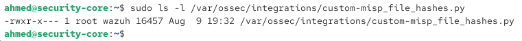
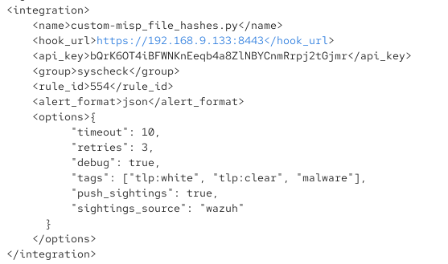
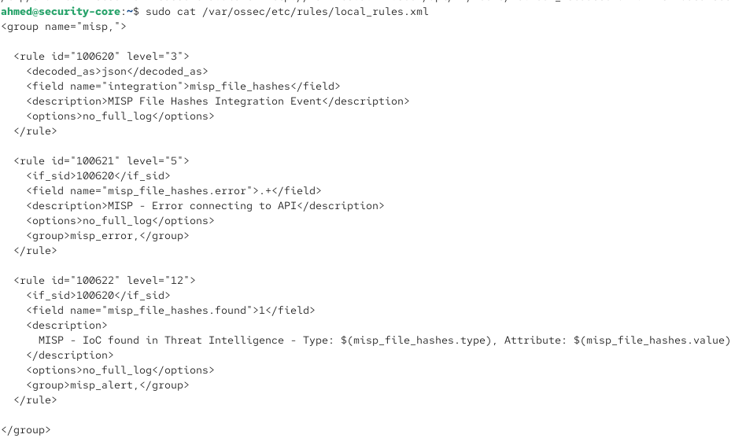
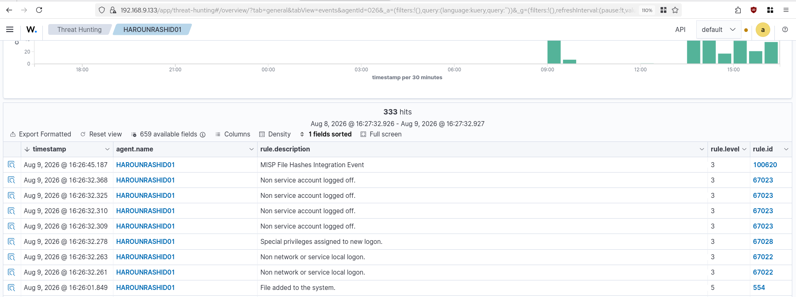

# Installation & Configuration — Intégration Wazuh ↔ MISP

Corrélation automatique des hashs de fichiers détectés par Wazuh (FIM/syscheck) contre la base de renseignement MISP. Basé sur l'intégration officielle du projet MISP (`github.com/MISP/wazuh-integration`).

---

## 1. Principe

1. Wazuh surveille un dossier (FIM/syscheck, `<directories realtime="yes">`).
2. Un nouveau fichier déclenche l'alerte **Rule 554** ("File added to the system"), avec ses hashs MD5/SHA1/SHA256.
3. Le module **Integrator** de Wazuh appelle un script Python (`custom-misp_file_hashes.py`) qui interroge l'API MISP (`/attributes/restSearch`) avec ces hashs.
4. Si MISP reconnaît un hash, une alerte de haute sévérité est générée côté Wazuh.

Wazuh Manager et MISP tournent sur la même VM (**Security-Core**), MISP étant accessible sur `https://192.168.9.133:8443` (conteneur Docker `misp-docker-misp-core-1`).

---

## 2. Configuration mise en place

### 2.1 – Clé API MISP

Générée depuis la WebUI MISP (profil utilisateur → Auth Keys → Add authentication key), permissions par défaut (lecture).

### 2.2 – Script d'intégration

```bash
sudo curl -o /var/ossec/integrations/custom-misp_file_hashes.py https://raw.githubusercontent.com/MISP/wazuh-integration/main/scripts/custom-misp_file_hashes.py
sudo chmod 750 /var/ossec/integrations/custom-misp_file_hashes.py
sudo chown root:wazuh /var/ossec/integrations/custom-misp_file_hashes.py
```


*`-rwxr-x--- root wazuh` — permissions confirmées correctes.*

⚠️ **Correctif appliqué (obligatoire dans cet environnement) :** le certificat TLS de MISP est auto-signé (`CN=localhost`, self-signed). Le script utilise `requests.post(..., verify=...)` par défaut, ce qui rejette la connexion (`SSLCertVerificationError`). Il a fallu ajouter `verify=False,` juste après chaque occurrence de `timeout=timeout,` dans le script (deux occurrences, lignes ~244 et ~428) :

```bash
sudo sed -i '428a\        verify=False,' /var/ossec/integrations/custom-misp_file_hashes.py
sudo sed -i '244a\        verify=False,' /var/ossec/integrations/custom-misp_file_hashes.py
sudo python3 -m py_compile /var/ossec/integrations/custom-misp_file_hashes.py && echo "OK syntaxe valide"
```

Ce compromis (désactivation de la vérification TLS) est acceptable pour un lab avec certificat auto-signé, mais doit être noté comme limitation assumée si ce script est réutilisé en dehors de ce contexte.

### 2.3 – Bloc d'intégration dans `ossec.conf` (Wazuh Manager)

```xml
<integration>
    <name>custom-misp_file_hashes.py</name>
    <hook_url>https://192.168.9.133:8443</hook_url>
    <api_key>bQrK6OT4iBFWNKnEeqb4a8ZlNBYCnmRrpj2tGjmr</api_key>
    <group>syscheck</group>
    <rule_id>554</rule_id>
    <alert_format>json</alert_format>
    <options>{
          "timeout": 10,
          "retries": 3,
          "debug": true,
          "tags": ["tlp:white", "tlp:clear", "malware"],
          "push_sightings": true,
          "sightings_source": "wazuh"
      }
    </options>
</integration>
```



⚠️ **Piège rencontré :** un espace involontaire s'était glissé dans `<hook_url>https://192.168.9.133:8443 </hook_url>` (juste avant la balise fermante), ce qui cassait l'URL construite par le script (`Exit status: 4`, aucune réponse). Vérifier l'absence de caractères invisibles en fin de valeur si le même symptôme apparaît :
```bash
sudo grep -A 1 "custom-misp" /var/ossec/etc/ossec.conf | cat -A | grep hook_url
```

`debug: true` est volontairement laissé actif pour l'instant, pour faciliter le diagnostic — à repasser à `false` une fois l'intégration validée en routine.

### 2.4 – Règles personnalisées

Ajoutées via **Server Management → Rules** dans la WebUI Wazuh, elles ont été enregistrées dans `/var/ossec/etc/rules/local_rules.xml` (pas dans un fichier séparé `misp_file_hashes.xml` comme initialement prévu — la WebUI a fusionné dans le fichier local existant) :

```xml
<group name="misp,">

  <rule id="100620" level="3">
    <decoded_as>json</decoded_as>
    <field name="integration">misp_file_hashes</field>
    <description>MISP File Hashes Integration Event</description>
    <options>no_full_log</options>
  </rule>

  <rule id="100621" level="5">
    <if_sid>100620</if_sid>
    <field name="misp_file_hashes.error">.+</field>
    <description>MISP - Error connecting to API</description>
    <options>no_full_log</options>
    <group>misp_error,</group>
  </rule>

  <rule id="100622" level="12">
    <if_sid>100620</if_sid>
    <field name="misp_file_hashes.found">1</field>
    <description>
      MISP - IoC found in Threat Intelligence - Type: $(misp_file_hashes.type), Attribute: $(misp_file_hashes.value)
    </description>
    <options>no_full_log</options>
    <group>misp_alert,</group>
  </rule>

</group>
```



```bash
sudo systemctl restart wazuh-manager
```

---

## 3. Validation

### 3.1 – Test sur un agent distant (pas seulement Security-Core)

Testé avec succès sur l'agent Windows **HAROUNRASHID01** (192.168.8.118) — confirme que l'intégration fonctionne aussi bien depuis un agent distant que depuis le Manager lui-même.

Fichier de test créé : `c:\users\haroun\downloads\malicious-file.exe` → Rule 554 déclenchée → script appelé → requête envoyée à MISP avec les 3 hashs → réponse reçue :
```json
{"misp_file_hashes": {"found": 0, "source": {...}}}
```
`found: 0` est le résultat attendu pour un hash inconnu de MISP — confirme que toute la chaîne fonctionne (réseau, authentification API, format de requête/réponse).

### 3.2 – Rule 100620 confirmée dans le Threat Hunting


*"MISP File Hashes Integration Event" (Rule 100620, level 3) apparaît bien pour chaque fichier ajouté surveillé.*

### 3.3 – Statut : cas positif (hash reconnu → Rule 100622) — en attente de confirmation finale

Pour valider ce dernier cas, il faut :
1. Ajouter un hash connu (ex. celui d'EICAR, `44d88612fea8a8f36de82e1278abb02f`, ou les hashs WannaCry déjà documentés dans `reports/phase-a-baseline/simulation-3-wannacry-ransomware.md`) comme attribut dans un événement MISP publié.
2. Recréer/copier un fichier ayant ce hash exact dans un dossier surveillé.
3. Confirmer que **Rule 100622** ("MISP - IoC found in Threat Intelligence") apparaît dans le Threat Hunting.

---

