# Phase B — Durcissement des postes clients Windows (GPO)

Renforcement des politiques de sécurité appliquées aux postes clients Windows du domaine `PROJET.local`, en réponse aux gaps identifiés en Phase A.

---

## 1. Contexte

**Domaine :** `PROJET.local`
**Contrôleur de domaine :** `TEKUP-DC` (Windows Server 2022)
**Clients concernés :** Windows 10/11 joints au domaine

### 1.1 – Failles identifiées en Phase A à corriger

| Faille | Détail |
|---|---|
| Politiques de mot de passe faibles | Mot de passe `TempPass123!` cassé offline après capture NTLMv2 (Simulation 4) |
| Audit par défaut insuffisant | Peu de visibilité sur les logons, créations de process, gestion des comptes |
| Windows Defender désactivé | GPO `Disable Windows Defender` créée en Phase A, a permis l'exécution de WannaCry sans détection (Simulation 3) |
| Règles de pare-feu faibles ou absentes | Pas de configuration explicite du pare-feu Windows sur les profils de domaine |
| UAC non appliqué | A permis la désactivation de Defender sans confirmation d'identité (Simulation 3) — traité séparément dans `phase-b-ad-hardening.md`, section 5 |

---

## 2. Politique de mots de passe et de verrouillage de compte

**GPO :** Computer Configuration → Policies → Windows Settings → Security Settings → Account Policies

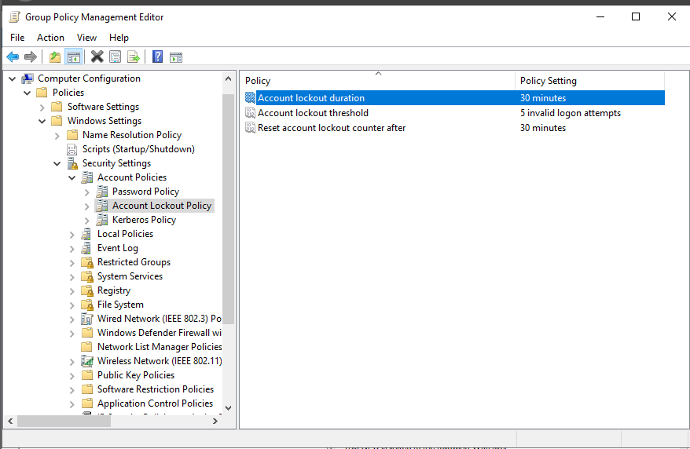


### 2.1 – Password Policy

| Politique | Valeur configurée |
|---|---|
| Enforce password history | 24 passwords remembered |
| Maximum password age | 60 days |
| Minimum password age | 1 day |
| **Minimum password length** | **14 characters** |
| Password must meet complexity requirements | Enabled |
| Store passwords using reversible encryption | Disabled |

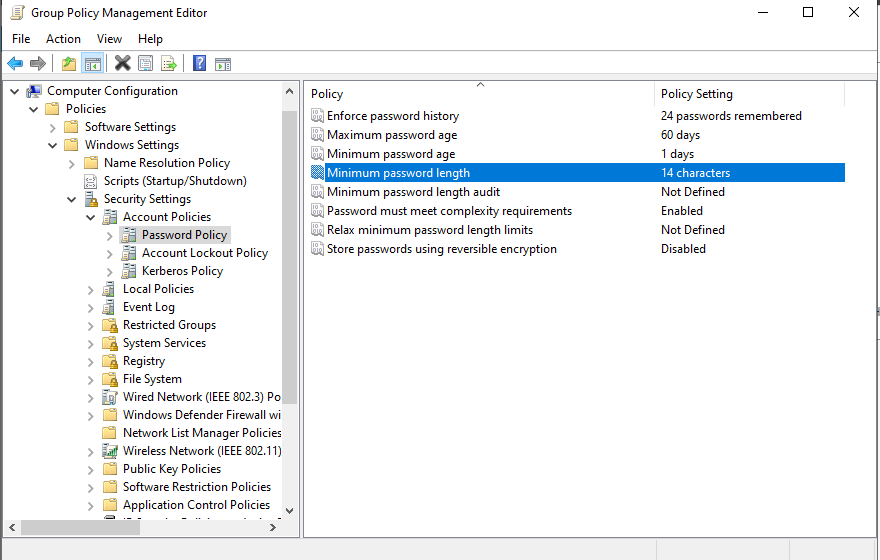

### 2.2 – Account Lockout Policy

| Politique | Valeur configurée |
|---|---|
| Account lockout duration | 30 minutes |
| Account lockout threshold | 5 invalid logon attempts |
| Reset account lockout counter after | 30 minutes |


**Lien direct avec la Phase A :** un mot de passe de 14 caractères minimum, avec complexité imposée, rend le cassage offline d'un hash NTLMv2 capturé (comme dans la Simulation 4) considérablement plus coûteux qu'un mot de passe court comme `TempPass123!`. Le verrouillage après 5 tentatives limite également le brute-force en ligne.

---

## 3. Politiques d'audit avancées

**GPO :** Computer Configuration → Policies → Windows Settings → Security Settings → Advanced Audit Policy Configuration → Audit Policies

| Sous-catégorie | Succès | Échec | Objectif |
|---|---|---|---|
| Audit Credential Validation (Account Logon) | ✅ | ✅ | Détecter les tentatives d'authentification (Kerberos/NTLM), réussies et échouées |
| Audit User Account Management (Account Management) | ✅ | ✅ | Détecter la création/modification de comptes (ex. le compte `backdoor` de la Simulation 4) |
| Audit Process Creation (Detailed Tracking) | ✅ | — | Visibilité sur l'exécution de processus — comble le gap identifié en Simulation 3 (pas de détection process-based pour `tasksche.exe`) |
| Audit Special Logon (Logon/Logoff) | ✅ | ✅ | Détecte les connexions avec des identifiants sensibles (comptes membres de groupes privilégiés) |
| Audit Security State Change (System) | ✅ | — | Démarrage/arrêt du système, changements d'état de sécurité |
| Audit Security System Extension (System) | ✅ | — | Chargement d'extensions du sous-système de sécurité (ex. DLL d'authentification) |

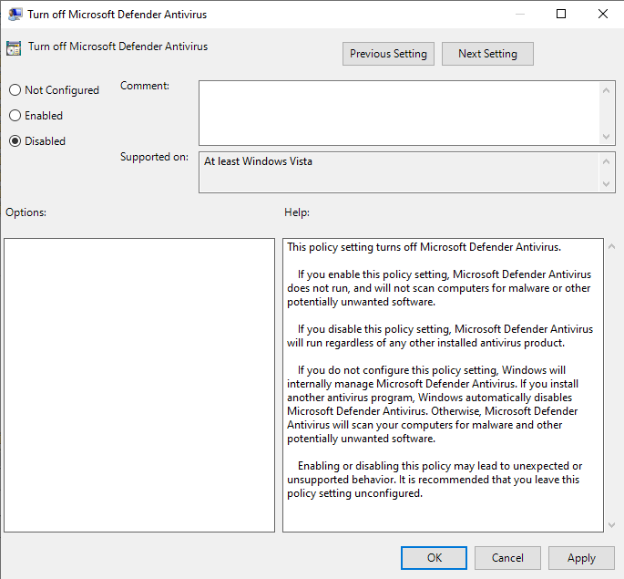
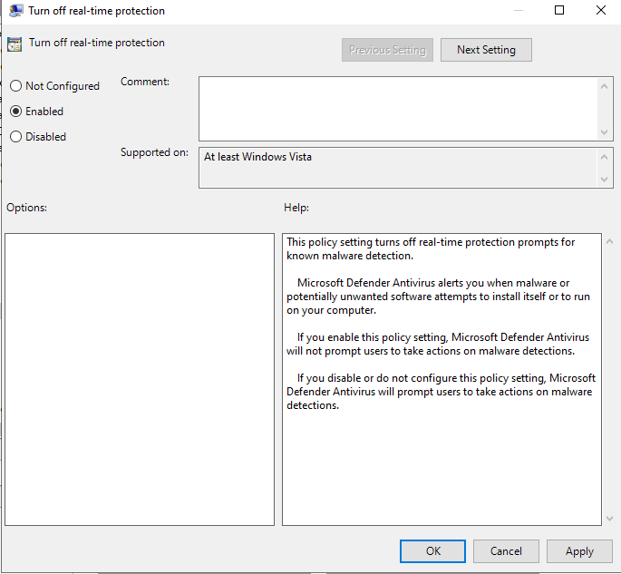
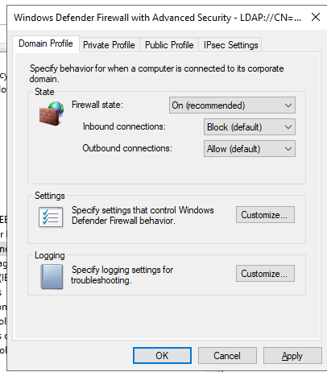
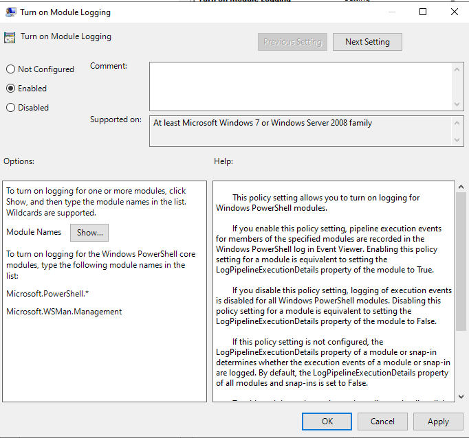
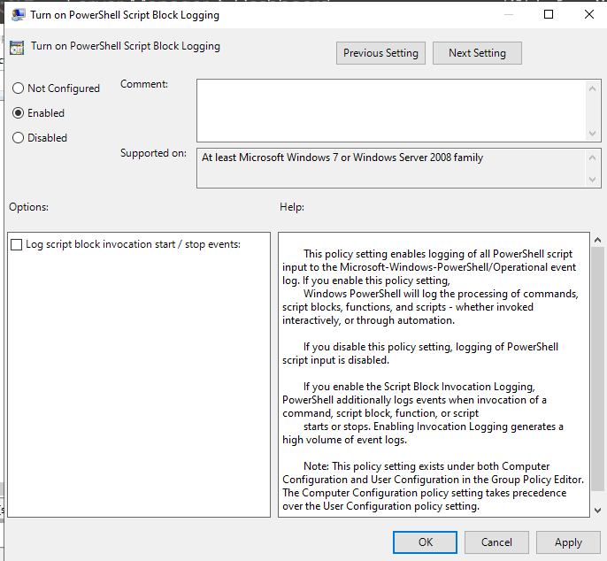
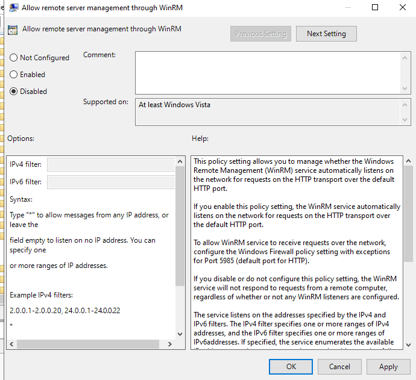

**Lien avec la Phase A :** `Audit Process Creation` est la correction directe recommandée dans le rapport de la Simulation 3 (section 6.1, "Sysmon Deployment") — combinée à un déploiement Sysmon (traité séparément), cette politique fournit la visibilité sur l'exécution de processus qui manquait pour détecter `tasksche.exe`/`mssecsvc.exe` par une règle dédiée.

---

## 4. Windows Defender

**GPO :** Computer Configuration → Policies → Administrative Templates → Windows Components → Microsoft Defender Antivirus

| Politique | Valeur configurée | Effet |
|---|---|---|
| Turn off Microsoft Defender Antivirus | **Disabled** | Defender reste actif — corrige directement la GPO `Disable Windows Defender` créée en Phase A |
| Turn off real-time protection | **Enabled** ⚠️ | **La protection en temps réel reste désactivée** — voir alerte ci-dessous |

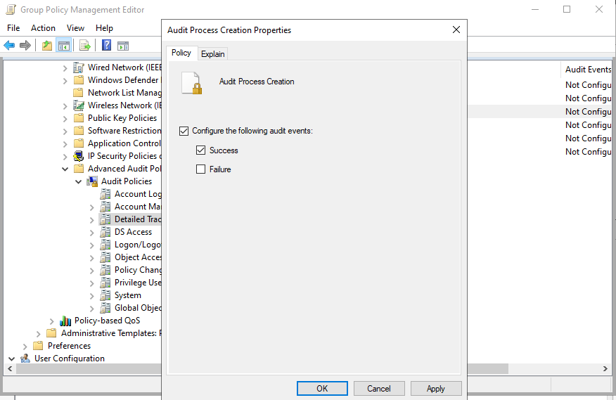
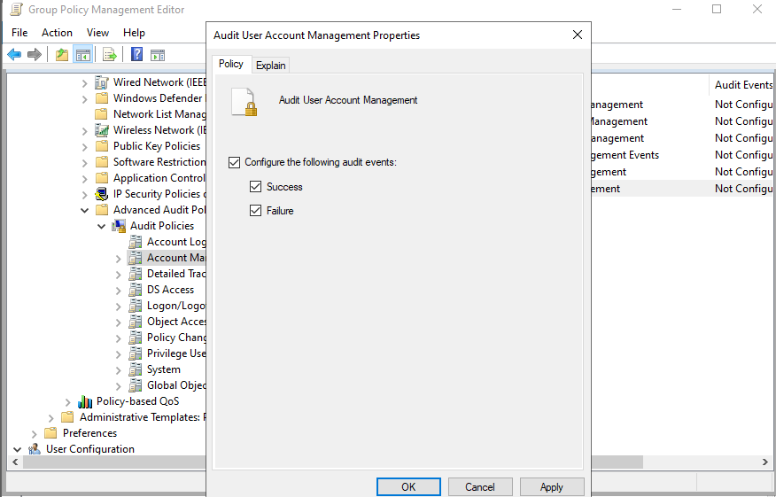

### ⚠️ Point critique à corriger avant de considérer ce chantier terminé

La capture confirme que **`Turn off Microsoft Defender Antivirus` est bien réglé sur `Disabled`** — Defender n'est plus désactivé globalement, ce qui corrige le problème principal de la Phase A. **Mais la capture montre aussi que `Turn off real-time protection` est réglé sur `Enabled`** — ce qui signifie que **la protection en temps réel de Defender reste désactivée**, malgré Defender lui-même actif. C'est une configuration contradictoire : Defender "tourne" mais sans scanner activement les fichiers en temps réel — ce qui laisserait encore passer un exécutable comme WannaCry sans détection immédiate.

**Action corrective nécessaire :** repasser `Turn off real-time protection` sur **`Disabled`** (ou `Not Configured`), puis revérifier avec :
```powershell
Get-MpComputerStatus | Select-Object RealTimeProtectionEnabled, AntivirusEnabled
```
Le résultat attendu est `RealTimeProtectionEnabled : True` et `AntivirusEnabled : True`.

---

## 5. Pare-feu Windows Defender

**GPO :** Computer Configuration → Policies → Windows Settings → Security Settings → Windows Defender Firewall with Advanced Security

| Profil | Firewall state | Inbound | Outbound |
|---|---|---|---|
| Domain Profile | On (recommended) | Block (default) | Allow (default) |

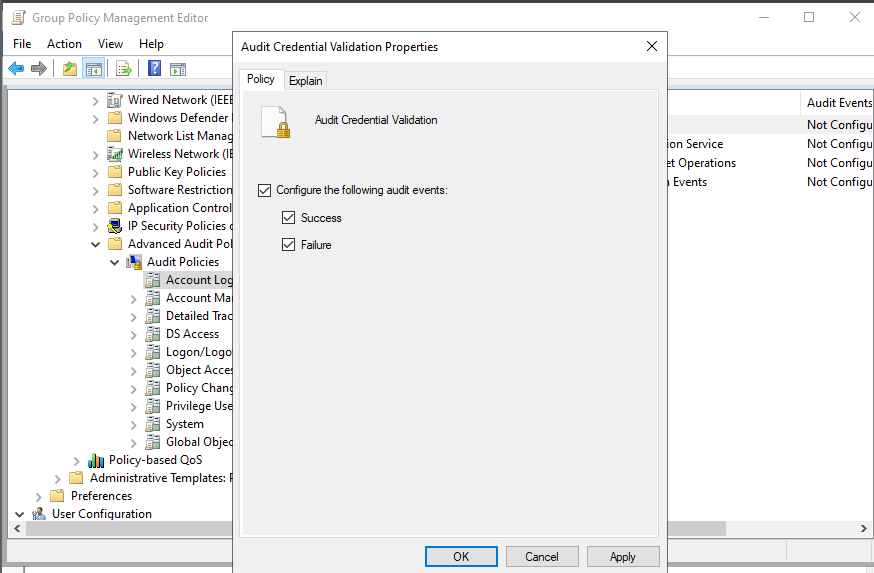

⚠️ **À noter :** cette configuration active explicitement le pare-feu avec les valeurs **par défaut** de Windows (blocage entrant, autorisation sortante) — elle formalise et verrouille ce comportement via GPO (empêchant une désactivation locale non autorisée), mais ne durcit pas au-delà des réglages standards. Aucune règle entrante/sortante spécifique (ex. restriction du trafic SMB/RPC entre postes clients, pertinent après la Simulation 4) n'apparaît configurée dans cette capture.

---

## 6. Journalisation PowerShell

**GPO :** Computer Configuration → Policies → Administrative Templates → Windows Components → Windows PowerShell

| Politique | Valeur configurée |
|---|---|
| Turn on PowerShell Script Block Logging | **Enabled** |
| Turn on Module Logging | **Enabled** — modules : `Microsoft.PowerShell.*`, `Microsoft.WSMan.Management` |

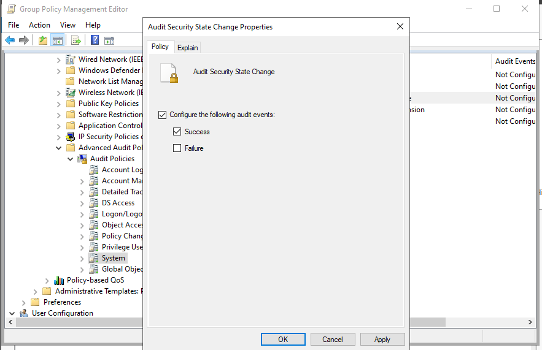
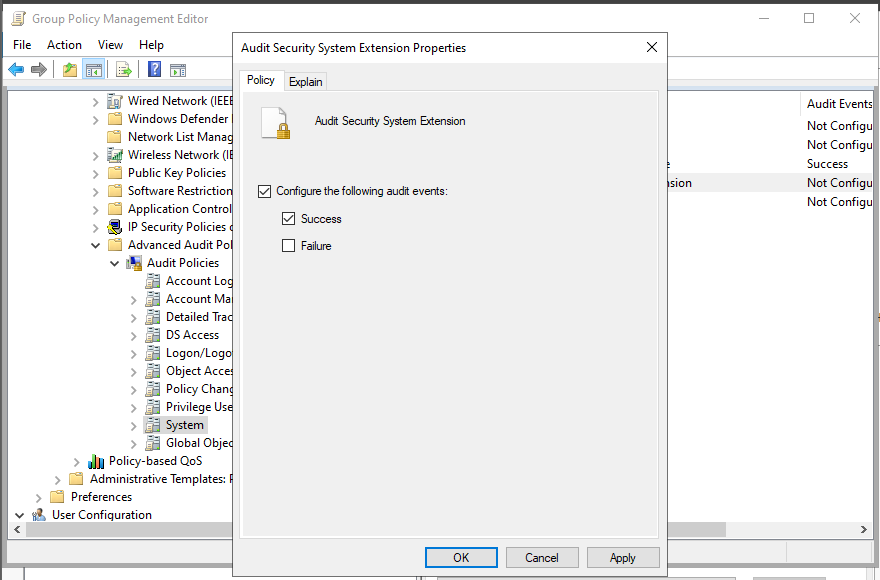

**Lien avec la Phase A :** la Simulation 4 (Active Directory) impliquait des outils PowerShell/scripts (`impacket-wmiexec`, énumération BloodHound). Cette journalisation permettrait de capturer le contenu exact des commandes PowerShell exécutées lors d'une attaque similaire en Phase C, renforçant les capacités DFIR (Velociraptor peut ensuite interroger ces logs).

---

## 7. Réduction de la surface d'administration distante

**GPO :** Computer Configuration → Policies → Administrative Templates → Windows Components → Windows Remote Management (WinRM) → WinRM Service

| Politique | Valeur configurée |
|---|---|
| Allow remote server management through WinRM | **Disabled** |

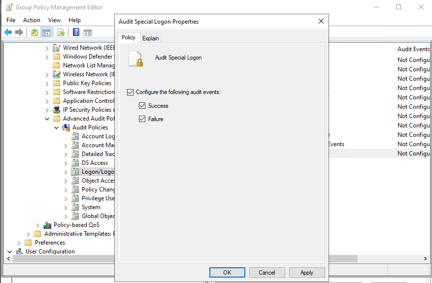

Réduit la surface d'attaque pour la gestion distante — bien que la Simulation 4 ait utilisé `wmiexec` (DCOM/WMI, distinct de WinRM), cette mesure ferme un vecteur d'administration distante supplémentaire qui n'est pas nécessaire dans ce lab.

---

## 8. Vérification

Commandes recommandées sur un poste client, après application des GPO (`gpupdate /force`) :

```powershell
# Confirme l'application des GPO
gpupdate /force
gpresult /r

# Vérifie la politique de mot de passe effective
net accounts

# Vérifie l'état réel de Defender (voir alerte section 4)
Get-MpComputerStatus | Select-Object RealTimeProtectionEnabled, AntivirusEnabled

# Vérifie que le journal PowerShell Operational reçoit bien les événements
Get-WinEvent -LogName "Microsoft-Windows-PowerShell/Operational" -MaxEvents 5

# Vérifie l'état du pare-feu
Get-NetFirewallProfile -Profile Domain | Select-Object Name, Enabled, DefaultInboundAction, DefaultOutboundAction

# Vérifie WinRM
reg query HKLM\SOFTWARE\Policies\Microsoft\Windows\WinRM\Service /v AllowAutoConfig
```

> 🚧 Aucune capture de sortie de ces commandes de vérification n'a été fournie — à documenter une fois exécutées, en particulier `Get-MpComputerStatus` pour confirmer (ou infirmer) le point critique de la section 4.

---

## 9. Synthèse

| Catégorie | Statut | Note |
|---|---|---|
| Politique de mot de passe | ✅ Confirmé | 14 caractères min., complexité, historique 24 |
| Verrouillage de compte | ✅ Confirmé | 5 tentatives, 30 min |
| Audit avancé (6 sous-catégories) | ✅ Confirmé | Couvre logon, création de compte, création de process, extensions système |
| Windows Defender — désactivation globale | ✅ Confirmé | `Turn off Microsoft Defender Antivirus` = Disabled |
| Windows Defender — protection temps réel | ❌ **Non résolu** | `Turn off real-time protection` = **Enabled** — action corrective requise (section 4) |
| Pare-feu (profil domaine) | ✅ Confirmé | Valeurs par défaut formalisées via GPO |
| Journalisation PowerShell | ✅ Confirmé | Script Block + Module Logging actifs |
| WinRM | ✅ Confirmé | Désactivé |
| Vérifications post-application | ⏳ À faire | Aucune sortie de commande fournie |

---

## 10. Conclusion

7 des 8 chantiers de durcissement des postes clients sont confirmés par capture. **Un point contredit directement l'objectif de la Phase A** : bien que la GPO désactivant globalement Defender ait été corrigée, la protection en temps réel reste désactivée via une politique distincte (`Turn off real-time protection` = Enabled) — ce qui, en l'état, laisserait toujours passer un exécutable malveillant sans détection immédiate, reproduisant partiellement les conditions de la Simulation 3.

**Impact sur les failles de Phase A :**
- Le cassage de mot de passe faible (Simulation 4) est rendu nettement plus coûteux (14 caractères + complexité).
- La visibilité d'audit (process creation, gestion de comptes, logons spéciaux) comble une partie du gap de détection identifié en Simulation 3.
- **La protection antivirus en temps réel reste à corriger** avant de considérer la remédiation de la Simulation 3 comme complète — voir action corrective section 4.

**Prochaine étape immédiate recommandée :** repasser `Turn off real-time protection` sur `Disabled`, `gpupdate /force`, puis confirmer avec `Get-MpComputerStatus` avant de clore ce chantier.
