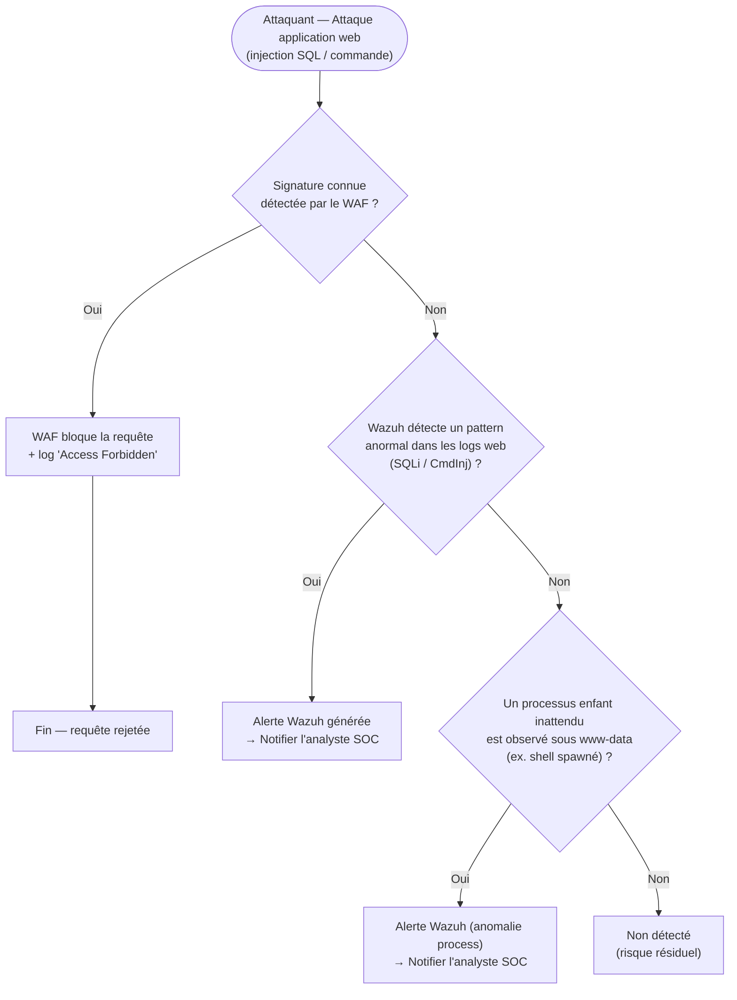

# Threat Model — DVWA (SQL Injection / Command Injection)

**Zone :** DMZ_LAN · **Cible :** DVWA (`192.168.11.177`) · **STRIDE :** Tampering, Elevation of Privilege · **MITRE ATT&CK :** T1190 (Exploit Public-Facing Application), T1059 (Command and Scripting Interpreter)

## Seuils / logique réelle

- **Détection primaire (couche 1) :** le WAF SafeLine, déployé en Phase B, filtre les signatures connues avant même que la requête n'atteigne DVWA.
- **Détection secondaire (couche 2) :** en l'absence de blocage WAF (payload non signé), Wazuh reste la ligne de défense suivante — surveillance des logs applicatifs.
- **Détection tertiaire (couche 3) :** même sans signature de log reconnue, un process enfant inattendu sous le compte de service web (`www-data`) est un signal fort d'exécution de commande — c'est ce type de comportement qui a permis d'obtenir un shell en Phase A.

## Résultat mesuré (Phase A)

Shell `www-data` obtenu, tentative d'escalade root **échouée**, tentative de pivot vers d'autres zones **bloquée par la segmentation**. Détection Wazuh confirmée.

## Statut Phase B

🟡 **Réduit, pas éliminé.** Le WAF ajoute une première couche, mais reste contournable par un payload non signé — les couches 2 et 3 restent donc la vraie ligne de défense, inchangées depuis la Phase A.
