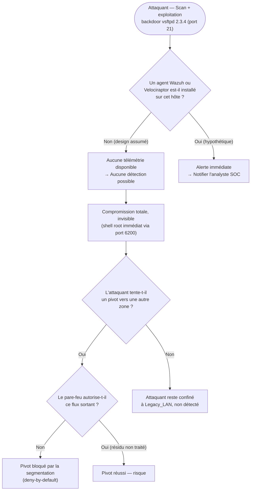

# Threat Model — Metasploitable2 (Backdoor vsftpd)

**Zone :** Legacy_LAN · **Cible :** Metasploitable2 (`192.168.6.144`) · **STRIDE :** Elevation of Privilege, Repudiation · **MITRE ATT&CK :** T1190 (Exploit Public-Facing Application)

## Seuils / logique réelle

Il n'y a, volontairement, **aucune règle de détection à évaluer** sur cet
hôte — c'est la branche `B → Non` qui domine tout le reste de l'arbre.
Ce n'est pas un oubli : Legacy_LAN est conçu comme la zone "aveugle" du
lab, pour mesurer ce que la segmentation seule peut ou ne peut pas
contenir en l'absence totale d'instrumentation (voir
[`security-principles.md`](../docs/security-principles.md), section 2).

## Résultat mesuré (Phase A)

Compromission root **immédiate et non détectée**. Pivot réseau vers les
autres zones **bloqué par la segmentation** (branche `F → Non` confirmée
en pratique).

## Statut Phase B

🔴 **Risque permanent et assumé sur cet hôte spécifiquement**, mais
**partiellement resserré côté réseau** : le pare-feu WAN, auparavant
ouvert sur tout protocole vers Legacy, est désormais limité aux ports
`21` et `6200` uniquement — cela ne corrige pas la vulnérabilité ni ne
restaure la visibilité, mais réduit la surface d'exposition externe.
⚠️ Un point reste à vérifier : confirmer qu'aucune règle "allow any"
auto-générée ne subsiste sur cette interface (branche `F → Oui`),
voir [`opnsense-firewall-rules-post-hardening.md`](../network/opnsense-firewall-rules-post-hardening.md).
