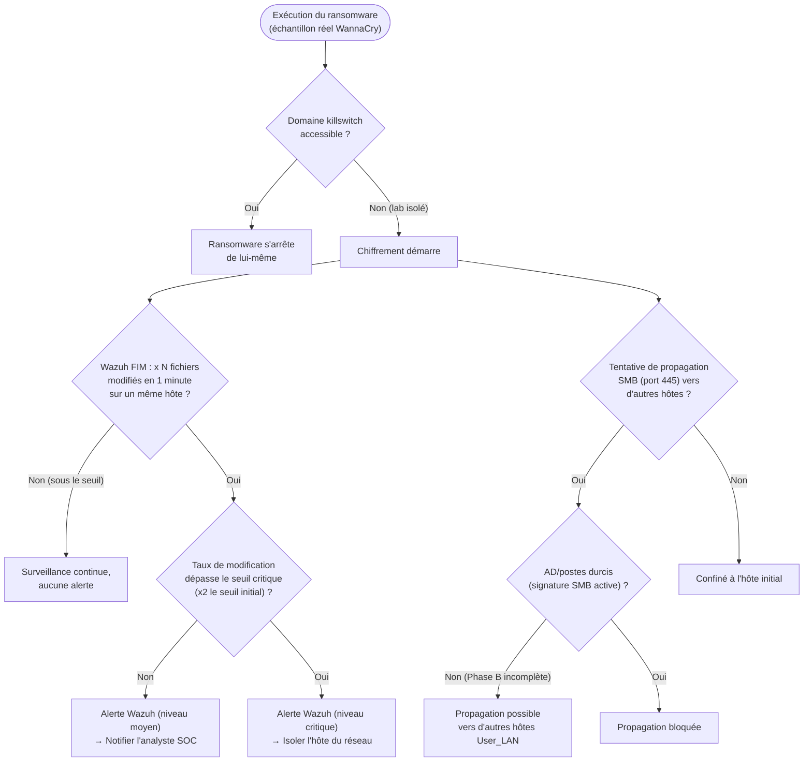

# Threat Model — WannaCry (Ransomware)

**Zone :** User_LAN · **STRIDE :** Tampering · **MITRE ATT&CK :** T1204 (User Execution), T1210 (Exploitation of Remote Services — SMB/EternalBlue), T1486 (Data Encrypted for Impact)

## Seuils / logique réelle

- Le seuil exact "x N fichiers/minute" n'est pas documenté précisément
  dans ce lab — Wazuh FIM (File Integrity Monitoring) a détecté le
  changement de masse **rapidement** en Phase A, mais sans qu'un seuil
  numérique formel à deux niveaux (alerte / isolation automatique) ait
  été configuré. C'est une amélioration concrète identifiable pour la
  suite : définir explicitement ces deux seuils, sur le modèle de ce qui
  a été fait pour le brute-force SSH (voir le 5ᵉ modèle de menace).
- **La branche d'isolation automatique (`I`) n'est pas encore
  implémentée** — contrairement au blocage IP automatique du pipeline
  SSH, il n'existe pas aujourd'hui d'action Shuffle qui isole
  automatiquement un hôte sur détection FIM critique.

## Résultat mesuré (Phase A)

Chiffrement **partiel** (contenu avant complétion), détection Wazuh
confirmée rapide via FIM.

## Statut Phase B

🔴 **Vecteur de propagation non fermé.** Le durcissement AD/postes
clients (signature SMB, entre autres) est encore 🟡 en cours, non
confirmé terminé — la branche `K → Non` reste donc la situation réelle
actuelle. L'isolation automatique sur détection critique (`G → Oui → I`)
n'existe pas encore comme automatisation — reste manuelle.
