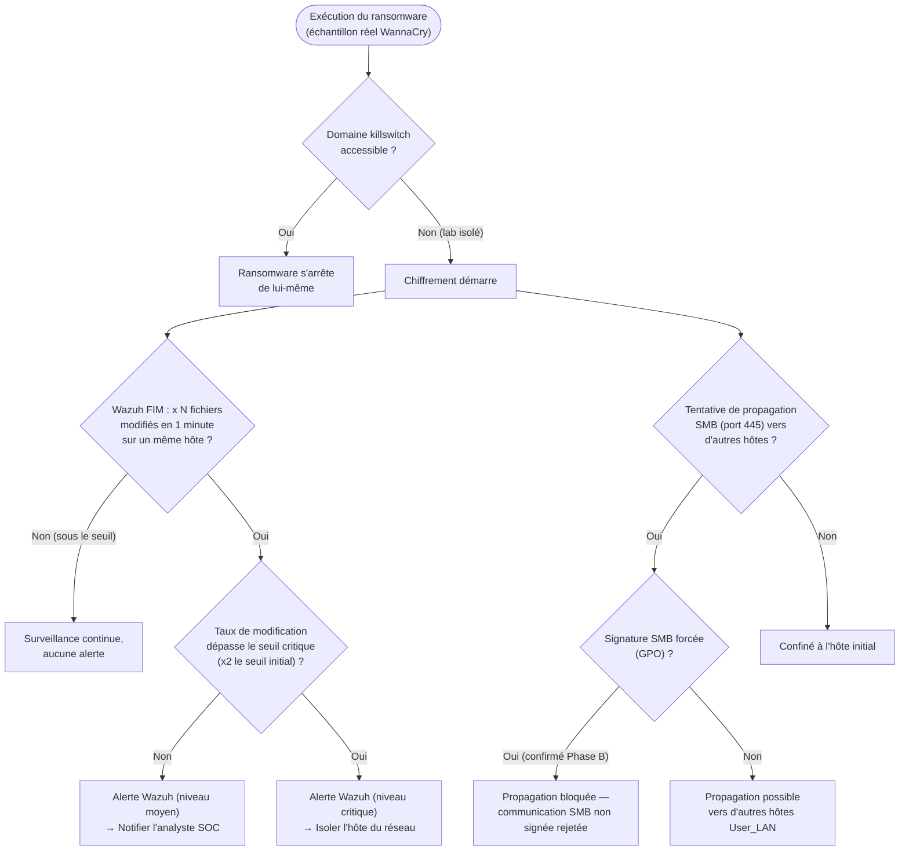

# Threat Model — WannaCry (Ransomware)

**Zone :** User_LAN · **STRIDE :** Tampering · **MITRE ATT&CK :** T1204 (User Execution), T1210 (Exploitation of Remote Services — SMB/EternalBlue), T1486 (Data Encrypted for Impact)

## Seuils / logique réelle

- Le seuil exact "x N fichiers/minute" n'est pas documenté précisément
  dans ce lab — Wazuh FIM (File Integrity Monitoring) a détecté le
  changement de masse **rapidement** en Phase A, mais sans qu'un seuil
  numérique formel à deux niveaux (alerte / isolation automatique) ait
  été configuré. C'est une amélioration concrète identifiable pour la
  suite : définir explicitement ces deux seuils, sur le modèle de ce qui
  a été fait pour le brute-force SSH (voir le 5ᵉ modèle de menace).
- **La branche d'isolation automatique (`I`) n'est pas encore
  implémentée** — contrairement au blocage IP automatique du pipeline
  SSH, il n'existe pas aujourd'hui d'action Shuffle qui isole
  automatiquement un hôte sur détection FIM critique.
- **La branche `K` reflète l'état réel confirmé en Phase B** : la
  signature SMB est désormais forcée par GPO (`Digitally sign
  communications (if client agrees)` **et** `(always)`, toutes deux
  activées — voir
  [`phase-b-ad-hardening.md`](../reports/phase-b-hardening/config/phase-b-ad-hardening.md),
  section 4). Le trafic SMB non signé, celui qu'EternalBlue exploitait en
  Phase A, est désormais rejeté.

## Résultat mesuré (Phase A)

Chiffrement **partiel** (contenu avant complétion), détection Wazuh
confirmée rapide via FIM.

## Statut Phase B

✅ **Vecteur de propagation SMB fermé.** La signature SMB forcée
(`K → Oui`) bloque désormais le mécanisme qui permettait la propagation
latérale de type EternalBlue en Phase A. Reste ouvert : l'isolation
automatique sur détection FIM critique (`G → Oui → I`) n'existe toujours
pas comme automatisation — seule la détection/alerte est en place, la
containment reste manuelle. Sysmon (détection comportementale fine)
reste également ⏳ à venir.
