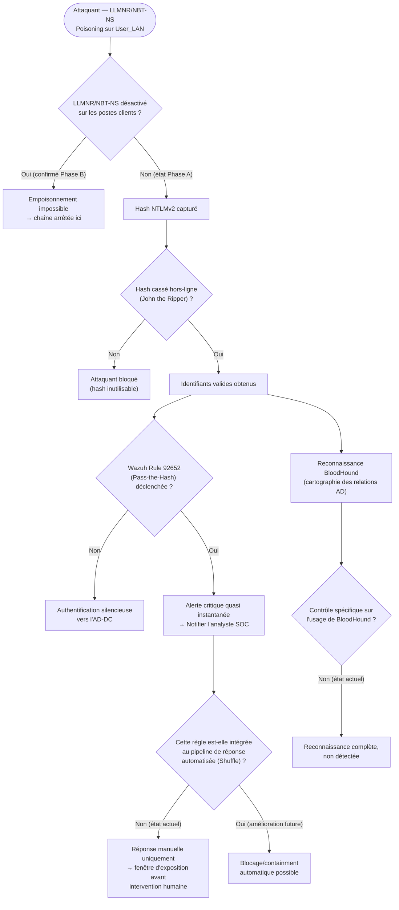

# Threat Model — Active Directory (LLMNR Poisoning → Pass-the-Hash → BloodHound)

**Zone :** User_LAN → Server_LAN · **STRIDE :** Spoofing, Elevation of Privilege, Information Disclosure · **MITRE ATT&CK :** T1557.001 (LLMNR/NBT-NS Poisoning), T1110.002 (Password Cracking), T1550.002 (Pass the Hash), T1482/T1087 (Domain Trust/Account Discovery)

## Seuils / logique réelle

- **La branche `B → Oui` reflète désormais l'état réel confirmé en
  Phase B** : LLMNR est désactivé (GPO `Turn off multicast name
  resolution`, plus le durcissement complémentaire
  `Turn off smart multi-homed name resolution`), et NBT-NS est désactivé
  via une préférence de registre GPO (`NetbiosOptions`) — voir
  [`phase-b-ad-hardening.md`](../reports/phase-b-hardening/config/phase-b-ad-hardening.md),
  section 3. **La chaîne d'attaque telle que rejouée en Phase A est
  désormais coupée à sa toute première étape.**
- **Détection confirmée rapide et fiable** (`H → Oui`) reste valable
  comme filet de sécurité supplémentaire si un autre vecteur de capture
  de hash venait à être trouvé (ex. autre protocole de résolution de nom,
  ou attaque de relais NTLM plutôt que LLMNR).
- **Mais la détection reste manuelle** (`K → Non`) : ce type d'alerte
  n'est pas aujourd'hui branché sur Shuffle pour une réponse automatique
  — une extension naturelle du pipeline SOAR déjà construit pour le
  brute-force SSH (5ᵉ modèle de menace).
- **BloodHound reste un angle mort total** (`O → Non`) : aucun contrôle
  identifié à ce jour pour cette étape spécifique de reconnaissance —
  reste vrai même après le durcissement LLMNR/SMB, puisqu'elle ne dépend
  pas de la capture de hash.

## Résultat mesuré (Phase A)

Chaîne complète réussie jusqu'à la compromission **Domain Admin**.
Détection Wazuh confirmée rapide sur l'étape Pass-the-Hash — mais sans
containment automatique, la chaîne d'attaque a eu le temps d'aboutir
avant toute réponse humaine.

## Statut Phase B

✅ **Point d'entrée de la chaîne fermé.** LLMNR/NBT-NS désactivés —
l'attaque telle que menée en Phase A ne peut plus démarrer de la même
façon. Restent ouverts : l'absence de containment automatique sur
détection Pass-the-Hash (`K → Non`), et l'absence totale de contrôle sur
la reconnaissance BloodHound (`O → Non`) — deux points qui ne dépendent
pas du durcissement LLMNR/SMB et qui restent des angles morts
indépendants à traiter séparément.
