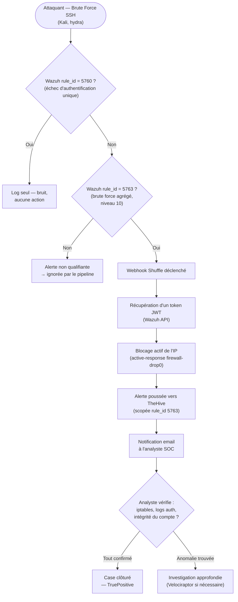

# Threat Model — SSH Brute Force (Wazuh → Shuffle → TheHive)

**Zone :** User_LAN/Server_LAN → Security_LAN · **STRIDE :** Elevation of Privilege · **MITRE ATT&CK :** T1110 (Brute Force)

Le seul des 5 modèles de menace de ce projet où la chaîne de décision est
**entièrement automatisée et réellement testée** de bout en bout — voir
[`phase-b-brute-force-blocking.md`](../reports/phase-b-hardening/config/phase-b-brute-force-blocking.md)
pour le détail complet et les captures d'écran de chaque étape.

## Seuils / logique réelle (confirmés par les tests)

- **`rule_id 5760`** — échec d'authentification unique. Génère du bruit,
  volontairement **exclu** du pipeline de réponse (branche `B → Oui`).
- **`rule_id 5763`** — règle agrégée native de Wazuh (niveau 10), déclenche
  sur plusieurs échecs depuis la même IP source dans une fenêtre de temps.
  C'est **le seul déclencheur** du pipeline automatisé — confirmé par test
  avec un alias existant réel (`ansible`) et un alias inexistant, les deux
  cas remontant correctement à cette même règle.
- **Le filtre + la condition de branchement** (`D`) ne sont pas
  cosmétiques : une leçon concrète du projet est qu'un nœud "Filter" seul,
  dans Shuffle, ne bloque pas l'exécution — il faut une **condition
  explicite sur la connexion** pour réellement arrêter les alertes non
  qualifiantes avant `F`.

## Résultat mesuré (Phase B — testé en conditions réelles)

Chaîne complète confirmée : IP attaquante bloquée (`iptables -L`
confirmé), ping de l'attaquant vers la cible en échec après blocage,
case TheHive créé avec observables et tags MITRE, email reçu avec les
bonnes données (IP, agent, règle, horodatage).

## Statut Phase B

✅ **Seule chaîne de ce projet entièrement automatisée et validée de bout
en bout.** Risque résiduel documenté séparément : un attaquant usurpant
une IP légitime pourrait en théorie déclencher un blocage contre un tiers
innocent (voir [`threat-model.md`](threat-model.md), section 4.2) — ce
risque est propre à l'automatisation elle-même, pas à la détection.

## Amélioration identifiée pour les autres modèles de menace

Ce pipeline est le modèle à suivre pour combler les points faibles
identifiés dans les 4 autres fichiers de threat modeling : branchement de
la règle Pass-the-Hash (`92652`) sur Shuffle pour un containment
automatique AD, et définition de seuils FIM à deux niveaux pour
l'isolation automatique en cas de ransomware.
